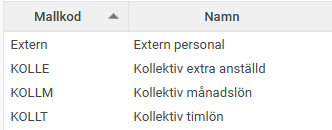
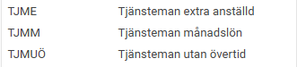
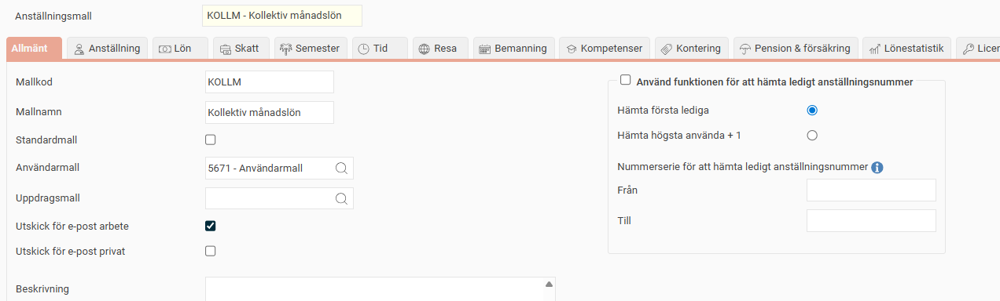
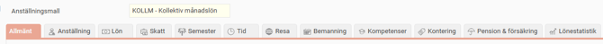

# ⚙️Anställningsmall - Hur skapar jag ett effektivt anställningsflöde?

**Datum:** den 26 augusti 2025  
**Kategori:** Employee  
**Underkategori:** Anställningshantering  
**Typ:** howto  
**Svårighetsgrad:** advanced  
**Tags:** anställning  
**Bilder:** 5  
**URL:** https://knowledge.flexhrm.com/sv/anstallningsmall-hur-skapa

---

Anställningsmall används för att förenkla processen när nyanställda skall läggas upp i systemet. Denna artikel beskriver hur du ställer in anställningsmallar i HRM.
Skapa anställningsmallar
Anställningsmall används för att förenkla processen när anställda skall läggas upp i systemet.
Vi lägger upp olika mallar för olika anställningskategorier eller andra typer av indelningar av personal som vi anser behövs. Mallen sätter standardvärden i HRM och är även viktig för nyanställningsflödet när du har HRM Employee.
Har du HRM Employee och har flera
Nyanställningsflöden
så kommer
Anställningsmallen
bli nyckeln för att systemet ska identifiera vilket nyanställningsflöde som ska användas för en anställning.
Administration – Inställningar – Personal – Anställningsmallar
Nedan bild visar
vanligt förekommande mallar. Vad mallarna heter och vad som behövs för ett unikt företag varierar. I ditt företag kan det
vara aktuellt med fl
er eller färre m
allar.

Ställa in mallar
Klicka på
Ny
för att skapa ny mall

eller gå in på önskad mall och gör justeringar för att passa ditt företag.
Under
Allmänt
ställer du in om användarmall ska kopplas på automatiskt och ev. andra funktioner/standardvärden som ska gälla för mallen.

I fältet
Användarmall
anger du vilken användarmall som ska användas när en ny anställd läggs upp med anställningsmallen. Användarmallar används för att automatiskt skapa användare när du lägger upp nya anställda och finns under menyingången
Administration – Systemregister – Användarmallar
. Vi rekommenderar att Användarmall används för att få ett så effektivt flöde som möjligt.
I fältet
Uppdragsmall
kan du även ange vilken uppdragsmall som ska falla ut som förslag när en ny anställd läggs upp. Uppdragsmallar hanterar du under
Administration – Register – Uppdrag
,
via knappen
Uppdragsmall
.
Du kan även ange om
utskick
som standard ska göras till den anställdes e-post på arbetet och/eller privata e-post. När du sedan lägger upp en nyanställd och väljer denna anställningsmall kommer valda inställningar att föreslås.
Under
Beskrivning
kan du, om du önskar, lägga in en valfri text som kan användas som vägledning kring när/hur anställningsmallen är tänkt att användas.
Använd funktionen för att hämta ledigt anställningsnummer
Här kan du aktivera funktionen för att
hämta ledigt anställningsnummer
, vilket innebär att systemet automatiskt föreslår nästa lediga anställningsnummer vid upplägg av ny anställd och vid import via fil/API.
Det går att ha samma nummerserie för flera anställningsmallar. För att kunna läsa in en kommande anställd i HRM utan anställningsnummer behöver du också aktivera och ställa in en nummerserie per anställningsmall.
Nummerserieinställningar kan även ställas in för hela företaget, se
Personal – Anställda
, under
Mer
och knappen
Inställningar
.
Gå igenom respektive meny för att sätta vilka standardvärden som ska gälla. Beroende av vilka moduler du har i HRM kan du se fler eller färre av menyerna.

Spara
