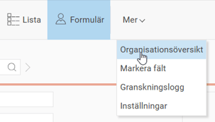
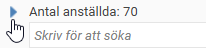
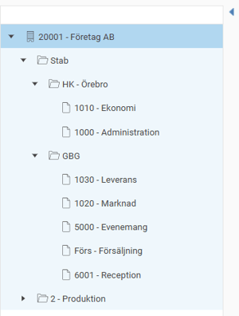
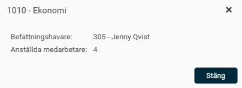
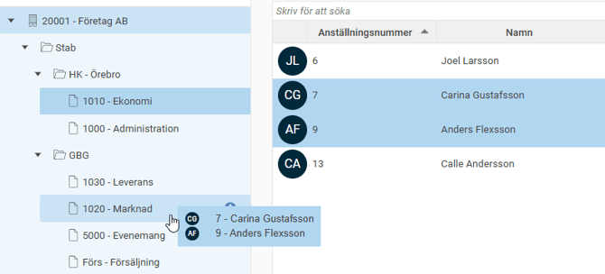
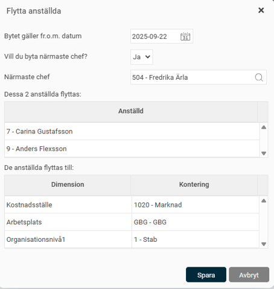

# Använd organisationsöversikten i HRM Employee

**Datum:** den 23 september 2025  
**Kategori:** Employee  
**Underkategori:** Organisation  
**Typ:** other  
**Svårighetsgrad:** advanced  
**Tags:** hrm-employee, kompetens  
**Bilder:** 7  
**URL:** https://knowledge.flexhrm.com/sv/anvand-organisationsoversikt-i-hrm

---

Ju större en organisation blir, desto viktigare är det att ha en tydlig överblick över hur den är uppbyggd. I HRM kan du använda funktionen Organisationsöversikt i anställdaregistret för att enkelt se vilka anställda som tillhör en viss del av organisationen.
Använd organisationsöversikten i anställdaregistret
I anställdaregistret, Under menyn
Mer
hittar du knappen
Organisationsöversikt
. När du klickar på den fälls en trädstruktur över din organisation ut till vänster.

Du kan även fälla ut trädet via den blåa lilla pilen uppe till vänster i vyn.

Översikten är ett användbart verktyg för att snabbt filtrera och hantera anställda direkt i listvyn.
Notera att organisationsöversikten även är synlig och användbar i andra vyer i HRM, så som till exempel
attestvyerna
för HRM Time och HRM Travel, i
Dashboarden
,
Kompetenssökningen
och på
Startsidan
i HRM.
Filtrera anställdalistan
När du klickar på en enhet i organisationsträdet, till exempel en avdelning eller en region, filtreras listan och visar endast de anställda som tillhör den valda delen. Det är ett smidigt sätt att snabbt få en överblick.
Om du klickar på en region visas alla anställda inom den regionen. Klickar du istället på en specifik avdelning under regionen visas bara de anställda på just den avdelningen. För att se alla anställda i hela företaget igen klickar du på företagets namn högst upp i trädstrukturen.
Se mer information om en enhet
Genom att klicka på
i-symbolen
bredvid en enhet i organisationsöversikten kan du se mer information, till exempel vem som är chef och hur många anställda som finns där.

Flytta anställda i organisationen
Du kan använda organisationsöversikten för att flytta en eller flera anställda till en annan del av organisationen.
Gör så här:
Markera den eller de anställda du vill flytta i listan.
För att markera flera anställda som inte ligger i följd: Håll ner
Ctrl
-tangenten och klicka på de anställda du vill välja.
För att markera flera anställda i följd: Klicka på den första anställda, håll ner
Shift
-tangenten och klicka på den sista anställda i blocket.
Dra och släpp
de markerade anställda på den enhet i organisationsträdet dit du vill flytta dem.

Ett nytt fönster öppnas där du anger detaljerna för flytten.
Välj från och med vilket
datum
bytet ska gälla. Du kan välja dagens datum eller ett datum framåt i tiden.
Bestäm om de anställda ska byta närmaste chef.
Väljer du
Nej
behåller de sin nuvarande chef.
Väljer du
Ja
får de den nya enhetens chef som sin närmaste chef. Om du vill välja en annan person än den föreslagna kan du göra det manuellt i fältet
Närmaste chef
.

Observera!
För att kunna flytta anställda på detta sätt behöver du ha behörighet att ändra uppgifter under fliken
Kontering
i anställdaregistret.
Relaterade artiklar
Kopiera anställd mellan bolag – smartare personalhantering för hela koncernen
⚙️Hur skapar jag ett organisationsträd i HRM Employee?
