# Arbeta med årets Lönerevision

**Datum:** den 30 september 2025  
**Kategori:** Employee  
**Underkategori:** Anställningshantering  
**Typ:** other  
**Svårighetsgrad:** intermediate  
**Tags:** anställning, lönerevision  
**Bilder:** 16  
**URL:** https://knowledge.flexhrm.com/sv/arbeta-med-arets-lonerevision-0

---

I artikeln hittar du information om hur du enkelt arbetar med årets lönerevision.  

Nedan beskrivs funktionerna i lönerevisionen när den har status Startad.

Arbeta med lönerevisionen
Personal > Lönerevision
Högst uppe till vänster i vyn för lönerevision väljer du vilken lönerevision du vill arbeta med. Du kan enkelt ta fram föregående års lönerevision om du skulle vilja titta på den.
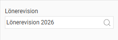
Vald lönerevision laddas in och du ser nu de anställda
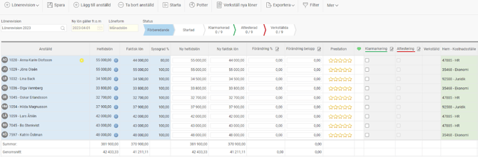
Blå kolumner
: Visar information om den anställda, aktuell lön och sysselsättningsgrad. Klicka på den blå
i-symbolen
för att se lönehistorik.
Vita kolumner
: Redigerbara fält. Här matar du in den nya lönen.
Gröna kolumner:
Innehåller ytterligare information som hemkontering, befattning och anställningsdatum.
Lägg in ny lön
De vita kolumnerna är de du använder för att lägga in den nya lönen. Här visas den nya heltidslönen, den nya faktiska lönen samt förändringen i procent och kronor. Du kan ändra vilket som helst av dessa värden, så beräknas de övriga uppgifterna utifrån det.

Arbetar ni med "utökad potthantering" ser vyn lite annorlunda ut och du lägger in förändringen i kronor i respektive kolumn för de olika potterna.
I exemplet nedan får
anställd nr 1
500kr från den generella "Företagspott", 800 kr från potten "Tjänstemannaavtalet" samt 750kr från "Jämställdhetspott". Totalt innebär det en höjning för den anställde på 2050kr.
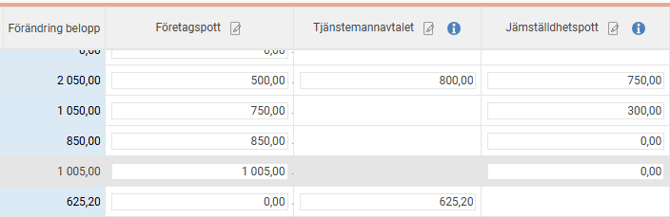
Prestation, kommentarer och anteckningar
Prestation
: Du kan göra en prestationsbedömning med stjärnor som endast visas i lönerevisionen.
Kommentar
: Texten du skriver här följer med den nya lönen till anställdaregistret när den verkställs.
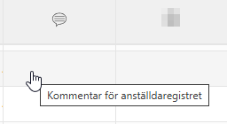
Anteckningar
: Anteckningar är endast synliga i lönerevisionen och fungerar som en dialog mellan de som arbetar med lönesättningen. Du kan bara redigera och ta bort dina egna anteckningar.
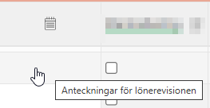
Genväg till anställdaregistret
Eftersom alla uppgifter om en anställd inte visas i lönerevisionen finns det en genväg för att enkelt se all information. Du öppnar anställdaregistret genom att klicka på
den anställdes namn
i listan.
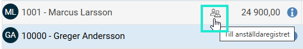
När du är i anställdaregistret finns det en knapp i knappraden som du kan klicka på,
Tillbaka till lönerevisionen,
för att komma tillbaka till lönerevisionen.
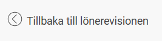
Massberedning av nya löner
Om du vill ange samma löneökning för flera anställda samtidigt kan du använda massberedning.
Klicka på ikonen i kolumnrubriken för
Förändring %
eller
Förändring belopp
för att ange ett värde som ska gälla för alla anställda som för närvarande visas i listan. Använd filtret om du vill applicera detta på en specifik grupp.
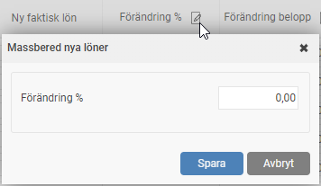
Analysera och följ upp
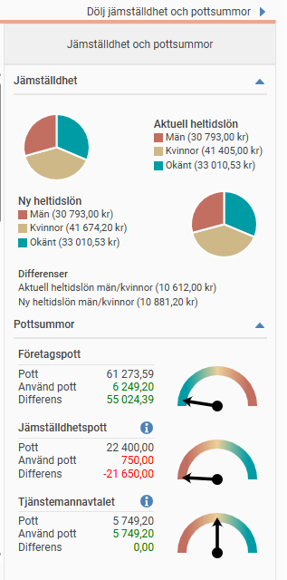
Pottsummor:
Till höger i vyn kan du visa pottsummor. Här ser du hur stor del av varje
pott som har använts. En mätare indikerar visuellt om du ligger inom eller utanför pottens ramar.
Här kan man se hur stor del av potten man nyttjat för de anställda som visas i listan.
De potter som har röda siffror behöver man åtgärda. De med gröna siffror är bra. Lägg märke till att olika potter kan bli röda om man överstiger eller understiger potten. Detta är för att man ska kunna se om man uppfyller kollektivavtalets krav på minsta löneökning, eller om man överskridit företagets budget för lönerevision.
Graf för jämställdhet
: Visar en jämförelse av den genomsnittliga lönen för kvinnor och män, både före och efter lönerevisionen, för att underlätta jämställdhetsarbetet.
Summering
: Längst ner i listan visas summor och genomsnitt för både nuvarande och nya löner.
Granska och attestera nya löner
Granska de nya lönerna
När de nya lönerna är ifyllda är det dags att följa den granskningsprocess som satts upp. Användare med rätt behörighet markerar sitt granskningssteg (t.ex.
Klarmarkering
eller
Attestering
) genom att bocka i rutan för respektive anställd.
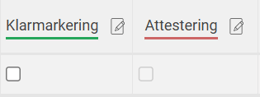
Du kan granska flera anställda samtidigt genom att klicka på ikonen i kolumnrubriken.
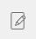
Som ett sista steg i lönerevisionen verkställs de nya lönerna. Det görs normalt av en lönehandläggare.
Hur verkställer jag nya löner i lönerevisionen?
Varningar
Tabellåsning per anställd
Låsning sker per anställd. Detta innebär att flera chefer kan vara inne och jobba samtidigt så länge de inte jobbar med samma anställda.
När en annan användare gör en ändring på en anställd blir den anställde låst för redigering i lönerevisionen. När den andre användaren därefter sparar en ändrad lön visas en informationstext högst upp i lönerevisionen som informerar om att en ändring skett. Man kan då välja att ladda om informationen i lönerevisionen och på så sätt hämta in de senast satta lönerna. Om man har osparade ändringar räcker det att spara dessa, så laddas alla nya uppgifter in efter sparningen.
Varningssymbol
Systemet kan visa en varningssymbol för en anställd om det finns något särskilt att uppmärksamma, till exempel om anställningen kommer att avslutas eller om den anställda redan har en annan planerad löneförändring efter lönerevisionsdatumet.
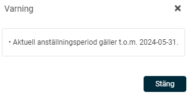
Om en anställd har en ny lön efter lönerevisionsdatumet, kommer den reviderade lönen från lönerevisionen att lägga sig som en rad mellan den gamla och den kommande lönen.
Innan lönerevisionen är verkställd
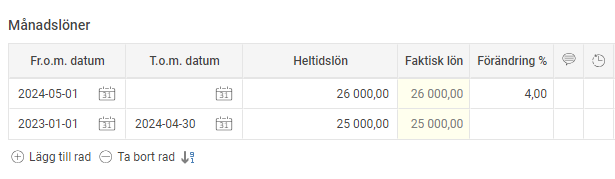
Efter att lönen är verkställd
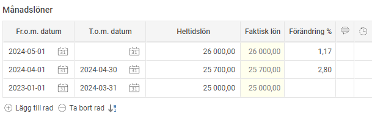
Observera
att om den nya kommande lönen efter lönerevisonsdatumet också ska höjas så måste det hanteras manuellt i anställdaregistret.
Relaterade artiklar
Anställd ingår i aktiv Lönerevision
