# Digital signering - Hur använder jag e-signering via Scrive i HRM?

**Datum:** den 26 augusti 2025  
**Kategori:** Employee  
**Underkategori:** Anställningshantering  
**Typ:** other  
**Svårighetsgrad:** advanced  
**Tags:** anställning, cv, dokument, signering  
**Bilder:** 17  
**URL:** https://knowledge.flexhrm.com/sv/integration-till-scrive-0

---

Syftet med integrationen mellan Scrive och HRM är att smidigt skicka anställningsdokument för e-signering. 
Denna artikel beskriver hur du använder e-signering via Scrive - HRM.
⚙️
Administratör som ska sätta upp Scrive för e-signering?
Här hittar du inställningarna.
Integration till Scrive
Med denna modul kan du i HRM skicka Anställningsavtal, HR-blanketter och CV för digital signering i Scrive och slipper på så sätt hantering av papper och manuella underskrifter. Chefer och HR med flera får i HRM en komplett översikt över alla pågående och signerade dokument och behöver därför inte arbeta i flera system med hanteringen.
Scrive sköter e-postutskick till alla som ska signera, påminnelser om dokument som ännu inte signerats samt hantering av den tekniska signeringen. Alla dokument finns tillgängliga både i HRM och Scrive.
Digital signering av dokument via Scrive
Nedan följer en beskrivning av arbetsflödet gällande digital signering av dokument i HRM.
Skicka dokument för e-signering
För att skicka ett dokument för e-signering följer du nedan steg.
1. G
å
till akt
uell anställd i anställdaregistret. Här väljer du ett anställningsavtal
, en HR-blankett eller ett CV som du vill skicka för digital signering.
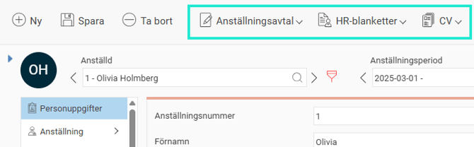
2. I nästa steg gör du önskade urval, såsom att lägga till bilagor till anställningsavtalet. Därefter kan du välja om du vill ladda ner avtalet som tidigare genom att klicka på knappen Ladda ner, eller om du istället vill skicka avtalet för digital signering genom att klicka på knappen Skicka för e-signering.

3. Du väljer i nästa steg vilka som ska signera samt om du vill sätta en deadline för signeringen.

Systemet föreslår som standard att den anställde som dokumentet gäller samt att den inloggade användaren ska signera dokumentet. Tanken är att till exempel ett anställningsavtal ska signeras dels av den anställde, dels av en chef som skickar iväg avtalet för signering. Vill du istället att någon annan, eller kanske bara den anställde, ska signera kan du lägga till och ta bort mottagare för signering.
Om mottagaren finns i aktuellt företag och du har behörighet till den kan du enklast välja denne i första kolumnen. Du kan då också välja om det är den anställdes e-postadress för arbete eller privat som ska användas. Är det någon annan person som ska signera kan du istället fylla i namn och e-post manuellt.
I de fall ni använder Pinkod via SMS måste även ett mobilnummer inkl. landskod finnas med.
4. Valet för autentisering har att göra med hur personen som öppnar dokumentet ska legitimera sig för att undvika att någon annan öppnar dokumentet. Ska autentisera ske med BankID behöver du också ange personnummer.
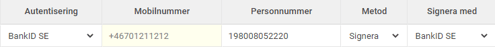
5. Därefter väljer du om mottagaren ska signera eller godkänna dokumentet. Signering är starkare och juridiskt bindande, medan godkännande inte kan räknas som juridiskt bindande. Om du valt signering ska du också ange om signering ska ske med BankID eller någon av de andra signeringsmetoderna som Scrive erbjuder.
6. I listan över dokument att signera kan du se vilka dokument som kommer skickas för signering. Du kan här också lägga till eller ta bort dokument som ska signeras. Alla dokument kommer hanteras var och ett för sig.
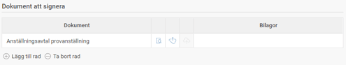
7. Innan du skickar ett dokument för signering kan du förhandsgranska det genom att klicka på dokumentikonen med förstoringsglas. Vill du dessutom redigera dokumentet innan det skickas klickar du först på ikonen i mitten, Ladda ner, redigerar dokumentet, sparar det på din dator och klickar sedan på ikonen till höger, Ladda upp, för att ladda upp ditt redigerade dokument som du vill ska skickas för signering. Tänk på att Ladda upp-ikonen inte blir aktiv förrän du först laddat ner dokumentet.

8. Signeringsordning innebär att du kan välja om mottagarna ska signera i tur och ordning eller om alla mottagare kan signera dokumentet parallellt.
Språk sätts här för samtliga signeringsmottagare.
Deadline talar om när dokumentet senast måste vara signerat och då kommer Scrive skicka ut påminnelser till mottagarna när deadlinen närmar sig enligt de inställningar du gjort under programlänken.
Meddelande som mottagaren får vid signering av dokumentet kan du här ändra på om du inte vill att det är standardmeddelandet som går ut.
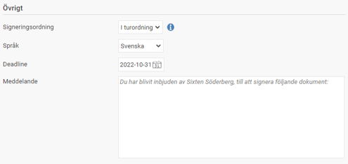
9. När du sedan klickar på knappen Skicka för e-signering skickas dokumentet från Flex HRM till Scrive, som i sin tur skickar ut e-postmeddelanden till mottagarna som ska signera.
Signera ett dokument
Mottagaren som ska signera ett dokument får ett e-postmeddelande som ser ut ungefär som bilden nedan. För att granska och signera dokumentet följer du instruktionerna.
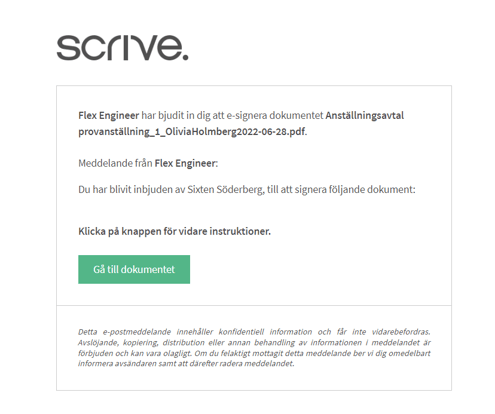
1. Efter att ha klickat på Gå till dokument verifierar du din identitet med BankID, i de fall du valt det som autentiseringsmetod.
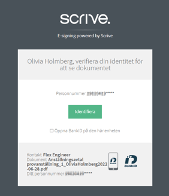
2. När autentiseringen är klar kommer du till dokument som ska granskas och signeras. Följ pilen för att läsa igenom dokument.
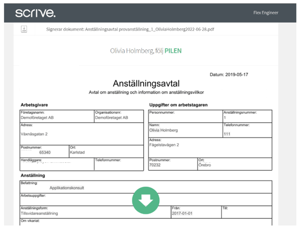
3. När du kommer längst ner efter att ha följt pilen kan du välja att signera eller avvisa avtalet.
Väljer du att avvisa får du ange anledningen som sedan går tillbaka till avsändaren.
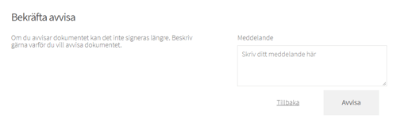
Väljer du att signera dokumentet skriver du i ditt personnummer och klickar på Signera.
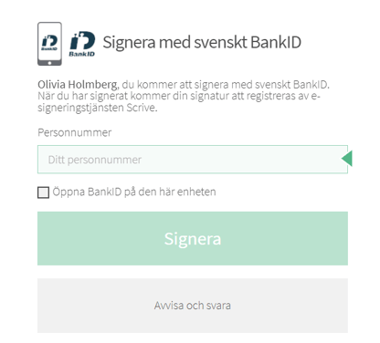
4. När signeringen är klar får du en bekräftelse på detta.
Den anställdes dokument
På fliken Dokument i anställdaregistret kan du se både dokument som är sparade i Flex HRM och dokument som är skickade för e-signering. Du kan här också ladda ner och öppna ett dokument som skickats för e-signering på samma sätt som för andra dokument. Om dokumentet är signerat kommer det i dokumentet finnas en sista sida som innehåller teknisk information om signeringen som gör dokumentet juridiskt bindande.

För dokument som är skickade för e-signering finns uppdaterad information i kolumnen Status. Aktuell status hämtas från Scrive varje gång du går in på fliken. Klickar du på i-symbolen bredvid status får du mer information om vilka som ska signera och status för respektive mottagare.
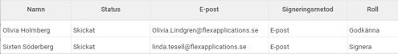
Översikt för e-signering
Vill du ha en översikt över alla dokument som skickats för e-signering kan du använda översiktsvyn som du hittar under Personal – E-signering. Här ser du dokument för de anställda du har behörighet att se dokument för i denna vy, vilket gör att en chef kan se dokumenten som gäller sin grupp, och någon på HR-avdelningen kan se en översikt över hela företaget.
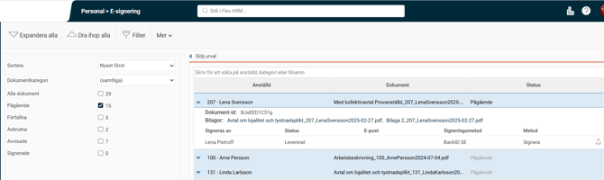
Till vänster i vyn kan du göra urval på vilka dokument som ska visas. Siffran bredvid kryssrutorna för respektive status visar hur många dokument som finns för aktuell status.
Listan innehåller en rad per dokument som skickats för signering. Du ser här vilken anställd dokumentet gäller samt status. Genom att klicka på raden kan du se fler detaljer gällande vilka som ska signera dokumentet. Du kan här också skicka en påminnelse till en mottagare genom att klicka på bjällran längst till höger.

Kommer du på att fel dokument har skickats kan du också avbryta e-signeringen genom att markera raden och klicka på knappen under listan. Här finns även en knapp för att ladda ner dokumentet.
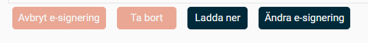
