# Digital signering - Hur använder jag e-signering via Verified i HRM?

**Datum:** den 25 augusti 2025  
**Kategori:** Employee  
**Underkategori:** Anställningshantering  
**Typ:** other  
**Svårighetsgrad:** advanced  
**Tags:** anställning, cv, dokument, signering  
**Bilder:** 19  
**URL:** https://knowledge.flexhrm.com/sv/integration-till-verified-0-0

---

Syftet med integrationen mellan Verified och HRM är att smidigt skicka anställningsdokument för e-signering. 
Denna artikel beskriver hur du använder e-signering via Verified- HRM.
⚙️
Administratör som ska sätta upp Verified för e-signering?
Här hittar du inställningarna.
Integration till Verified
Med denna modul kan du i HRM skicka Anställningsavtal, HR-blanketter och CV för digital signering i Verified och slipper på så sätt hantering av papper och manuella underskrifter. Chefer och HR med flera får i HRM en komplett översikt över alla pågående och signerade dokument och behöver därför inte arbeta i flera system med hanteringen.
Verifiedsköter e-postutskick till alla som ska signera, påminnelser om dokument som ännu inte signerats samt hantering av den tekniska signeringen. Alla dokument finns tillgängliga både i HRM och Verified.
Digital signering av dokument via Verified
Nedan följer en beskrivning av arbetsflödet gällande digital signering av dokument i HRM.
Skicka dokument för e-signering
För att skicka ett dokument för e-signering följer du nedan steg.
1. G
å
till akt
uell anställd i anställdaregistret. Här väljer du ett anställningsavtal
, en HR-blankett eller ett CV som du vill skicka för digital signering.

2. I nästa steg gör du önskade urval, såsom att lägga till bilagor till anställningsavtalet. Därefter kan du välja om du vill ladda ner avtalet som tidigare genom att klicka på knappen Ladda ner, eller om du istället vill skicka avtalet för digital signering genom att klicka på knappen Skicka för e-signering.

3. Du väljer i nästa steg vilka som ska signera samt om du vill sätta en deadline för signeringen.
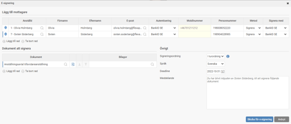
Systemet föreslår som standard att den anställde som dokumentet gäller samt att den inloggade användaren ska signera dokumentet. Tanken är att till exempel ett anställningsavtal ska signeras dels av den anställde, dels av en chef som skickar iväg avtalet för signering. Vill du istället att någon annan, eller kanske bara den anställde, ska signera kan du lägga till och ta bort mottagare för signering.
Om mottagaren finns i aktuellt företag och du har behörighet till den kan du enklast välja denne i första kolumnen. Du kan då också välja om det är den anställdes e-postadress för arbete eller privat som ska användas. Är det någon annan person som ska signera kan du istället fylla i namn och e-post manuellt.
4. Valet för autentisering har att göra med hur personen som öppnar dokumentet ska legitimera sig för att undvika att någon annan öppnar dokumentet. Ska autentisera ske med BankID behöver du också ange personnummer.
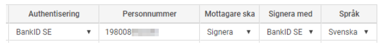
5. Därefter väljer du om mottagaren ska signera eller godkänna dokumentet. Signering är starkare och juridiskt bindande, medan godkännande inte kan räknas som juridiskt bindande. Om du valt signering ska du också ange om signering ska ske med BankID eller någon av de andra signeringsmetoderna som Verified erbjuder.
Du kan också välja vilket språk som gäller för mottagaren under signeringsprocessen.
6. I listan över dokument att signera kan du se vilka dokument och bilagor som kommer skickas för signering. Du kan här också lägga till eller ta bort dokument som ska signeras. Alla dokument kommer hanteras tillsammans i det Verified kallar ett kuvert som signeras tillsammans.

7. Innan du skickar ett dokument för signering kan du förhandsgranska det genom att klicka på dokumentikonen med förstoringsglas. Vill du dessutom redigera dokumentet innan det skickas klickar du först på ikonen i mitten, Ladda ner, redigerar dokumentet, sparar det på din dator och klickar sedan på ikonen till höger, Ladda upp, för att ladda upp ditt redigerade dokument som du vill ska skickas för signering. Tänk på att Ladda upp-ikonen inte blir aktiv förrän du först laddat ner dokumentet.
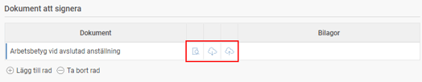
8. Signeringsordning innebär att du kan välja om mottagarna ska signera i tur och ordning eller om alla mottagare kan signera dokumentet parallellt.
Du kan också ange en deadline för signeringen. Då kommer Verified skicka ut påminnelser till mottagarna när deadlinen närmar sig enligt de inställningar du gjort under programlänken.
Vill du kan du också ändra det meddelande som mottagaren får vid signering av dokumentet.

9. När du sedan klickar på knappen Skicka för e-signering skickas dokumentet från Flex HRM till Verified, som i sin tur skickar ut e-postmeddelanden till mottagarna som ska signera.
Signera ett dokument
Mottagaren som ska signera ett dokument får ett e-postmeddelande som ser ut ungefär som bilden nedan. För att granska och signera dokumentet följer du instruktionerna.
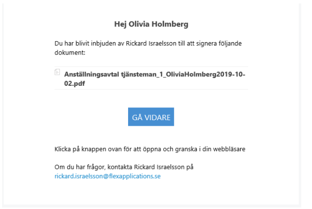
1. Klicka på länken och du kommer först till steget för autentisering. Här loggar du då in med BankID.
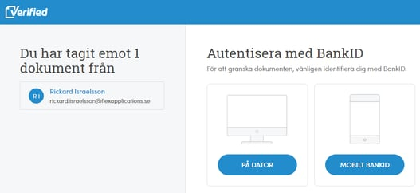
2. När autentiseringen är klar kommer du till dokumentet som ska granskas och signeras. Du kan här se dokumentet samt bilagor.
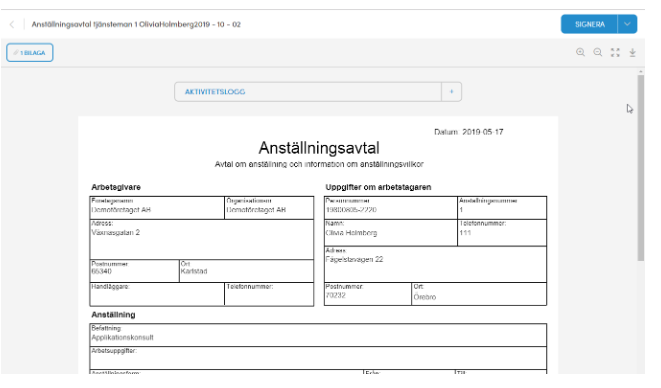
3. Uppe till höger kan du välja att signera eller avböja avtalet. Du kan också ladda ner egna kopior på dokumenten.
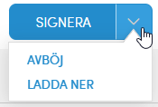
Väljer du att avböja får du ange anledningen som sedan går tillbaka till avsändaren.
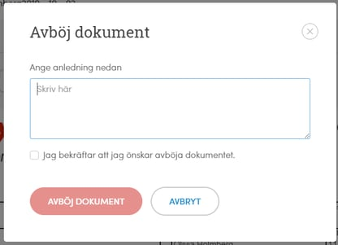
Väljer du att signera dokumentet får du i denna dialogruta först bekräfta att du godkänner eventuella bilagor, därefter väljer du vilken typ av BankID du vill signera med.
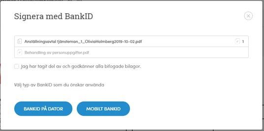
4. När signeringen är klar får du en bekräftelse på detta.
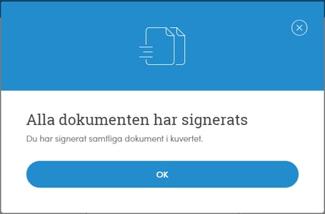
Den anställdes dokument
På fliken Dokument i anställdaregistret kan du se både dokument som är sparade i Flex HRM och dokument som är skickade för e-signering.
För dokument som är skickade för e-signering finns uppdaterad information i kolumnen Status. Aktuell status hämtas från Verified varje gång du går in på fliken. Klickar du på i-symbolen bredvid status får du mer information om vilka som ska signera och status för respektive mottagare.

Du kan här också ladda ner och öppna ett dokument som skickats för e-signering på samma sätt som för andra dokument. Om dokumentet är signerat kommer det i dokumentet finnas en sista sida som innehåller teknisk information om signeringen som gör dokumentet juridiskt bindande.

Översikt för e-signering
Vill du ha en översikt över alla dokument som skickats för e-signering kan du använda översiktsvyn som du hittar under
Personal – E-signering.
Här ser du dokument för de anställda du har behörighet att se dokument för i denna vy, vilket gör att en chef kan se dokumenten som gäller sin grupp, och någon på HR-avdelningen kan se en översikt över hela företaget.

Till vänster i vyn kan du göra urval på vilka dokument som ska visas. Siffran bredvid kryssrutorna för respektive status visar hur många dokument som finns för aktuell status.
Listan innehåller en rad per dokument som skickats för signering. Du ser här vilken anställd dokumentet gäller samt status. Genom att klicka på raden kan du se fler detaljer gällande vilka som ska signera dokumentet. Du kan här också skicka en påminnelse till en mottagare genom att klicka på bjällran längst till höger.
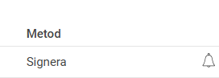
Kommer du på att fel dokument har skickats kan du också avbryta e-signeringen genom att markera raden och klicka på knappen under listan. Här finns även en knapp för att ladda ner dokumentet.

