# ⚙️Digitala checklistor - Hur skapar jag ett uppdrag i HRM?

**Datum:** den 17 september 2025  
**Kategori:** Employee  
**Underkategori:** Onboarding & Offboarding  
**Typ:** howto  
**Svårighetsgrad:** intermediate  
**Tags:** anställning, dokument, offboarding, onboarding  
**Bilder:** 19  
**URL:** https://knowledge.flexhrm.com/sv/digitala-checklistor-hur-skapar-jag-ett-uppdrag-i-hrm-0

---

HRM Employee effektiviserar onboarding och offboarding genom guidade anställningsprocesser där man kan följa upp uppdrag via en panel på startsidan. Uppgifter och Uppdrag kan även användas för uppföljning av andra HR- och löneprocesser. 

Denna artikel beskriver hur du kan skapa och aktivera hela arbetsflödet för uppdrag och uppdragsmallar.
Innehåll
Uppdragsvy
Uppdragsmall
Ansvarig för uppgifter
Kopiera mall eller uppgifter
Behörigheter
Skapa påminnelser
Skapa och hantera uppdrag och uppdragsmallar
Med funktionen
Uppdrag
kan du skapa och fördela arbetsflöden, till exempel checklistor för nyanställning eller andra processer. Du kan dela ut uppgifter till anställda med en bestämd deadline och sedan följa upp hur arbetet fortskrider.
Den anställde kan se sina tilldelade uppgifter direkt på startsidan och där markera när en uppgift är påbörjad och när den är klar. För att underlätta arbetet kan du skapa mallar för återkommande uppdrag. Det finns även möjlighet att bifoga dokument till uppgifterna och att bygga upp en trädstruktur för att förenkla uppföljningen.
Uppdragsvyn
Under
Administration > Register > Uppdrag
hanterar du alla uppdrag som du har skapat eller är ansvarig för.
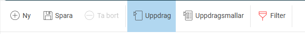
Du kan strukturera uppdragen i en trädstruktur för att få en bättre överblick. I listan till vänster ser du alla uppdrag, deras status, vem som är ansvarig och när de ska vara klara. Uppdrag som har passerat sitt datum för deadline utan att markeras som klara blir rödmarkerade i listan.
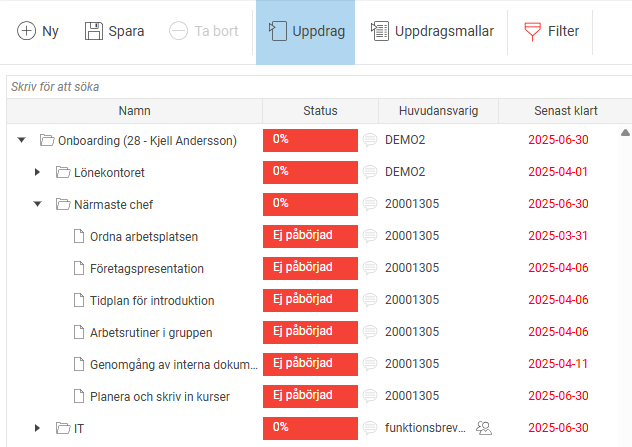
Uppdrag kan skapas som huvud- och delmoment (visas som mappar) eller som uppgifter (den lägsta nivån i strukturen). Du kan ange startdatum, sista klardatum, ansvarig och en beskrivning för alla nivåer. Du kan även bifoga filer till både moment och enskilda uppgifter.
Hur du startar nya uppdrag kan du läsa mer om
HÄR
.
Uppdragsmallar
För att underlätta när du skapar nya uppdrag kan du använda u
ppdragsmallar
. Du växlar mellan uppdrag och uppdragsmallar med hjälp av knapparna i menyraden.

Du skapar uppdragsmallar på nästan samma sätt som vanliga uppdrag, med skillnaden att mallarna inte har något start- eller slutdatum. All information du lägger in i mallen, som ansvarig person eller bifogade filer, följer med när du sedan använder mallen för att skapa ett nytt uppdrag.
Skapa mallar för nyanställning och avslut
Nu ska vi gå igenom hur du skapar uppdragsmallar som innehåller de uppgifter som ska utföras vid en nyanställning (onboarding) eller ett avslut (offboarding). Detta gör du under
Administration > Register > Uppdrag
via knappen
Uppdragsmallar
.
Vi rekommenderar att du delar upp varje mall i undermappar för att skapa en tydlig struktur, till exempel baserat på vem som ansvarar för de olika uppgifterna. Fundera igenom vilka uppgifter som är aktuella i just din organisation och vem som ska göra vad. Om det till exempel alltid är samma person som beställer en ny dator kan du med fördel lägga in den personen som ansvarig direkt i mallen.
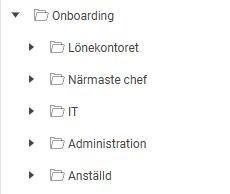
Klicka på
Ny
och skapa din mall.
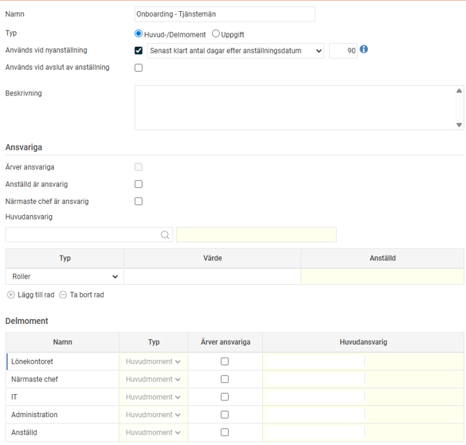
För att mallen ska kunna användas vid nyanställning och avslut av anställning markerar du detta med en kryssruta för
Används vid nyanställning
alternativt
Används vid avslut av anställning
.
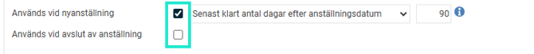
Här anger du också när uppdraget ska vara klart, relativt anställnings- eller avgångsdatum. Du kan även sätta olika datum för olika delar av uppdraget för att exempelvis säkerställa att nödvändig utrustning finns på plats när den anställde börjar.
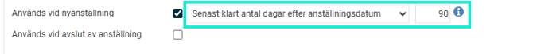
Tänk på att datumet för
Senast klart
på ett huvudmoment styr de datum du kan ange på underliggande uppgifter och delmoment.
Utgå från när hela processen, till exempel en hel onboarding eller offboarding, ska vara färdig. Om det sista steget är ett uppföljningssamtal med medarbetaren 90 dagar efter anställningsdatumet, är det 90 dagar du ska ange som
Senast klart
på huvudmomentet.
Skapa huvudmoment/mappar
Skapa sedan de huvudmoment du önskar. Klicka på
Lägg till rad
, skriv in namn och
spara
.
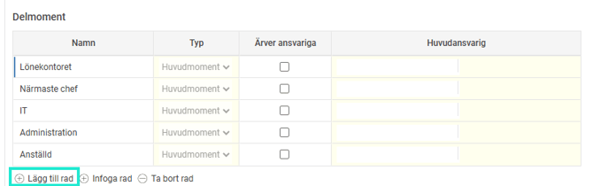
Skapa uppgifterna till checklistan
När huvudmomenten är skapade är det dags att lägga till de faktiska uppgifterna. Klicka på mappen i trädstrukturen till vänster.
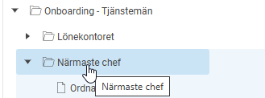
Under
Delmoment
klickar du på
Lägg till rad
för att lägga till uppgifter. I exempelbilden nedan visas uppgifterna som lagt till under huvudmomentet Närmaste chef.
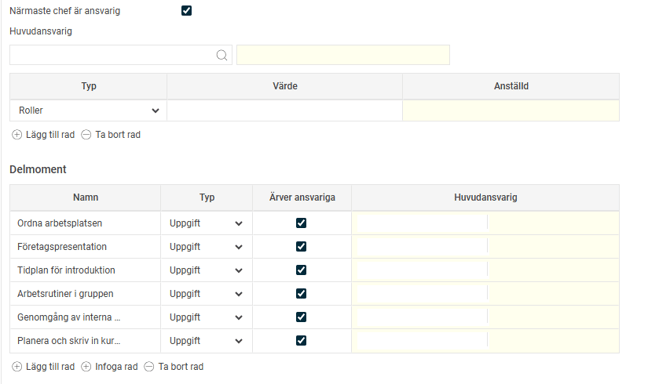
När du skapat dina uppgifter med namn och sparat, klickar du dig in i uppgiften via menyn till vänster.
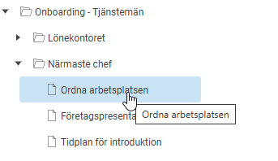
I uppgiften sätter du sen önskad deadline för
Senast klart
,
Beskrivning
,
Ansvarig
och bifogar eventuella filer.
Spara.
Ansvarig för uppgifter
För uppgifterna sätts en ansvarig som ska utföra uppgiften.
Skapar du ett uppdrag utifrån en uppdragsmall sätts den eller de som är ansvariga i mallen även som ansvariga i uppdraget.
Saknas ansvarig i mallen kommer ingen ansvarig sättas i uppdraget. De måste då kompletteras manuellt på det aktuella startade uppdraget i vyn
Uppdrag
.
En ansvarig kan vare en specifik användare, en roll eller en hel hemkontering. Sätts ansvarig på roll eller kontering innebär det att alla som har rollen eller är kopplade till den aktuella konteringen blir ansvariga för uppgiften.
Observera att om man lägger ansvariga mot roller så kommer alla som har den rollen att få ut uppgiften. Sedan är det någon av de som har rollen som behöver klarmarkera uppgiften, det kan vem som helst av de som har den rollen göra. Ett vanlig exempel när detta kan användas är för en IT-avdelning där man inte har bestämt vem som ska göra uppgiften, utan det varierar från gång till gång och det är den som först hanterar uppgiften som blir ansvarig.
Huvudansvarig kan anges både för hela uppdrag (huvudmoment) och för enskilda uppgifter eller delmoment.
Du kan lägga till flera ansvariga, men huvudansvarig är den som tydligt står som ansvarig för uppgiften.
Alla ansvariga, inklusive huvudansvarig, kan se och klarmarkera uppgiften om de har rätt behörighet. Om flera personer är ansvariga behöver ni internt komma överens om vem som faktiskt ska utföra uppgiften.
Det finns en särskild funktion i uppdrag för att sätta att
närmaste chef eller anställd är ansvarig för uppgiften. Används
Anställd är ansvarig
eller
Närmaste chef är ansvarig
sätts ansvarig från registret.
Här kan du läsa mer om Närmaste chef.
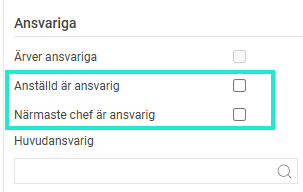
Om du markerar att
ansvarig ska ärvas,
kommer underliggande uppgifter eller delmoment automatiskt att få samma ansvarig som huvudmomentet (den övre mappen). Är bocken för närmaste chef eller anställd ibockad kommer den inställningen ärvas från ovan nivå. Om du vill ändra på någon nivå behöver du först bocka ur ärver för att kunna välja chef/anställd istället.
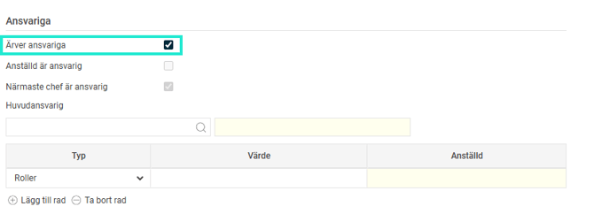
Är det tomt i listan när du ska välja Huvudansvarig eller ansvarig användare?
Då beror det på att rollen/rollerna inte har rätt behörigheter. För att kunna ta emot och hantera uppgifter måste användaren ha en roll som har panelen
Uppdrag
på startsidan (Hem). Vanligt är att aktivera det på medarbetarrollen, så att alla medarbetare kan ta emot uppgifter. Se mer under
Behörigheter.
Kopiera uppdragsmallar
Du kan kopiera hela uppdragsmallar eller enskilda delar, som ett delmoment eller en specifik uppgift.
Markera den del av mallen (noden) som du vill kopiera i listan.
Klicka på knappen
Kopiera
.
Välj var du vill klistra in den kopierade delen och klicka på
Klistra in
. Om du inte väljer en specifik plats kommer den att klistras in som en ny huvudmall.
Du kan också kopiera eller flytta delar genom att dra och släppa dem i trädstrukturen. När du släpper får du upp en dialogruta där du bekräftar om du vill kopiera, flytta eller avbryta åtgärden.
Behörigheter
För att kunna använda funktionen behöver du tilldela rätt behörigheter. Det gör du under
Administration > Användare/Behörigheter > Roller
.
Användare som ska kunna se sina uppgifter på startsidan behöver ha behörighet till panelen
Uppdrag
.
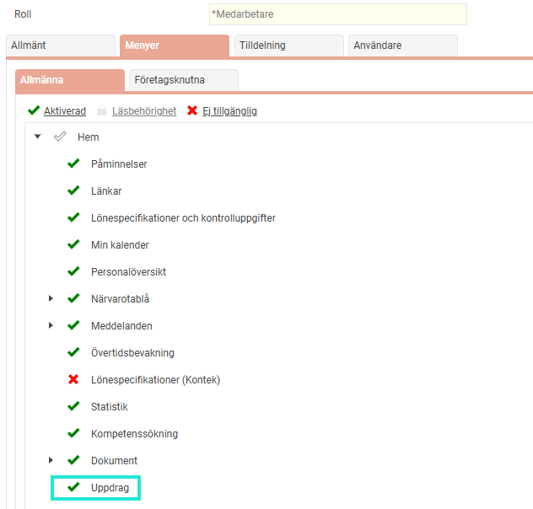
Användare som ska kunna dela ut och följa upp uppdrag behöver ha behörighet till
Administration > Register > Uppdrag
.
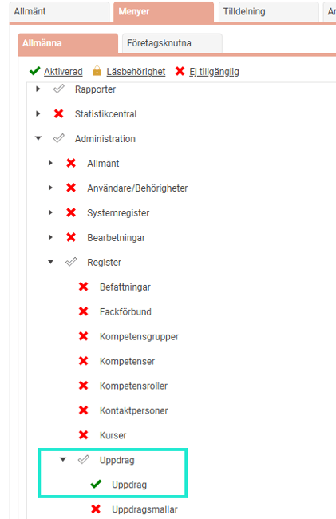
Ska användare bara kunna se uppdragen men inte ändra, dela ut eller delegera uppgifterna räcker det med "läsbehörighet".
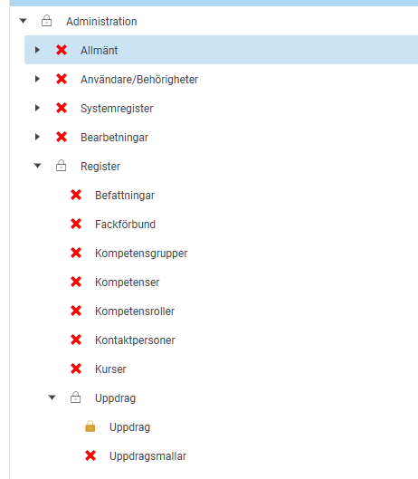
Användare som även ska kunna skapa och redigera uppdragsmallar behöver behörighet till
Administration > Register > Uppdragsmallar
.
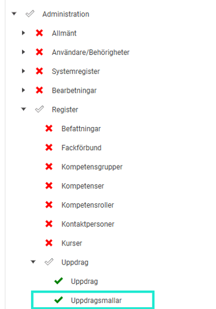
Ställ in påminnelser för uppgifter
För att aktivera automatiska påminnelser för nya uppgifter, gå till
Administration > Inställningar > Allmänt > Påminnelser
.
Här skapar du en påminnelse av typen
Uppgift
och anger när den ska skickas.
Ny uppgift
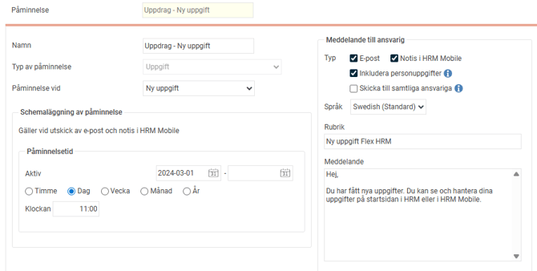
Uppgift senast klar
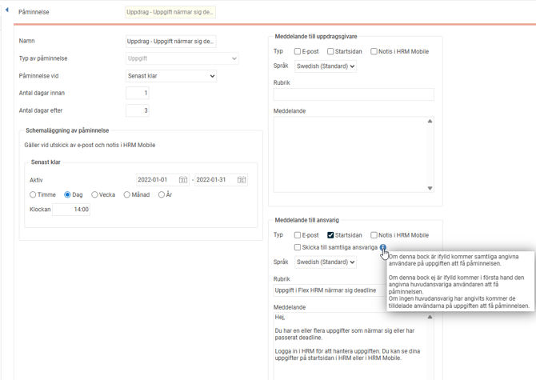
Relaterade artiklar
Hur hanterar jag uppgifter och uppdrag i HRM?
Hur skapar jag nya uppgifter och uppdrag i HRM?
Hur hanterar HRM Employee onboarding av anställda?
Hur hanterar HRM Employee offboarding av anställda?
