# ⚙️Exempel på egna fält i HRM Employee

**Datum:** den 11 september 2025  
**Kategori:** Employee  
**Underkategori:** Anställningshantering  
**Typ:** config  
**Svårighetsgrad:** intermediate  
**Tags:** cv, dokument, hrm-employee, medarbetarsamtal, signering  
**Bilder:** 27  
**URL:** https://knowledge.flexhrm.com/sv/exempel-egna-falt-i-hrm-employee-0-0

---

Egna fält kan byggas under befintliga flikar i personregistret eller i egna flikar. Dessa erbjuder en frihet för er att välja hur flikarna ska byggas, vilket innehåll som ska visas och på vilket sätt. Med hjälp av egna flikar kan du styra var informationen ska synas och vem som ska se informationen.

Denna artikel visar exempel på hur olika typer av fält kan byggas i HRM.
Här hittar du mer info om hur du bygger egna flikar och fält i HRM
Exempel på olika typer av egna fält
💡Nedan ser du exempel på olika typer av fält som kan byggas
Textfält med datumhistorik
Radioknappar och listor
Formulärmallar och medarbetarsamtal
Fält med stjärnor och kryssrutor
Tabeller
Datumfält för bevakning
Exempel: IT-utrustning med fältgrupp med datumhistorik och text som fälttyp
Valbart med datumhistorik
Du kan välja om fältens värden i en
fältgrupp
ska kunna sparas med eller utan datumhistorik. Detta val gör man när du skapar fältgruppen första gången och kan därefter inte ändras.
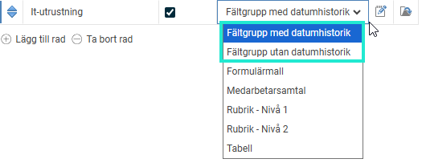
Fält med
datumhistorik
används för att kunna ha en datumstyrning för ett värde samt få en historik på värdets förändring. Detta är användbart för till exempel lönetillägg och olika förmåner.
I anställdaregistret visas fältet enligt nedan med dagens aktuella värde för respektive fält. För att ändra fältets värde samt se datum-historiken klickar man på ikonen till höger på raden.
Så här kan ett exempel se ut där vi använder datumfält:
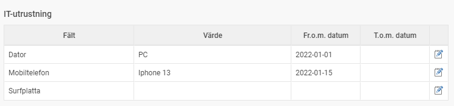
Du sätter upp exemplet ovan enligt bilderna nedan:
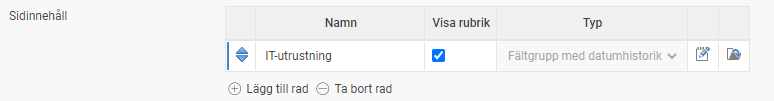

Exempel: Passageutrustning – med Rubrik - Nivå 1,
fältgrupp utan datumhistorik och radioknappar
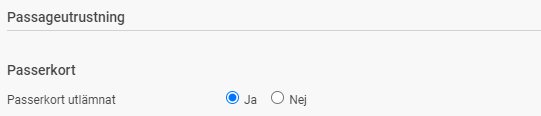
För att sätta upp ovan fält, gör enligt bilderna nedan:
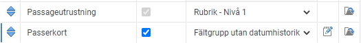
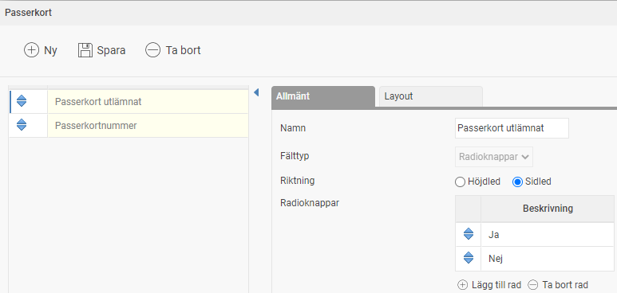
Exempel: Arbetskläder – med Rubrik - Nivå 1, fältgrupp utan datumhistorik och fälttyp radioknappar och lista
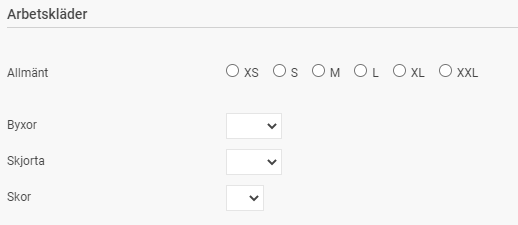
För att sätta upp ovan fält, gör enligt bilderna nedan:
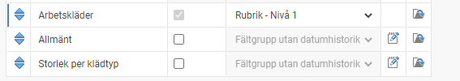
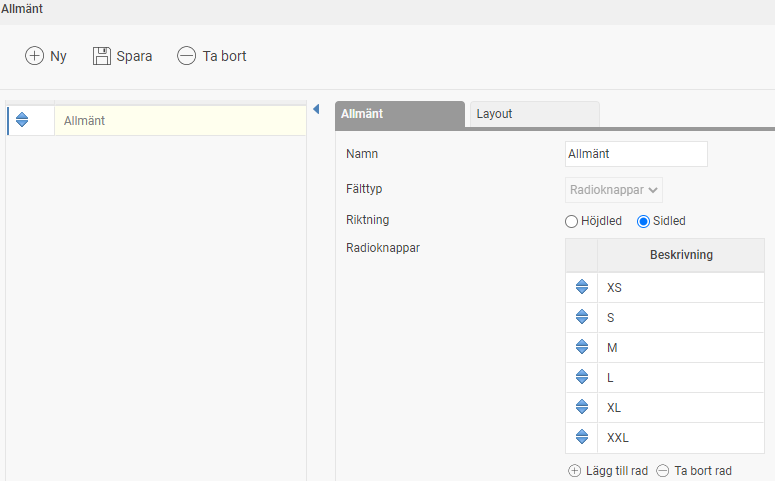
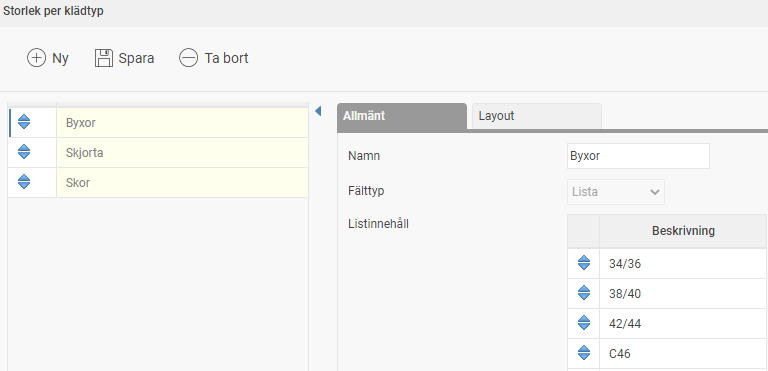
Exempel:  Formulärmallar eller medarbetarsamtal – med formulärmall/medarbetarsamtal med gradering, rubriker och textfält
HRM Employee erbjuder systemstöd för att förenkla hanteringen av
medarbetarsamtal
och samla information på ett ställe utan att behöva arbeta med externa dokumentmallar. Man kan skapa flera olika mallar för medarbetarsamtal att använda för olika typer av samtal.
Grundläggande inställningar
Det första du behöver göra är att skapa en yta för medarbetarsamtal i anställdaregistret (om det inte redan finns).
Här väljer du fliken för medarbetarsamtal. Därefter lägger du till
sidinnehåll
genom att skapa en rad i listan, ge den ett namn som du vill ska användas i anställdaregistret samt välja typen
Medarbetarsamtal
. Här är ett exempel på hur det kan se ut:
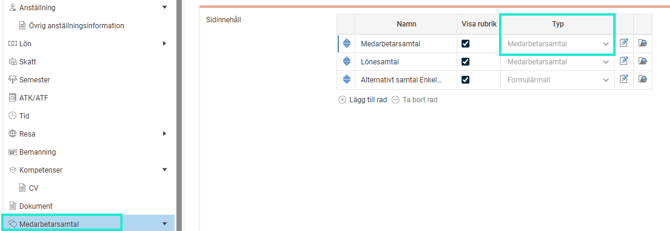
Förutom typen Medarbetarsamtal kan du välja typerna
Formulärmall
och
Fältgrupper
. För mer information om fältgrupper kan du läsa föregående avsnitt om egna fält. Typerna Medarbetarsamtal och Formulärmallar är dock olika. Skillnaden är att för typen Medarbetarsamtal anger du ansvarig samt datum när du fyller i en mall i anställdaregistret.
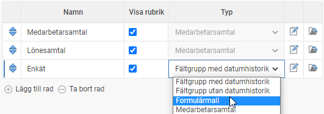
Tanken är att man ska kunna använda dessa
formulärmallar
till annat än bara medarbetarsamtal. Man skulle till exempel kunna skapa upp olika enkäter och låta de anställda svara på olika frågor. De kan även användas för enklare samtalsformulär (där ansvarig och signering inte är så viktigt att notera) exempelvis vid uppföljning- eler kortare avstämningssamtal. Användningsområdena kan vara många, så här är det upp till dig att använda fantasin för att komma fram till hur just er organisation kan nyttja möjligheten med formulär.
Mallar för samtal
När man har skapat ett sidinnehåll för medarbetarsamtal eller formulärmallar är det dags att
skapa mallar
. Detta gör du genom att
klicka på ikonen till höger i listan
. I fönstret som öppnas skapar du de olika mallarna som innehåller de frågor som ska fyllas i under medarbetarsamtalet eller i formuläret.
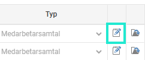
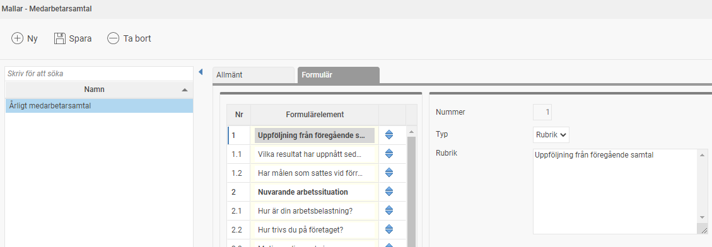
Till vänster i bild listas de olika mallarna. För varje mall ska du sätta ett
namn
samt välja om den ska vara
aktiv
eller inte. Detta är användbart om man har arbetat med en mall en tid, men sedan vill ändra frågorna i mallen. Då kan man inaktivera den gamla mallen och skapa en ny mall som ska användas framöver.
Därefter är det dags att skapa de olika
rubrikerna
och
frågorna
i mallen, det görs under
Formulär
. I listan ser du en översikt över mallens olika rubriker och frågor. Här lägger du till och tar bort frågor och rubriker med knapparna under listan.
För att se detaljer eller ändra en fråga
markera raden i listan
.
Du kan ändra ordningen på frågor och rubriker i listan genom att dra och släppa raderna i listan med hjälp av
pilarna
till höger.
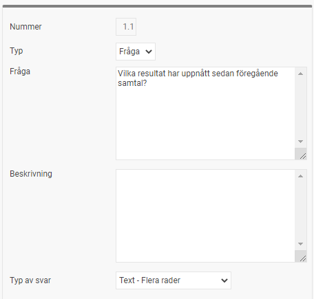
Varje rubrik eller fråga har en rad egenskaper som du matar in till höger om listan.
Nummer
Varje rubrik och fråga får automatiskt ett nummer. Den första rubriken får nummer 1, den andra nummer 2 osv. Den första frågan efter rubrik 1 får nummer 1.1, den andra frågan under rubrik 1 får nummer 1.2 osv. På så sätt byggs en struktur för formuläret upp.
Typ
Här anger du om det är en
Rubrik
eller
Fråga.
Fråga/Rubrik
Här matar du in texten för rubriken eller frågan som ska visas i formuläret.
Typ av svar
Om det är en fråga väljer du här vilket typ av svar man ska kunna mata in. Du kan välja mellan följande:
Text – En rad
Används för ett kortare svar
Text – Flera rader
Används om man tillåter ett längre, mer utförligt svar.
Gradering enligt skapa (1-5)
Används till svar där man vill ha en bedömning på en skala 1-5.
Läs mer om funktionaliten i medarbetarsamtal, under avsnittet
Medarbetarsamtal.
Exempel: Personalintroduktion – med Rubrik 1-2, fältgupp utan datumhistorik med stjärnor och kryssrutor
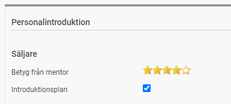
För att sätta upp exemplet ovan, gör enligt bilderna nedan:
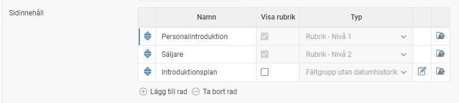
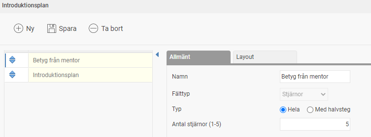
Exempel: CV – Tabell
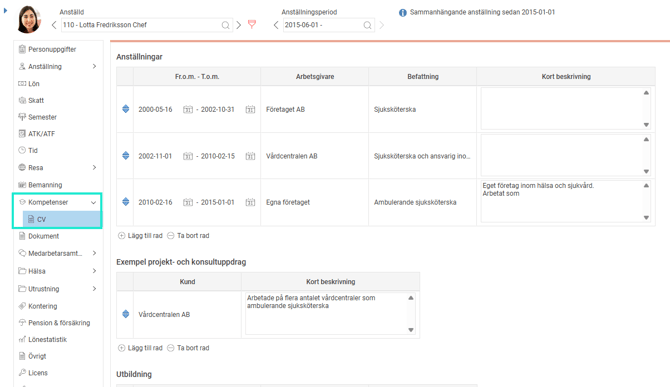
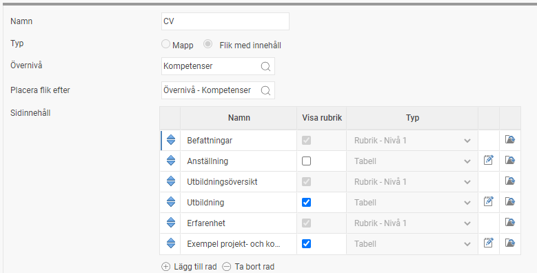
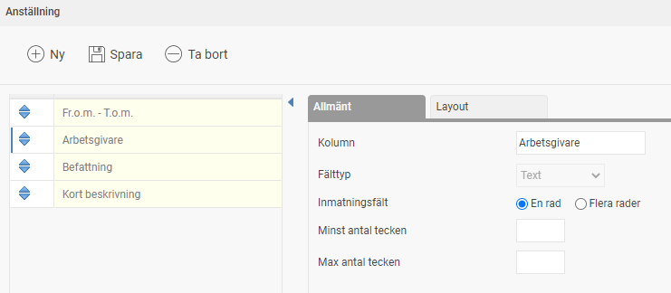
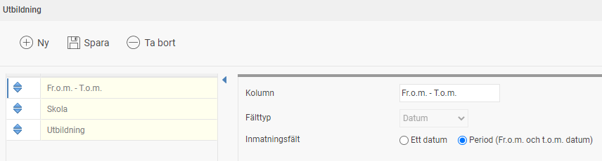
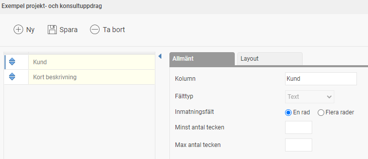
Exempel på datumfält för bevakning
Det finns möjlighet att skapa egna fält av typen datumfält. På så sätt kan man enkelt välja ett korrekt datum även för egna fält som kan vara användbart i till exempel egna tabeller eller för fält som du önskar sätta en bevakning på.
Välj Fältgrupp utan datumhistorik med fälttypen Datum. Därefter väljer du om du vill ha ett fristående datum, eller en datumperiod där du anger både fr.o.m.- och t.o.m.-datum.
Exempel på Inventeringsdatum – med datumfält
Som ett exempel tänker vi oss att man har ett fält för nyckelkort upplagt i systemet och att man årligen vill inventera dessa nyckelkort relativt när den anställde fick nyckelkortet. För att hålla reda på detta behöver vi ett inventeringsdatum per anställd.
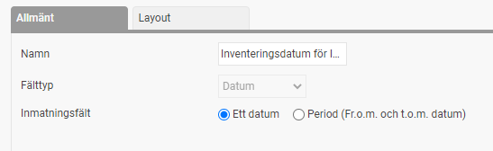
I anställdaregistret får vi då ett fält där vi bara kan ange ett korrekt datum enligt användarens nationella inställningar.
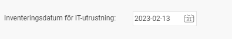
Ett konkret användningsområde för datumfält är möjligheten att sätta påminnelser relativt ett inmatat datum. Detta blir perfekt i vårt exempel för att ge chefen en notis till exempel 30 dagar före inventeringsdatumet.
Exempel på hur man kan ställa in en påminnelse för ett eget fält:
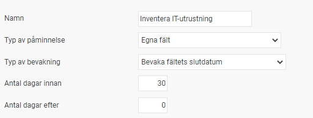
