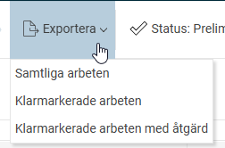
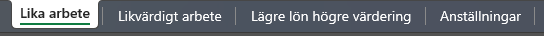

# Exportera värden från Lönekartläggningen i HRM

**Datum:** den 4 november 2025  
**Kategori:** Employee  
**Underkategori:** Anställningshantering  
**Typ:** other  
**Svårighetsgrad:** intermediate  
**Tags:** Ingen  
**Bilder:** 2  
**URL:** https://knowledge.flexhrm.com/sv/export-i-hrm-lonekartlagging-0

---

Export
Du kan exportera följande från lönekartläggningen
Samtliga arbeten
Klarmarkerade arbeten
Klarmarkerade arbeten

När du tar ut exporten får du den i Excell. Här kan du se detaljuppgifter på anställda som ingår i lönekartläggningen, samt kommentarer och klarmarkeringar från de olika analysvyerna.

💡 Tips!
Om du behöver göra en omräkning av lönekartläggningen
efter
att du har påbörjat analyserna i
Likvärdigt arbete
eller
Lägre lön högre värdering
, är det viktigt att veta att omräkningen tar bort dessa kommentarer och klarmarkeringar.
Ta därför först ut en export av samtliga arbeten. Då har du en lista med alla kommentarer att gå tillbaka till när du behöver skriva in dem på nytt i analyserna.
