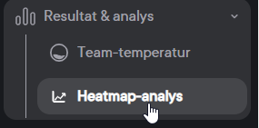
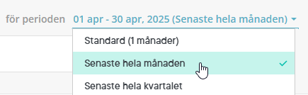

# Frågor och svar - Winningtemp & HRM

**Datum:** den 11 september 2025  
**Kategori:** Employee  
**Underkategori:** Integration  
**Typ:** other  
**Svårighetsgrad:** advanced  
**Tags:** Ingen  
**Bilder:** 2  
**URL:** https://knowledge.flexhrm.com/sv/fragor-och-svar-winningtemp-paneler-0

---

Den här artikeln svarar på vanligt förekommande frågor om integrationen om Winningtemp & HRM
Kan vi visa SMART-index i HRM?
Nej, SMART-index ser du endast i Winningtemp
Visas jämförande index för organisation eller bransch i HRM?
Nej, index som är jämförande med bransch/organisation finns inte med i API-integrationen. Du kan se och ställa in ett jämförande index i Winningtemp, men det kan inte visas i HRM Dashboard.
Kan man kombinera alla “Fråga” med alla “Typ av fråga”?
Index
- kan kombineras med Temperatur och eNPS.
Kategori
- kan kombineras med Temperatur och Custom.
Fråga
- kan kombineras med Temperatur och Custom.
Kan vi styra behörighet för Dashboarden i HRM?
Behörighet per dashboard gäller inte för paneler med data från Winningtemp.
Siffrorna i HRM och i Winningtemp är inte samma, vad beror det på?
För att se att siffrorna stämmer så behöver ni jämföra HRM dashboard med de resultat som ni ser i Winningtemps
Heatmap-analys
med valet för perioden “Senaste hela månaden”.
Detta beror på att panelen i HRM alltid visar hel månad. I Winningtemp finns det möjlighet att se resultaten från mätningarna både på aktuellt datum och för hel månad.
Bilderna nedan visar hur du hittar
Resultat & analys - Heatmap-analys - Senaste hela månaden
i Winningtemp.

Relaterade artiklar
⚙️Exempel på Winningtemp-paneler i HRM Dashboard
⚙️Skapa Dashboard i HRM med Winningtemp-paneler
⚙️Pulsmätningar och medarbetarundersökningar - Hur integrerar jag Winningtemp & HRM?
