# Genomför Lönekartläggning i HRM - Steg 1 förberedelser

**Datum:** den 1 december 2025  
**Kategori:** Employee  
**Underkategori:** Anställningshantering  
**Typ:** other  
**Svårighetsgrad:** intermediate  
**Tags:** anställning  
**Bilder:** 12  
**URL:** https://knowledge.flexhrm.com/sv/genomfor-lonekartlaggning-i-hrm-forberedelser-0

---

Den här guiden hjälper dig att genomföra en lönekartläggning i HRM steg för steg.

Lönekartläggning är ett lagkrav (Diskrimineringslagen 2008:567 3kap.) och ska utföras varje år i syfte att arbetsgivaren ska upptäcka, åtgärda och förhindra osakliga skillnader i lön och andra anställningsvillkor mellan kvinnor och män. Det är alltså ett viktigt verktyg i arbetsgivarens arbete mot diskriminering och jämställda löner.
Skapa ny lönekartläggningen
Gå till
Personal > Lönekartläggning
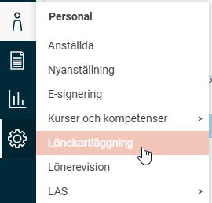
Klicka på
Ny
och döp din lönekartläggning.
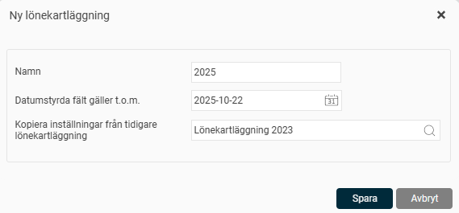
Bestäm t.o.m. vilket datum de datumstyrda fälten som t.ex. löner och lönetillägg minst ska gälla till. Har du ett fält som börjar gälla efter valt datum kommer det inte synas i lönekartläggningen.
Här väljer du också
om du vill kopiera förberedelser och arbetsvärdering f
rån tidigare lönekartläggningar. I de fall du inte vill att föregående lönekartläggning ska kopieras (läs mer om det under Förberedelser) så kan du välja vilken tidigare lönekartläggning du vill kopiera ifrån. Lämnar du fältet tomt kommer ingen lönekartläggning kopieras utan du behöver göra alla förberedelser (faktorplan finns enligt standardmall) och arbetsvärderingen på nytt.
När du
sparar
ovan kommer du få en notis om att det sker en bearbetning och när lönekartläggningen skapats upp.
Vilka anställda kommer med?
Samtliga anställda med
Anställningstyp
Anställd (exklusive VD) tas med i lönekartläggningen. Personer som har Anställlningstyp Extern personal i menyn
Anställning
i HRM kommer inte med i lönekartläggningen.
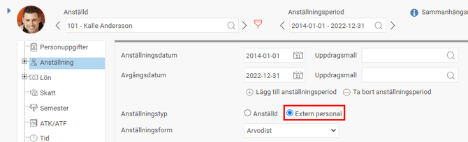
Observera att anställningstyp Extern personal även påverkar andra funktioner i HRM såsom till exempel Payroll och viss statistik.
Vem som är
VD
i företaget anges under inställningen
Företag
.
Förberedelser
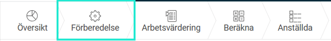
Inställningar som görs under
Förberedelser
ligger till grund för hela lönekartläggningen och kopieras även med till nästa lönekartläggning som du skapar. Varje lönekartläggnings inställningar kan ändå redigeras så länge detta steg inte är klarmarkerat. Det påverkar inte andra redan skapade lönekartläggningar utan enbart den du just arbetar med.
Nedan följer de inställningar som kan ställas in i steget
Förberedelser.
Gruppering för arbetsvärdering
Här väljer du vilka arbeten/grupperingar som ska värderas. Det går att välja på befattningsregistret och samtliga konteringar med undantag för konteringen som används som Närmaste chef. Syftet med att gruppera är att kunna jämföra och analysera anställda som har lika arbeten dvs de med samma eller väldigt lika arbetsuppgifter.
Välj mellan
Befattning
,
Befattning (egen gruppering)
eller valfri kontering.
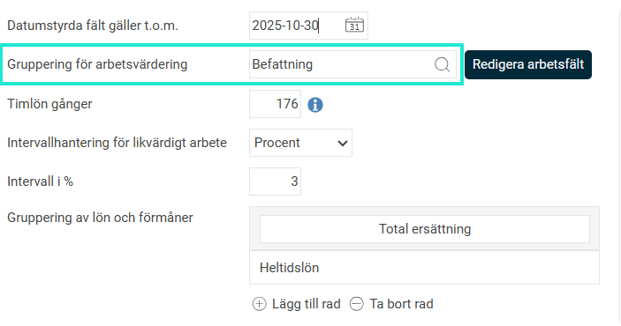
Vilken gruppering ska jag välja?
Befattning -
Används om varje titel i befattningsregistret ska vara ett eget arbete. Inga befattningar är så pass lika när det gäller arbetsuppgifter att de kan slås ihop.
Befattning (egen gruppering) -
Används då flera titlar (befattningar) kan grupperas ihop till ett och samma arbete. Exempelvis har ni befattningarna Projektkoordinator, Affärskoordinator och Utbildningskoordinator, alla dessa gör i stort sett lika arbetsuppgifter och kan då samlas under ett och samma arbete i lönekartläggningen. Du skapar då upp arbetena i lönekartläggningen under
Redigera arbetsfält
, i detta exempel kallar du arbetet "Koordinator".
Kontering -
Används då ni har behov av att gruppera på annat sätt. Exempelvis ni har befattningen Projektledare. Alla anställda som projektledare har samma befattning i fältet befattning i HRM. Men inom befattningen projektledare finns det projektledare vars arbetsuppgifter ser väldigt olika ut, ni har svårt att arbetsvärdera detta arbete som ett och samma. Ni skapar då en kontering och definierar per anställd om den anställde är Senior projektledare, Intern projektledare eller Junior projektledare. På så sätt kan ni arbetsvärdera varje enskild grupp för sig.
⚠️OBS! Detta alternativ kommer att tas bort i Flex HRMs nya version av Lönekartläggning som släpps under 2026. Vi rekommenderar därför att redan nu fundera på ert arbetsflöde och se över er struktur av befattningar inför 2026.
Redigera arbetsfält
behövs i de fall du lagt till något i valt registret/valda listan eller om du vill ta bort något av arbetena. Exempelvis om du använder befattningsregistret som gruppering kan du behöva ta bort befattningen för VD eftersom den inte ska ingå i analysen. Det används även för att skapa eller redigera grupper/arbeten när du valt Befattning (egen gruppering), se avsnitt nedan.
Varning!
Om du efter att ha startat en lönekartläggning vill byta grupperingen ovan kan du göra det men får en pop-up som varnar om att det kommer rensa samtliga svar som fyllts i under fliken Arbetsvärdering.
Gruppering för arbetsvärdering - Befattning (egen gruppering)
Detta val är till dig som många befattningar och där vissa har liknande krav och därför kan grupperas ihop innan arbetsvärderingen påbörjas.
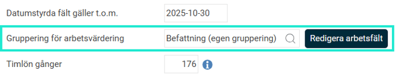
När du valt grupperingen
Befattning (egen gruppering)
likt bilden ovan så klickar du på
Redigera arbetsfält
för att skapa era arbeten/grupper.
Tänk på att du måste skapa ett arbete även för befattningar som inte ska grupperas med någon annan befattning.
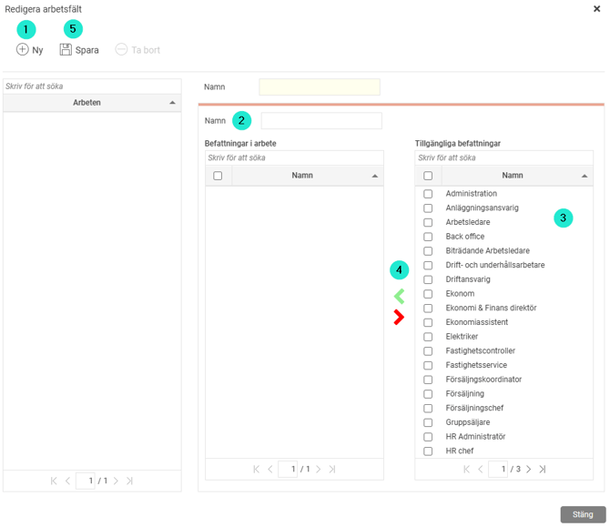
Klicka på
Ny
Döp arbetet till ett
namn
Välj vilken eller vilka befattningar som ska ingå i arbetet
Klicka på den
gröna pilen
för att lägga till dem i kolumnen för Befattningar i arbete. Om du råkar lägga till en befattning för mycket i ett arbete markerar du det bara och klickar på den
röda pilen
för att få det tillgängligt för ett annat arbete istället.
Spara
Börja om på 1 för att skapa upp samtliga arbeten
Här ser du ett exempel på ett arbete som innehåller fler befattningar
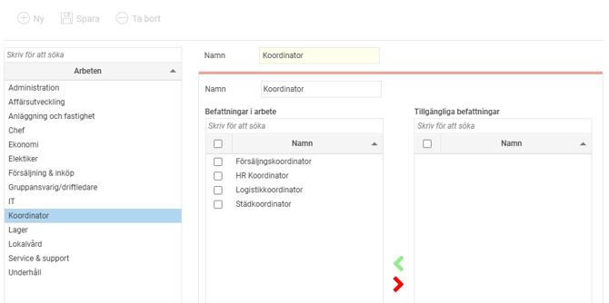
Här ser du ett exempel på ett arbetet som innehåller en befattning

Timlön
Timlön gånger faktorn som är skriven i detta fält motsvarar omräkningen till heltidslön. Det kommer räknas lika för samtliga med timlön på företaget så det likvärdigt går att jämföra.
Intervallhantering för likvärdigt arbete
För att få fram vilka arbeten som är likvärdiga behöver poängen som senare framkommer per arbete i arbetsvärderingen grupperas. Syftet med att gruppera likvärdiga arbeten är att kunna jämföra och analysera de arbeten där anställda räknas bidra med lika stort värde bl.a. utifrån ansvar och erfarenhet, även om deras arbetsuppgifter inte är lika.
Här väljer du om grupperingen ska beräknas utifrån en procent eller ett intervall:
För procent
måste du skriva en siffra mellan 2 och 10
.
När du använder procent förhåller sig lönekartläggningen till maxpoängen i faktorplanen. Är faktorplanens maxpoäng 640 med inställning på 3%, anses ett arbete likvärdigt ett annat arbete om det ligger inom 19 poäng.
För egna intervall
kan du själv bestämma hur stora och hur många intervall du vill använda för just era likvärdiga arbeten genom att lägga till rader. Döp varje grupp och ange vilket poängintervall som gäller.
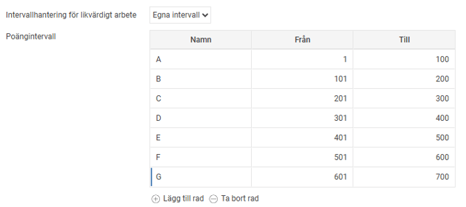
Gruppering av lön och förmåner
För att bestämma vilka fält/förmåner förutom heltidslön som ska jämföras i lönekartläggningen grupperar du dessa här. Syftet med detta är att jämföra de anställdas lön utifrån den ersättning de faktiskt får och inte enbart heltidslön. Du kan själv döpa om rubriken, vilken även är namnet på denna kolumn som visas i lönekartläggningen.
Lägg till rad
för att lägga till de fält som ska ingå.
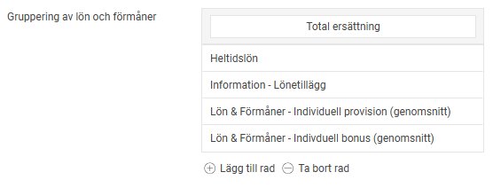
OBS! För att kunna välja på numeriska egna fält, så som lönetillägg, behöver du ställa in det i
inställningarna
först.
Faktorplan
Faktorbaserade arbetsvärderingar har en s.k. faktorplan. Faktorplanen består av frågor för de faktorer du senare utgår ifrån i din arbetsvärdering, de finns här definierade och nivåindelade.
Syftet med inställningen är att kunna ställa in hur många poäng varje faktor ska värderas utifrån samt vilken viktning som gäller för respektive faktor. Viktning väger de olika faktorerna mot varandra och bestämmer deras inbördes inflytande. En viktning på 1,00 betyder att det inte är någon viktning.
Det finns tre typer av faktorplaner i HRM att välja på.
Varje faktorfält kan ha ett svar
Enbart ett svarsalternativ per faktorfält/fråga är tillåtet och ger då angiven poäng samt eventuell viktning. Detta lämpar sig där ett alternativ stämmer, exempelvis enligt nedan bild:
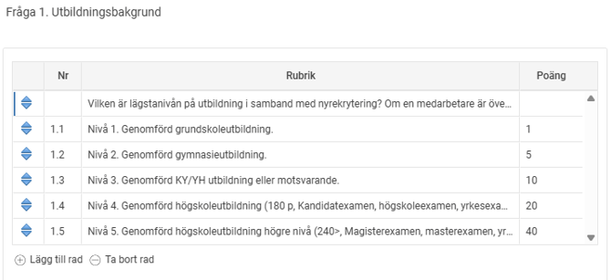
Varje faktorfält kan ha flera svar
Varje svarsalternativ på ett faktorfält/en fråga/ett område går att svara på och ger då angivna poäng för samtliga svar inkl. eventuell viktning.
⚠️OBS! Detta alternativ kommer att tas bort i Flex HRMs nya version av Lönekartläggning som släpps under 2026. Vi rekommenderar därför att se över er arbetssätt och anpassar era inställningar redan nu.
Ange färdiga poäng per arbete
Har du redan en färdig arbetsvärdering? Då kan du själv ange aktuell poäng per arbete här antingen manuellt eller via filimport. Detta är användbart om du t.ex. använder ett befintligt system för arbetsvärdering som t.ex. BAS eller BESTA. Detta alternativ innebär att ingen arbetsvärdering görs i HRM vilket gör att fliken Arbetsvärdering utgår.
Återställ till standard
Du kan när som helst återgå till den standardfaktorplan som kommer med lönekartläggningen i Flex HRM genom att klicka på
Återställ till standard
. Då raderar du eventuella egna justeringar som gjorts i faktorplanen. Det återställer enbart aktuell lönekartläggnings faktorplan.
Denna knapp ger hela tiden den senaste versionen av den grundmall som tillhandahålls av Flex Applications AB.
Klarmarkera vyn
högst upp till höger när alla förberedelserna är klara.
Du är nu redo att gå vidare till
Arbetsvärderingen
.
