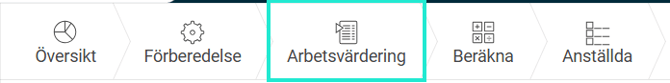
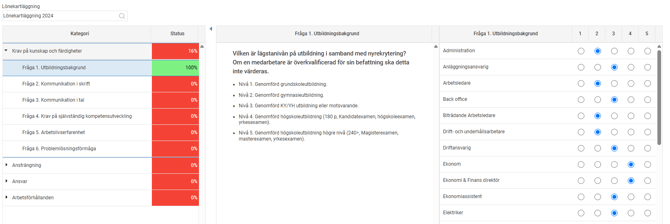
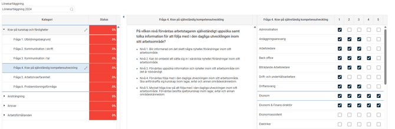
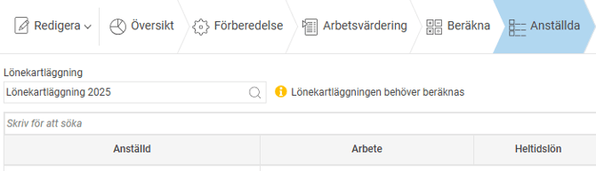

# Genomför Lönekartläggning i HRM - Steg 2 arbetsvärdering

**Datum:** den 4 november 2025  
**Kategori:** Employee  
**Underkategori:** Anställningshantering  
**Typ:** other  
**Svårighetsgrad:** advanced  
**Tags:** Ingen  
**Bilder:** 4  
**URL:** https://knowledge.flexhrm.com/sv/genomfor-lonekartlaggning-i-hrm-arbetsvardering-0

---

Den här guiden hjälper dig att genomföra en lönekartläggning i HRM steg för steg.

Här går vi igenom hur du gör steget för arbetsvärdering.
Arbetsvärdering

Arbetsvärdering är en systematisk metod för att utvärdera ett arbetes krav och svårigheter.
I HRM använder vi oss av faktorbaserad arbetsvärdering. Utifrån den faktorplan som angetts under
Förberedelse
går du nu igenom samtliga faktorer för att värdera arbetena.
Har ni valt
Ange färdiga poäng per arbete
under Förberedelse så behöver inte detta steg genomföras och är därmed inte synligt i lönekartläggningen.
Det är viktigt att du enbart tittar på arbetets krav och svårighetsgrad när du gör din arbetsvärdering dvs. inte blandar in vem eller vilka som utför respektive arbete och deras prestation eller förmåga.
Gå igenom samtliga faktorer och besvara per arbete enligt det alternativ du valt i förberedelserna. Notera att om du redan läst in dina poäng per arbete dvs. valt alternativet
Varje faktorfält kan ha ett svar

Varje fråga besvaras och kan ha flera svar

Till vänster i vyn, i första kolumnen Kategori, ser du alla faktorgrupper (t.ex. Krav på kunskap och färdigheter) och dess faktorfält (t.ex. Fråga 1. Utbildningsbakgrund).
Du markerar det faktorfält du vill värdera och fyller i svarsalternativen per arbete/grupp längst till höger i vyn.
I mittersta kolumnen ser du rubriken och svarsalternativen för det faktorfält du markerat i vänstra kolumnen.
Du kan följa varje kategoris Status för hur långt du har kommit. Alla kategorier måste ha
100%
i status innan du kan gå vidare och
klarmarkera
denna vy.
När arbetsvärderingen är klar
Klarmarkerar
du. Då sker en beräkning av lönekartläggningen.
Beräkna
Beräkna
gör du för att anställda ska dyka upp i övriga vyer.
För att kunna beräkna lönekartläggningen måste du ha full behörighet till Förberedelse, Arbetsvärdering eller Anställda samt att Förberedelse och Arbetsvärdering måste ha status Klarmarkerad. Behörigheten ställer du in under roller.
Har du inte beräknat får du en varning, "Lönekartläggningen behöver beräknas", när du kommer till t.ex. vyn för Anställda för att tydligare se varför de anställda inte syns i vald vy.

Observera
När du beräknar efter att du börjat analysera i vyn Likvärdigt arbete och Lägre lön högre värdering (ej för Lika arbete) så kommer eventuella kommentarer och klarmarkeringar att raderas eftersom grupperingen av arbeten räknas om vid beräkning. Detta eftersom grupperingarna kan komma att se annorlunda ut efter beräkningen.
💡
Om du behöver göra en omräkning av lönekartläggningen
efter
att du har påbörjat analyserna i
Likvärdigt arbete
eller
Lägre lön högre värdering.
Ta först ut en
export
av samtliga arbeten. Då har du en lista med alla kommentarer att gå tillbaka till när du behöver skriva in dem på nytt i analyserna.
När beräkningen är klar kan du se och gå igenom listan med
Anställda
.
