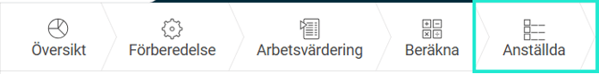
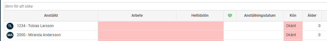
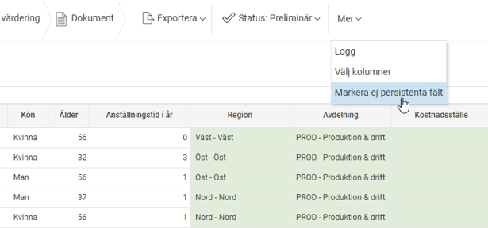
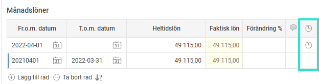
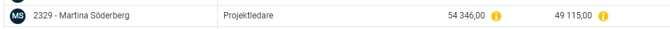

# Genomför Lönekartläggning i HRM - Steg 3 anställda

**Datum:** den 4 november 2025  
**Kategori:** Employee  
**Underkategori:** Anställningshantering  
**Typ:** other  
**Svårighetsgrad:** advanced  
**Tags:** anställning  
**Bilder:** 5  
**URL:** https://knowledge.flexhrm.com/sv/genomfor-lonekartlaggning-i-hrm-anstallda-0

---

Den här guiden hjälper dig att genomföra en lönekartläggning i HRM steg för steg.

Här går vi igenom vyn Anställda.
Anställda

Syftet med denna vy är att få en överblick av samtliga anställdas löner mm. för att se till att allt är korrekt innan analysarbetet startar.
I de fall information om Heltidslön, Arbete eller Kön saknas på anställd varnar systemet dig och du kommer inte vidare. Åtgärda detta för berörda anställda och beräkna sedan om lönekartläggningen.

Redigera – Lägg till/Ta bort anställd
Längst till vänster i menyn finns
Redigera
där du kan lägga till eller ta bort anställda manuellt samt skriva en kommentar för din åtgärd. Detta kommer loggas.
Automatisk hantering av nyanställda och ändrade beräkningsdatum
Systemet kommer automatiskt att inkludera relevanta anställda när du gör en omräkning. Om en nyanställd har ett anställningsdatum som infaller före beräkningsdatumet läggs personen automatiskt till i urvalet.
På samma sätt tas anställda bort om deras avgångsdatum infaller före beräkningsdatumet.
Observera dock att en omräkning påverkar ev. påbörjad analys i vyerna
Likvärdigt arbete
och
Lägre lön högre värdering
.
Manuellt borttagna anställda
Dessa personer kommer inte att läggas tillbaka automatiskt vid en omräkning.
Om du vill lägga till en person som tidigare tagits bort använder du knappen "Lägg till borttagna anställningar".
Sortera och söka i kolumner
Du kan klicka på respektive kolumns rubrik för att sortera kolumnen uppåt eller neråt. Undantaget för sortering är kolumnerna Kommentar och Semesterrätt.
I sökrutan kan du fritextsöka på samtliga kolumners innehåll.
Markera ej persistenta fält
Markerar du
Markera ej persistenta fält
så blir vissa kolumner färgmarkerade. Dessa kolumner har dynamiska värden d.v.s. de visar datumstyrd data enligt datum angivet på lönekartläggningen. T.ex. om du visar Kostnadsställe och skulle ändra det historiskt på en anställd så skulle även kostnadsstället i lönekartläggningen ändra värde. Du hittar markeringen under
Mer
.

Historisk lön
En historisk lön (kan även benämnas Avvikande lön) kan förekomma när du t.ex. behåller en chefslön utan att vara chef längre. I en lönekartläggning kan det vara saklig grund för en löneskillnad.
För att markera en anställds lön som historisk kan du markera det med en klocka på berörd eller berörda lönerader.

Dessa syns då på den anställde i lönekartläggningen.

När du kontrollerat alla anställda kan du klarmarkera vyn genom att klicka på Status högst upp i menyfältet och välja
Klarmarkera.
Du kan nu gå vidare för att göra
analyserna.
