# Genomför Lönekartläggning i HRM - Steg 4 analys

**Datum:** den 4 november 2025  
**Kategori:** Employee  
**Underkategori:** Anställningshantering  
**Typ:** other  
**Svårighetsgrad:** intermediate  
**Tags:** anställning, dokument  
**Bilder:** 21  
**URL:** https://knowledge.flexhrm.com/sv/genomfor-lonekartlaggning-i-hrm-analys-0

---

Den här guiden hjälper dig att genomföra en lönekartläggning i HRM steg för steg.

Här går vi igenom hur du gör analyserna i lönekartläggningen.
Analys
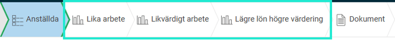
I analysen för att upptäcka eventuella osakliga löneskillnader har du tre vyer att utgå från:
Lika arbete
,
Likvärdigt arbete
och
Lägre lön högre värdering
.
För att enklare kunna fokusera på just den information du behöver i din analys kan du i samtliga tre analysvyer göra följande:
Markera könsdominerade arbeten
Detta gör du under
Mer
.
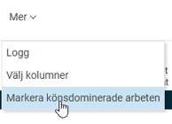
Dra och ändra storlek på widgetarna
Du kan ändra storleken på widgetarna i vyn genom att markera och dra mellan
Arbete
och
Anställningar
, eller lodrätt mellan
Arbete
/
Anställningar
och
Grafer
. Detta minskar eller ökar storleken på vilka arbeten som syns.

Dölja/Visa graf/anställd/arbete
Du döljer eller visar en graf, anställd eller ett arbete genom att använda valen längst upp till höger i vyn
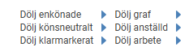
eller genom att använda ikonerna för respektive widget för att förstora eller dölja.
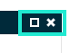
Välja kolumner
I vyn kan du under
Mer
välja vilka kolumner som ska visas. Beroende på vilken vy du står i får du olika val.
Du gör dina val genom att bocka i de kolumner du vill visa. Ordningen ändrar du genom att dra och släppa med de
blåa pilarna
till vänster. De kolumner som har utgråade bockar måste always visas.
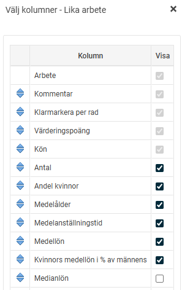
Bra att veta:
Dina inställningar sparas för alla som arbetar i lönekartläggningen och följer även med nästa gång du skapar en ny.
Klarmarkera en hel vy
Du klarmarkerar en hel vy genom att välja
Klarmarkera
uppe i menyraden för respektive analysvy. Du kan även ta bort klarmarkeringen. Om du tar bort klarmarkeringen för en vy, kommer klarmarkeringen även att tas bort från de vyer som ligger
efter
i flödet.
Analys - Lika arbete
I denna vy ska du med hjälp av den data som presenteras analysera ett arbete åt gången.
Syftet är att upptäcka löneskillnader för anställda i lika arbete dvs. där arbetsuppgifterna är samma eller väldigt lika. Är kvinnornas löner lägre än männens ska löneskillnaden, enligt lag, analyseras. Du har här även möjlighet att analysera eventuella löneskillnader oberoende av kön.
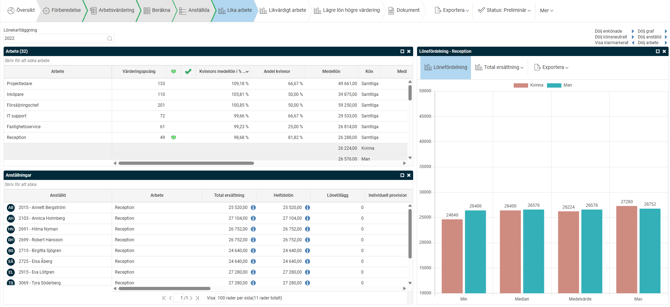
I denna vy behöver, enligt lag, inte enkönade arbeten analyseras vilket gör att sådana arbeten kan döljas i vyn. Som hjälp för att kunna fokusera på just den information du behöver i din analys av lika arbeten kan du välja på nedan högst upp till höger i vyn:
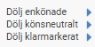
Du kan skriva en kommentar per arbete genom att klicka i kolumnen för kommentar (klicka på kommentarsikonen som dyker upp när du hovrar i kolumnen). Du ser samtidigt om någon skrivit något för samma arbete i någon av de andra två vyerna.
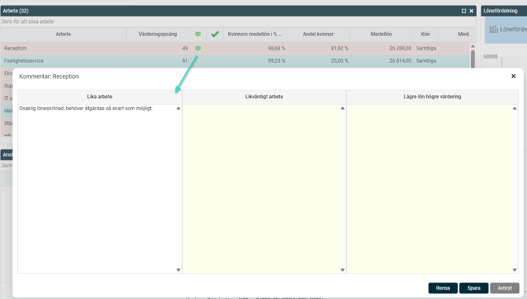
Utöver att klarmarkera en hel vy kan du välja att klarmarkera varje arbete var för sig.
Klarmarkera genom att välja
Klarmarkera
eller
Klarmarkera med åtgärd
(klicka på bocken som dyker upp när du hovrar i kolumnen). Du kan även skriva en kommentar t.ex. till vad för åtgärd som behöver vidtas.
Grön bock
betyder att arbetet är klarmarkerat men inte kräver någon åtgärd och
gul bock
betyder att arbetet är klarmarkerat men kräver en åtgärd.
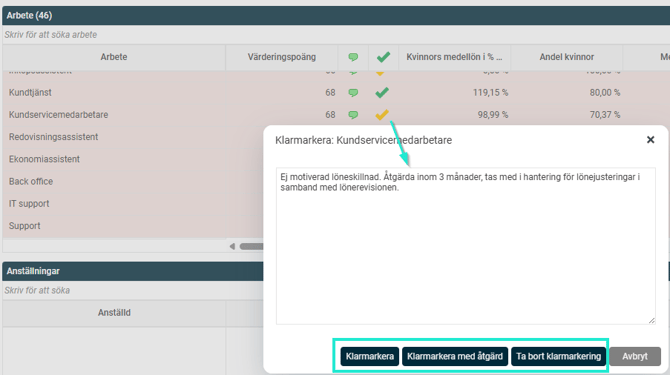
Du kan även välja att
ta bort klarmarkering
om du ångrar dig.
Analys - Likvärdigt arbete
I denna vy ska du, med hjälp av den data som presenteras, analysera en grupp åt gången. Varje grupp innehåller två eller flera likvärdiga arbeten, dvs. arbeten som fått nästan samma värderingspoäng och därmed anses ha lika värde utifrån den arbetsvärdering som gjorts. Det kan alltså vara olika arbetsuppgifter i de olika arbetena i en grupp men arbetena ställer likvärdiga krav på de anställda utifrån kriterier som ansvar, ansträngning, arbetsförhållanden, kunskap och färdigheter.
Syftet
är att upptäcka och åtgärda osakliga löneskillnader för anställda i likvärdiga arbeten dvs. där arbetsförhållandena är lika värderade. Är lönerna lägre inom de arbeten som är (eller som brukar anses vara) kvinnodominerade än inom de icke kvinnodominerade ska löneskillnaden, enligt lag, analyseras. Kan inte löneskillnaden förklaras med sakliga skäl ska den rättas till. Du har här även möjlighet att analysera eventuella löneskillnader oberoende av kön.
Som hjälp för att kunna fokusera på just den information du behöver i din analys av likvärdiga arbeten kan du även välja på nedan högst upp till höger i vyn:
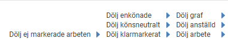
Om du döljer ej markerade arbeten innebär det att du enbart ser de arbeten i en grupp som har bocken i. För nedan grupp skulle alla arbeten förutom Elektriker och Arbetsledare döljas:
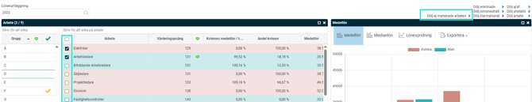
Du kan skriva en kommentar per grupp genom att klicka i kolumnen för kommentar (klicka på kommentarsikonen som dyker upp när du hovrar i kolumnen). Du ser samtidigt om någon skrivit något per arbete för de arbeten som ingår i gruppen.
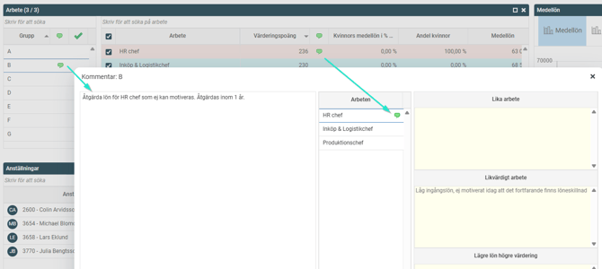
Utöver att klarmarkera en hel vy kan du välja att klarmarkera varje grupp för sig. Denna kolumn visas alltid men är inget krav för att få klarmarkera hela vyn. Syftet är att det ska kunna vara ett stöd i vad du gått igenom och inte.
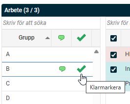
Klarmarkera genom att välja
Klarmarkera
eller
Klarmarkera med åtgärd
(klicka på bocken som dyker upp när du hovrar i kolumnen). Du kan även skriva en kommentar t.ex. till vad för åtgärd som behöver vidtas.
Grön bock
betyder att arbetet är klarmarkerat men inte kräver någon åtgärd och
gul bock
betyder att arbetet är klarmarkerat men kräver en åtgärd.
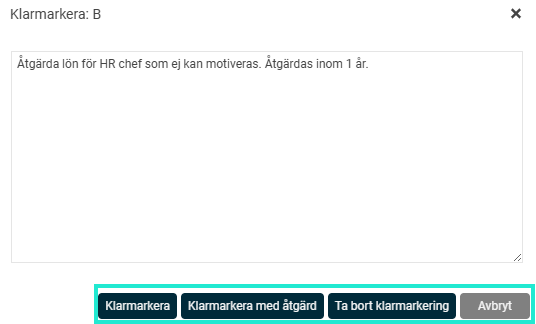
Du kan även välja att
ta bort klarmarkering
om du ångrar dig.
Lägre lön högre värdering
I denna vy ska du, med hjälp av den data som presenteras, analysera de arbeten som har lägre lön men högre värderingspoäng än andra arbeten.
Syftet är att hitta hierarkiska löneskillnader för att i så fall kunna åtgärda dem.
I exemplet nedan kan vi se att Elektriker har lägre medellön än Inköpare trots att Inköpare har lägre värderingspoäng än Elektiker.
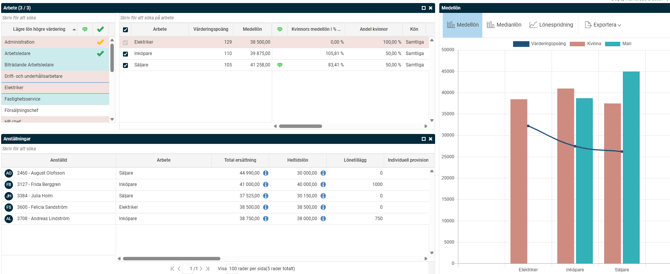
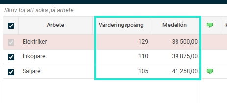
Som hjälp för att kunna fokusera på just den information du behöver i din analys kan du välja på nedan högst upp till höger i vyn:
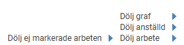
Du kan även skriva en kommentar för Elektiker i samband med analysen av lägre lön högre värdering. Du ser även respektive arbetes kommentarer från samtliga tre analysvyer samlat på ett ställe.
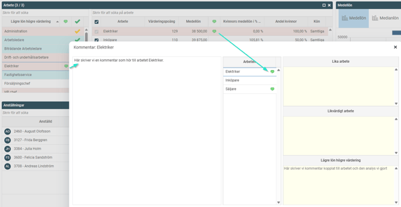
Utöver att klarmarkera en hel vy kan du välja att klarmarkera varje arbete med lägre lön för sig. Denna kolumn visas alltid men är inget krav för att få klarmarkera hela vyn. Syftet är att det ska kunna vara ett stöd i vad du gått igenom och inte.
Klarmarkera genom att välja
Klarmarkera
eller
Klarmarkera med åtgärd
(klicka på bocken som dyker upp när du hovrar i kolumnen). Du kan även skriva en kommentar t.ex. till vad för åtgärd som behöver vidtas.
Grön bock
betyder att arbetet är klarmarkerat men inte kräver någon åtgärd och
gul bock
betyder att arbetet är klarmarkerat men kräver en åtgärd.
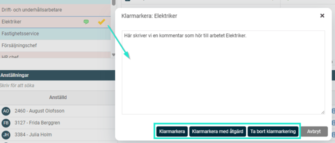
Du kan även välja att
ta bort klarmarkering
om du ångrar dig.
När du är helt klar med samtliga analyser klarmarkerar du vyerna

Analysen är klar och du kan nu
ta ut slutrapporten under Dokument
.
