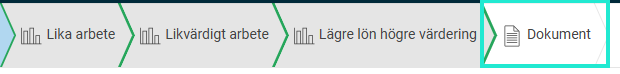
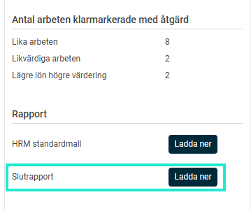
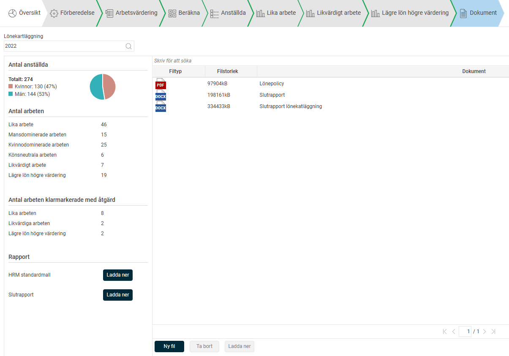
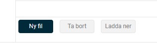

# Genomför Lönekartläggning i HRM - Steg 5 dokument

**Datum:** den 4 november 2025  
**Kategori:** Employee  
**Underkategori:** Anställningshantering  
**Typ:** other  
**Svårighetsgrad:** intermediate  
**Tags:** anställning, dokument  
**Bilder:** 4  
**URL:** https://knowledge.flexhrm.com/sv/genomfor-lonekartlaggning-i-hrm-dokument-0

---

Den här guiden hjälper dig att genomföra en lönekartläggning i HRM steg för steg.

Här går vi igenom funktionen för slutrapport och dokumentation.
Dokumentation

Om du är en arbetsgivare med minst tio anställda ska du dokumentera arbetet med lönekartläggningen och analysen. Dokumentation ska upprättas även för de lönekartläggningar som inte har några osakliga löneskillnader. För att underlätta arbetet med dokumentationen kan du använda Flex HRMs slutrapport.
Genom att klicka på knappen
Ladda ner
vid Slutrapport enligt bilden nedan får du ut ett, till viss del, förifyllt dokument med data från aktuell lönekartläggning.

Slutrapporten innehåller bland annat alla arbeten inklusive värderingspoäng, sammanställningar av lika och likvärdigt arbete samt en åtgärdsplan. Där det saknas data i aktuell lönekartläggning lämnas det avsnittet tomt i det nedladdade dokumentet. Den laddas ner som ett Word-dokument så att du själv kan fylla på med och redigera det du själv vill och behöver.
Du kan bifoga din slutrapport med tillhörande handlingsplan samt övriga dokument som påverkar lön, förmåner eller annat som kan anses utgöra lön.

Du bifogar filer genom att klicka på
Ny fil
. Så länge dokumentvyn inte är klarmarkerad kan du ladda upp och ta bort filer. Du kan när som helst ladda ner och titta på de filer som redan är uppladdade.

