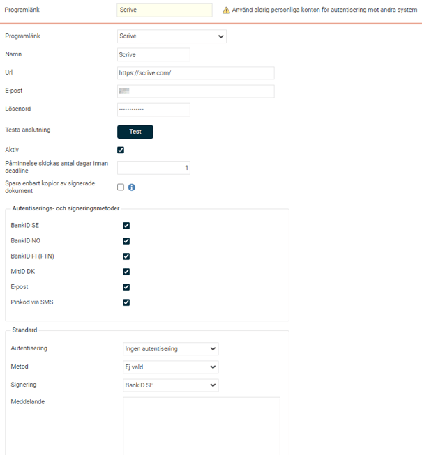
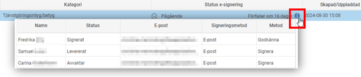
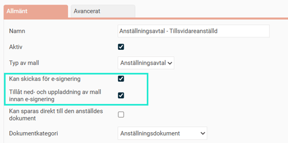
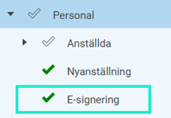

# ⚙️Hur aktiverar jag e-signering via Scrive i HRM?

**Datum:** den 13 januari 2026  
**Kategori:** Employee  
**Underkategori:** Dokument & E-signering  
**Typ:** config  
**Svårighetsgrad:** advanced  
**Tags:** anställning, cv, dokument, signering  
**Bilder:** 8  
**URL:** https://knowledge.flexhrm.com/sv/aktivera-integration-till-scrive-0-0

---

Syftet med integrationen mellan Scrive och HRM är att smidigt skicka anställningsdokument för e-signering. 
Denna artikel beskriver hur du aktiverar integrationen för e-signering via Scrive - HRM.
💻Här finns en beskrivning av arbetsflödet gällande digital signering av dokument i HRM.
Innehåll
Aktivera licens
Programlänk - Aktivera integration
Välj dokument för e-signering
Behörighet
Integration till Scrive
Med denna modul kan du i HRM skicka Anställningsavtal, HR-blanketter och CV för digital signering i Scrive och slipper på så sätt hantering av papper och manuella underskrifter. Chefer och HR med flera får i HRM en komplett översikt över alla pågående och signerade dokument och behöver därför inte arbeta i flera system med hanteringen.
Scrive sköter e-postutskick till alla som ska signera, påminnelser om dokument som ännu inte signerats samt hantering av den tekniska signeringen. Alla dokument finns tillgängliga både i HRM och Scrive.
För att kunna använda integrationen till Scrive måste det finnas ett avtal mellan ditt företag och Scrive. Kontakta
Scrive
för mer information om villkor och pris för att aktivera integrationen.
Aktivering – steg för steg
Licens
För att aktivera funktionen för e-signering måste du först aktivera licensen E-signering i HRM. Under
Administration – Allmänt – Företag
ser du att ditt företag har licensen:

Programlänk
För att aktivera funktionen för e-signering måste du först skapa en programlänk till Scrive.
Gå till
Administration – Inställningar – Import/export – Programlänkar
.

Välj programlänk
Scrive
Ange namn, t.ex. Scrive
Lägg in URL
https://Scrive.com/
OBS! Glöm inte / i slutet av URL:en.
Ange den
användare
i Scrive som HRM ska använda för kommunikation med Scrive. Vi rekommenderar att du här anger ett administratörskonto som har tillgång till alla HR-relaterade dokument i Scrive. Alla dokument som skickas för signering från HRM kommer vara kopplade till detta konto i Scrive.
Klicka på knappen
Test
för att se att du får en anslutning till Scrive. Du ser längst ner i högra hörnet om du lyckades eller inte.
Ange hur många
dagar före deadline
som Scrive ska skicka en påminnelse till de som ska signera dokumentet.
Spara enbart kopior av signerade dokument – se separat rubrik nedan.
Välj vilken eller vilka
autentiserings- och signeringsmetoder
som ska användas.
Ange vilka
standardvärden
som ska synas varje gång du ska skicka dokument för signering. Dessa går att ändra för varje signering dvs. standardvärden är bara ett förslag.
Spara enbart kopior av signerade dokument
Alla e-signerade dokument i HRM är egentligen en länk till dokumentet som ligger hos Scrive. Funktionen att spara en kopior av dokumenten kan vara användbar om du enbart vill ha dokumenten sparade i HRM och inte hos Scrive (separat inställning hos Scrive för att radera dokument däri). Det kan även användas vid byte av e-signeringsleverantör, då du kan spara ner era signerade dokument med den befintliga leverantören före bytet. Sparar du inte ner dem innan bytet kommer dokumenten (egentligen länken till dokumenten) att försvinna i HRM när programlänken inaktiveras. Så länge du har möjlighet att aktivera programlänken igen kan du få tillbaka länkarna till dokumenten för att sedan kunna spara ner kopior av dem enligt nedan.
Notera
att det
enbart är helt signerade dokument
som det sparas ner en kopia på, det vill säga inte dokument med status
Avbruten, Avvisad eller Förfallen. När du aktiverar inställningen och sparar kan du inte ångra dig. Det innebär att signerade dokument som blivit kopior inte längre kan få tillbaka kopplingen till Scrive. De dokument som inte är signerade (Pågående, Avbruten, Avvisad eller Förfallen) kommer att ligga kvar med koppling till Scrive.
Notera även att du
inte kommer att kunna se det kopierade dokumentet i E-signeringsvyn
efter att kopian har sparats ner eller se status på vilka som har godkänt/signerat i HRM (se bild). Du kan fortsatt se vilka som har signerat dokumentet i HRM om du öppnar dokumentet. Fullständig information om samtliga godkännare/signerare finns inne i Scrive, under förutsättning att dokumentet finns kvar där. Godkännare syns enbart i Scrive.

Om det är viktigt för er att kunna se den fullständiga statusen på ett e-signerat dokument direkt i HRM rekommenderar vi att endast använda denna inställning när man skall avsluta Scrive. Kontakta en konsult på Flex Applications om du har frågor.
Välj dokument för e-signering
För att kunna skicka ett anställningsavtal eller HR-blankett för digital signering som beskrevs tidigare måste du först aktivera detta i inställningarna för dokumentet.
Gå till
Administration – Inställningar – Personal – HR-blanketter
. (du styr på så sätt vilka dokument som får skickas för e-signering, då det blir en löpande kostnad per signering.)
Bocka i
Kan skickas för e-signering
på de dokument som är aktuella för det.
Bocka i
Tillåt ned- och uppladdning av mall innan e-signering
i de fall du vill kunna redigera ett dokument innan det skickas.

Behörighet
Ställ in nedan behörighet för e-signering på de roller som ska kunna se översiktsvyn för e-signering.

Tänk på att
du måste ha behörighet till
HR-blanketter/CV
,
dokumentkategorier
för aktuella HR-blanketter och behörighet till
Rapporten Anställningsavtal
(gäller endast HR-blankett av typen Anställningsavtal) för att kunna hämta ut HR-blanketter för e-signering.
Behörighet som styr att rollen får hämta ut HR-blanketter och CV

Styr vilka HR-blanketter som får hämtas (Dokumentkategori)
Nedan får HR-blanketter kopplade till kategorierna "Anställningsdokument" och "CV" hämtas ut. Finns det HR-blanketter kopplade till kategorin "Diverse", kan denna roll inte hämta ut dessa blanketter.

Rapport styr om HR-blanketter av typen "Anställningsavtal" får hämtas
För anställningsavtal krävs ovan + denna behörighet

