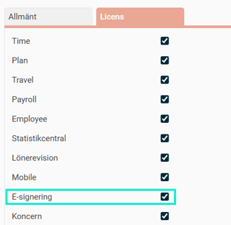
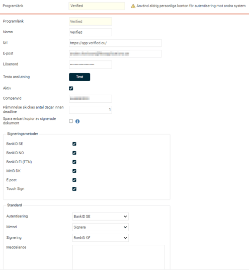
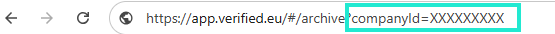
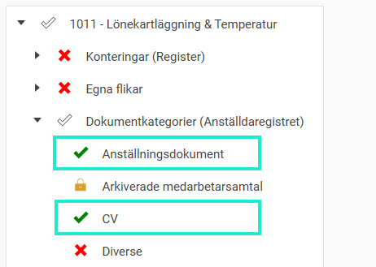
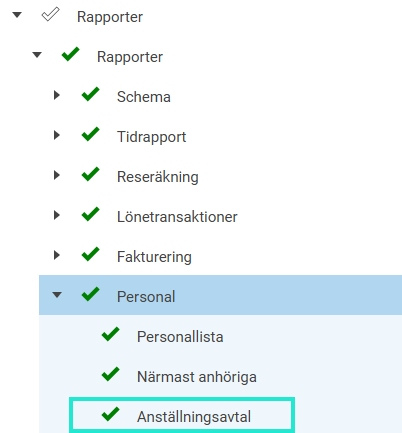

# ⚙️Hur aktiverar jag e-signering via Verified i HRM?

**Datum:** den 13 januari 2026  
**Kategori:** Employee  
**Underkategori:** Dokument & E-signering  
**Typ:** config  
**Svårighetsgrad:** advanced  
**Tags:** anställning, cv, dokument, signering  
**Bilder:** 8  
**URL:** https://knowledge.flexhrm.com/sv/aktivera-integration-till-verified-0-0-0

---

Syftet med integrationen mellan Verified och HRM är att smidigt skicka anställningsdokument för e-signering. 
Denna artikel beskriver hur du aktiverar integrationen för e-signering via Verified - HRM.
💻Här finns en beskrivning av arbetsflödet gällande digital signering av dokument i HRM.
Innehåll
Aktivera licens
Programlänk - Aktivera integration
Välj dokument för e-signering
Behörighet
Integration till Verified
Med denna modul kan du i HRM skicka Anställningsavtal, HR-blanketter och CV för digital signering i Verified och slipper på så sätt hantering av papper och manuella underskrifter. Chefer och HR med flera får i HRM en komplett översikt över alla pågående och signerade dokument och behöver därför inte arbeta i flera system med hanteringen.
Verified sköter e-postutskick till alla som ska signera, påminnelser om dokument som ännu inte signerats samt hantering av den tekniska signeringen. Alla dokument finns tillgängliga både i HRM och Verified.
För att kunna använda integrationen till Verified måste det finnas ett avtal mellan ditt företag och Verified. Kontakta
Verified
för mer information om villkor och pris för att aktivera integrationen.
Aktivering – steg för steg
Licens
För att aktivera funktionen för e-signering måste du först aktivera licensen E-signering i HRM. Under
Administration – Allmänt – Företag
ser du att ditt företag har licensen:

Programlänk
För att aktivera funktionen för e-signering måste du först skapa en programlänk till Verified.
Gå till
Administration – Inställningar – Import/export – Programlänkar
.

Välj programlänk Verified
Ange namn, t.ex. Verified
Lägg in URL https://app.verified.eu
Här anger du den användare i Verified som Flex HRM ska använda för kommunikation med Verified. Vi rekommenderar att du här anger ett administratörskonto som har tillgång till alla HR-relaterade dokument i Verified. Alla dokument som skickas för signering från Flex HRM kommer vara kopplade till detta konto i Verified. För att status på dokumenten ska kunna visas i Flex HRM måste denna användare komma åt status på alla dokument.
Klicka på knappen Test för att se att du får en anslutning till Verified. Du ser längst ner i högra hörnet om du lyckades eller inte.
Du behöver ange ett CompanyId för att dokumenten ska komma till rätt företag i Verified. När du loggat in i Verified hittar du detta id i url:en efter likhetstecknet. Har du fler företag upplagda i Verified hittar du dem där under menyn Grupp. Lägg då respektive CompanyId i motsvarande företags programlänk i HRM.

Ange hur många dagar före deadline som Verified ska skicka en påminnelse till mottagaren.
Spara enbart kopior av signerade dokument – se separat rubrik nedan.
Välj vilken eller vilka signeringsmetoder ni använder er av.
Ange vilka standardvärden som ska synas varje gång du ska skicka dokument för signering. Dessa går att ändra för varje signering dvs. standardvärden är bara ett förslag.
Spara enbart kopior av signerade dokument
Alla e-signerade dokument i Flex HRM är egentligen en länk till dokumentet som ligger hos Verified. Funktionen att spara kopior av dokumenten kan vara användbar om du enbart vill ha dokumenten sparade i Flex HRM och inte hos Verified. Det kan även användas vid byte av e-signeringsleverantör, då du kan spara ner era signerade dokument med den befintliga leverantören före bytet. Sparar du inte ner dem innan bytet kommer dokumenten (egentligen länken till dokumenten) att försvinna i Flex HRM när programlänken inaktiveras. Så länge du har möjlighet att aktivera programlänken igen kan du få tillbaka länkarna till dokumenten för att sedan kunna spara ner kopior av dem enligt nedan.
Notera
att det
enbart är helt signerade dokument
som det sparas ner en kopia på, det vill säga inte dokument med status Avbruten, Avvisad eller Förfallen.
När du aktiverar bocken och sparar kan du inte ångra dig. Det innebär att signerade dokument som blivit kopior
inte längre kan få tillbaka kopplingen till Verified
. De dokument som inte är signerade (Pågående, Avbruten, Avvisad eller Förfallen) kommer att ligga kvar med koppling till Verified.
Var ändå försiktig med att använda denna bock. Kontakta en konsult/konsultbokning på Flex Applications om du har frågor.
Välj dokument för e-signering
För att kunna skicka ett anställningsavtal eller HR-blankett för digital signering som beskrevs tidigare måste du först aktivera detta i inställningarna för dokumentet.
Gå till
Administration – Inställningar – Personal – HR-blanketter
. (du styr på så sätt vilka dokument som får skickas för e-signering, då det blir en löpande kostnad per signering.)
Bocka i
Kan skickas för e-signering
på de dokument som är aktuella för det.
Bocka i
Tillåt ned- och uppladdning av mall innan e-signering
i de fall du vill kunna redigera ett dokument innan det skickas.

Behörighet
Ställ in nedan behörighet för e-signering på de roller som ska kunna se översiktsvyn för e-signering.

Tänk på att
du måste ha behörighet till
HR-blanketter/CV
,
dokumentkategorier
för aktuella HR-blanketter och behörighet till
Rapporten Anställningsavtal
(gäller endast HR-blankett av typen Anställningsavtal) för att kunna hämta ut HR-blanketter för e-signering.
Behörighet som styr att rollen får hämta ut HR-blanketter och CV

Styr vilka HR-blanketter som får hämtas (Dokumentkategori)
Nedan får HR-blanketter kopplade till kategorierna "Anställningsdokument" och "CV" hämtas ut. Finns det HR-blanketter kopplade till kategorin "Diverse", kan denna roll inte hämta ut dessa blanketter.

Rapport styr om HR-blanketter av typen "Anställningsavtal" får hämtas
För anställningsavtal krävs ovan + denna behörighet

