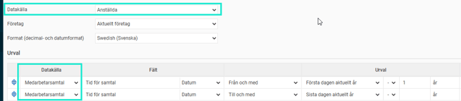
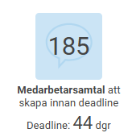
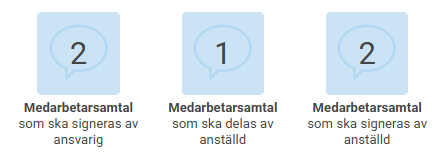

# Hur följer jag upp vilka som har gjort sina medarbetarsamtal?

**Datum:** den 5 november 2025  
**Kategori:** Employee  
**Underkategori:** Anställningshantering  
**Typ:** howto  
**Svårighetsgrad:** intermediate  
**Tags:** medarbetarsamtal  
**Bilder:** 3  
**URL:** https://knowledge.flexhrm.com/sv/hur-folja-upp-medarbetarsamtal-0

---

Denna artikel innehåller vanliga frågor för medarbetarsamtal i HRM
Du kan följ upp medarbetarsamtalens status via
Rapportgeneratorn.
Använd huvuddatakälla
Anställda
och kopplingsbar datakälla
Medarbetarsamtal.
Lägg till önskade urval och visning i rapporten.

Du kan få
påminnelser
på startsidan som visar vilka medarbetarsamtal som inte är skapade, delade och/eller signerade. På så sätt kan du följa upp vilka medarbetarsamtal som inte är färdigställda. Under inställningar för påminnelser heter denna typ av påminnelse
Medarbetarsamtal.

