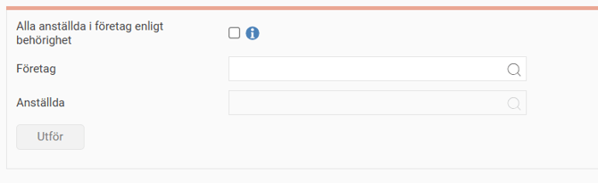

# Hur fungerar anonymisera anställda i HRM?

**Datum:** den 14 augusti 2025  
**Kategori:** Employee  
**Underkategori:** Anställningshantering  
**Typ:** howto  
**Svårighetsgrad:** intermediate  
**Tags:** dokument, medarbetarsamtal  
**Bilder:** 1  
**URL:** https://knowledge.flexhrm.com/sv/hur-fungerar-anonymisera-anstallda-i-hrm-0

---

I artikeln hittar du information om hur anonymisering av anställda fungerar i HRM Employee.
Observera att anonymisering av anställd inte kan ångras.
När du väl genomfört aktiviteten på en anställd kan datan inte återskapas.
Anonymisering av anställda
I HRM finns det en funktion för att
anonymisera anställda
.
Allmänt > Gallring > Anonymisera anställda
Med denna funktion finns möjlighet att anonymisera anställdas personuppgifter, vilket innebär att namn, personnummer, telefonnummer, adress och andra uppgifter som identifierar en person ändras eller tas bort.
Detta kan vara användbart då man vill ta bort information om den anställde men inte har möjlighet att ta bort den anställde helt. Ett annat användningsområde är att i testmiljöer kunna anonymisera alla anställda för att minska risken att exponera personuppgifter i onödan.

Här kan du välja att endera anonymisera alla anställda i de företag du är behörig till eller göra detsamma i ett enstaka företag. Om du har valt ett företag kan du dessutom välja en specifik anställd att anonymisera. Om du inte väljer en anställd kommer anonymiseringen att utföras på alla anställda i valt företag.
OBS!
När du har utfört anonymiseringen går det
inte att ångra
på annat sätt än att återläsa en säkerhetskopia av hela databasen. Var därför ytterst noga med att urvalet är korrekt innan anonymiseringen utförs.
Vid användning av funktionen kommer följande fält att:
Raderas
e-post privat och arbete
telefonnummer
adressrader
fackförbund
närmast anhöriga
profil-bild
dokument på anställda
medarbetarsamtal och formulär
clearing- och kontonummer samt BIC och IBAN
Pseudonymiseras
födelsedatum, personnummer och kön
namn
barn
registreringsnummer bilar
Vyn är behörighetsstyrd via
Användare/Behörigheter - Roller.
Relaterade artiklar
Hur tar jag bort en anställd?
Hur fungerar gallring/rensning av personuppgifter i HRM?
