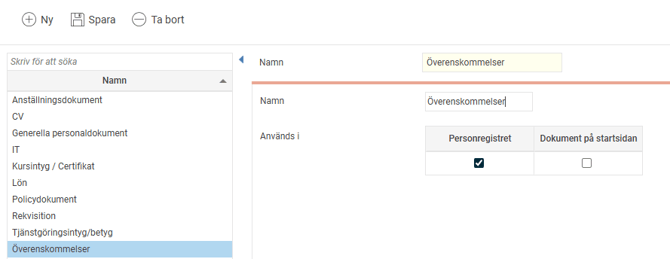
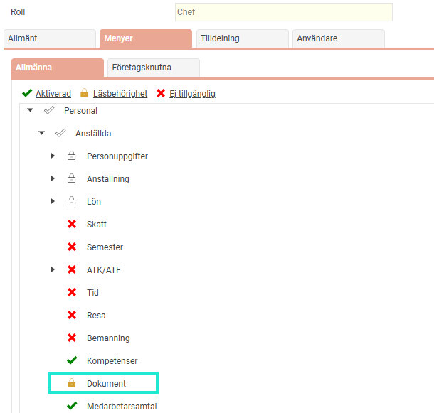
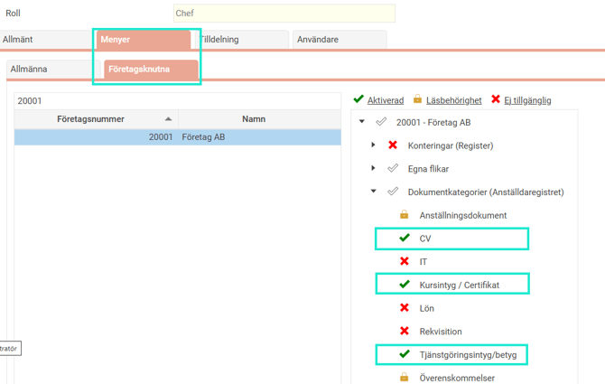

# ⚙️Hur fungerar Dokumentkategorier i HRM Employee?

**Datum:** den 17 september 2025  
**Kategori:** Employee  
**Underkategori:** Anställningshantering  
**Typ:** config  
**Svårighetsgrad:** intermediate  
**Tags:** anställning, cv, dokument, hrm-employee, kurs, signering  
**Bilder:** 4  
**URL:** https://knowledge.flexhrm.com/sv/sa-har-fungerar-dokumentkategorier-0

---

I HRM Employee finns det möjlighet att lägga upp dokument på anställda, på startsidan och hantera olika typer av HR-blanketter. För att kategorisera in olika dokument används dokumentkategorier i HRM. 

Den här artikeln beskriver hur du skapar dokumentkategorier.
Använda dokument i HRM
I HRM kan du använda dokumentfunktionen på flera olika sätt.
Personliga dokument i anställningsregistret
Under
Anställda > Dokument
kan du samla alla dokument som rör en specifik anställd. Detta blir en digital samlingsplats för den anställdes alla handlingar.
Informationsmaterial på startsidan
Du kan publicera dokument direkt på startsidan som informationsmaterial till de anställda. Det kan till exempel vara policys, informationsbrev eller manualer.
Skapa HR-blanketter
För att effektivisera administrationen kan du skapa
HR-blanketter
som automatiskt hämtar information från anställningsregistret. På så sätt kan du snabbt ta fram exempelvis anställningsavtal eller tjänstgöringsintyg.
Dokumentkategorier
Du använder dokumentkategorier för att sortera och koppla de dokument som du lägger in i HRM. Kategorierna används också för att styra behörigheten.
Behörigheten styr
Vilka användarroller som får se/administrera ett specifikt dokument.
Vilka användarroller som får hämta ut HR-blanketter från en viss kategori.
Du hanterar dokumentkategorierna via menyn
Administration > Inställningar > Personal > Dokumentkategorier
.

Skapa dina kategorier
Skapa de dokumentkategorier som behövs för ditt företag genom att klicka på
Ny.
Ställ in vart kategorin ska kunna användas. Anställda och/eller Startsida?
Spara.
När kategorierna är skapade kan du ställa in behörigheterna på rollerna.
Rollbehörigheter
Ställ in så att rollen som ska se anställdas dokument har läsbehörighet till ikonen
Dokument.
Nedan exempel visar rollen
Chef.

Ställ sedan in vilka dokumentkategorier som rollen ska få Full behörighet (Aktiverad) alternativt Läsbehörighet till. Det gör du under rollens inställningar
Menyer> Företagsknutna.
Välj aktuellt företag och ställ in. Läsbehörighet räcker om användarrollen endast ska kunna se och ladda ned dokument för den specifika kategorin.
I nedan exempel har chef behörighet att fullt administrera dokument för kategorierna CV, Kursintyg/Certifikat samt Tjänstgöringsintyg/betyg.
Chefen kan läsa dokumenten för; Anställning och Överenskommelser. Men ingen behörighet till att se dokument för kategorierna; IT, Lön och Rekvisition.

Vad innebär "Visa alla dokumentkategorier"?
Observera att det på rollerna finns en funktion som heter "Visa alla dokumentkategorier".
Aktiverar du denna så får du samma behörighet till alla dokumentkategorier. I personal får denna samma behörighet som menyn
Dokument
. Samt att behörigheten gäller både dokument på dokumentfliken samt uttag av HR-blanketter. I översiktsvyn för e-signering får denna samma behörighet som
E-signering
. Kan kombineras med inställningar på fliken företagsknutna, där högsta behörighet gäller.

Vår generella rekommendation
är att lägga Läsbehörighet på menyn
Dokument
, att INTE bocka i rutan "Visa alla dokumentkategorier" och att istället ställa in inställningarna per dokumentkategori under
Företagsknutna
. På så sätt har du bättre kontroll på vem som kan se vilket dokument för anställda.
Lägger du till fler dokumentkategorier i efterhand kom ihåg att aktivera rätt behörighet på rollerna.
