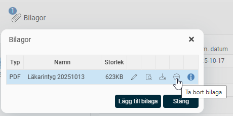

# ⚙️Hur fungerar gallring/rensning av personuppgifter i HRM?

**Datum:** den 23 oktober 2025  
**Kategori:** Employee  
**Underkategori:** Anställningshantering  
**Typ:** config  
**Svårighetsgrad:** intermediate  
**Tags:** anställning, dokument  
**Bilder:** 2  
**URL:** https://knowledge.flexhrm.com/sv/hur-fungerar-gallring-rensning-av-personuppgifter-i-hrm-0

---

I artikeln hittar du information om hur gallring hanteras i HRM Employee.

Under
Personal> Anställda
i HRM hittar du anställdaregister med personuppgifter och övriga anställningsuppgifter.
Automatiskt borttag av personuppgifter
I HRM finns det en automatisk funktion för att gallra bort personuppgifter.
Automatisk gallring sker för
Närmast anhörig
Bankkontouppgifter
Övriga personuppgifter gallras manuellt.
Tänk på att om dokument laddas upp i HRM behöver du hantera gallringen manuellt.
Har en bilaga lagts upp i en frånvaroansökan i HRM Time gallras den bilagan i frånvaron. Gå till den anställdes
tidrapport
, klicka på
Frånvaro
, välj aktuell frånvaro och klicka på
Bilagor
. Här hittar du bilagan och väljer ikonen
Ta bort bilaga
.

Radering av personuppgifter - Inställningar
Med denna funktion tas den anställdes uppgifter bort automatiskt efter att en anställning har avslutats. Detta sker via ett bakgrundsjobb strax före midnatt varje dygn.
Borttaget sker för alla anställda som uppfyller följande kriterier.
saknar aktiv anställningsperiod idag
har avslutat sin anställning för 90 dagar sedan eller mer och saknar kommande anställningsperioder.
Funktionen gäller på systemnivå och går inte att stänga av. Däremot går tidsfristen att ändra under
Administration - Allmänt - Gallring - Radering av personuppgifter - Inställningar
.
Standard för tidsfristen är
90 dagar
. Den kan ställas in manuellt under kolumnen
Fält
till ett antal mellan
0-999 dagar
. Noll innebär att uppgiften raderas vid slutet av den sista dagen på anställningen. I vyn loggas vem som senast ändrat inställningen genom att tidpunkt och användare visas i kolumnen för
Senast ändrad
.
Vyn är behörighetsstyrd via
Användare/Behörigheter - Roller.
Borttaget av uppgifterna loggas under
Inställningar – Allmänt - Logg - Anställdaregistret
förutsatt att loggen är aktiverad. Loggen visar det gamla värdet samt att borttaget gjorts av systemet, det vill säga inte av en användare.
Observera att funktionen endast är tillgänglig om Flex HRM Employee ingår i din programversion.
Relaterade artiklar
Hur tar jag bort en anställd?
Hur fungerar anonymisera anställda i HRM?
