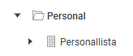
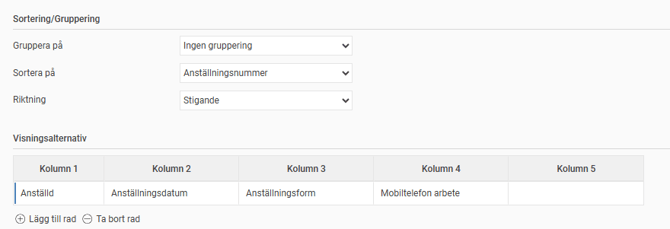

# Hur fungerar rapporten Personallista i HRM Employee?

**Datum:** den 5 november 2025  
**Kategori:** Employee  
**Underkategori:** Anställningshantering  
**Typ:** howto  
**Svårighetsgrad:** intermediate  
**Tags:** hrm-employee  
**Bilder:** 3  
**URL:** https://knowledge.flexhrm.com/sv/rapport-personallista-hrm-employee-0

---

Rapporten
Personallistan
är en standardrapport i HRM Employee.

Rapporten är behörighetsstyrd vilket innebär att du endast ser de anställda som du har behörighet till.
När du skapar rapporten får du själv välja vilken information du önskar se.
Välj
Sortering/Gruppering
Välj sedan valda kolumner under
Visningsalternativ

Under
Urval
kan du ställa in vilka anställda, som du har behörighet till, som du önskar få med i rapporten.

Observera
att rapporten ger behörighet till många fält från anställdaregistret. Även om inställningen på rollen inte ger behörighet till ett specifikt fält, till exempel fältet månadslön, i anställdaregistret under
Anställda
så kan man ändå hämta ut den informationen i rapporten Personallista om man har behörighet till rapporten.
Är det inte lämpligt att användaren ska få tillgång till alla fält i rapporten rekommenderar vi att en administratör istället bygger önskad rapport i
Rapportgeneratorn
och delar ut det till användaren. På så sätt kan ni styra vilken information som finns med i rapporten.
