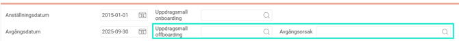

# Hur hanterar HRM Employee offboarding av anställda?

**Datum:** den 20 oktober 2025  
**Kategori:** Employee  
**Underkategori:** Anställningshantering  
**Typ:** howto  
**Svårighetsgrad:** intermediate  
**Tags:** anställning, hrm-employee, offboarding, onboarding  
**Bilder:** 4  
**URL:** https://knowledge.flexhrm.com/sv/hur-hanterar-flex-hrm-employee-offboarding-av-anst%C3%A4llda-0

---

HRM Employee effektiviserar offboarding genom guidad anställningsprocess där man avslutar anställningar och följer upp uppdrag via en panel på startsidan.
Offboarding - Avsluta anställd
Att avsluta anställning i Flex HRM
Gå till
Personal > Anställda > Anställning
När en anställd ska sluta behöver ett avgångsdatum läggas in.

När avgångsdatum läggs in så dyker fälten
Uppdragsmall
och
Avgångsorsak
upp. Här fyller du i rätt mall/värde från listan.

Avgångsorsak
används för statistik, LAS och arbetsgivarintyg.
När du har kopplat på en
uppdragsmall
för offboarding triggas uppgifter till ansvariga igång för vad som ska göras när en anställd slutar.

Hur hanterar jag uppgifter vid en offboarding?
Vad betyder Varningen som dyker upp?

Läs mer om vad denna varning innebär här.
Relaterade artiklar
Hur hanterar HRM Employee onboarding av anställda?
Hur hanterar jag uppgifter och uppdrag i HRM?
Hur fungerar gallring/rensning av personuppgifter i HRM?
Hur tar jag bort en anställd?
Hur tar jag bort en anställningsperiod?
