# Hur hanterar jag uppgifter och uppdrag i HRM?

**Datum:** den 5 december 2025  
**Kategori:** Employee  
**Underkategori:** Anställningshantering  
**Typ:** howto  
**Svårighetsgrad:** intermediate  
**Tags:** anställning, offboarding, onboarding  
**Bilder:** 13  
**URL:** https://knowledge.flexhrm.com/sv/hur-hanterar-jag-uppgifter-och-uppdrag-i-flex-hrm

---

HRM effektiviserar onboarding och offboarding genom guidade anställningsprocesser där man kan följa upp uppdrag via en panel på startsidan. 

Denna artikel beskriver hur du hanterar dina tilldelade uppgifter via startsidan i HRM.
Innehåll
Uppdrag - Panel på startsidan
Påminnelser för uppgifter
Uppdrag - Panel på startsidan
I HRM kan man använda sig av uppdrag med uppgifter som ska hanteras. Det kan exempelvis vara uppgifter som ska utföras vid onboarding och offboarding av anställda.  I uppgiftspanelen på startsidan kan du se de uppgifter du är ansvarig för. Här kan du, allteftersom du utför dina uppgifter, ändra status på dem och vid behov skriva kommentarer genom att klicka på pratbubblan till höger om statusen.
Uppgifter som du tilldelas som ansvarig hanteras på
startsidan
genom att ändra status.
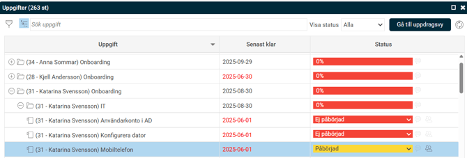
Mer information om uppgiften ses under informations-iet.
Klicka på
i:et
och du får upp ett fönster med mer information om uppgiften samt möjlighet att ladda ner eventuella bifogade filer.
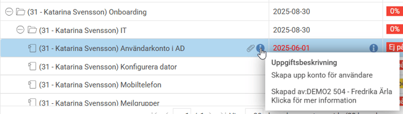
Om du är behörig till uppdragsvyn kan du också gå direkt till den aktuella uppgiften i
uppdragsvyn
via länken uppe i fönstret.
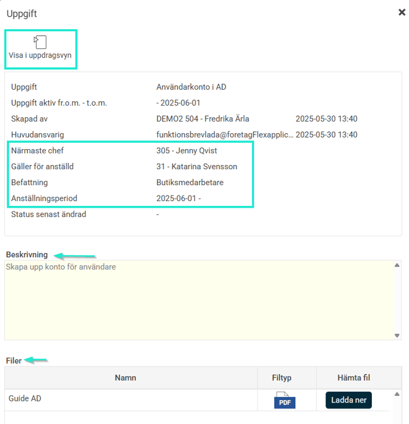
Genom att klicka på pratbubblan kan du skriva och läsa kommentarer gällande uppdraget.
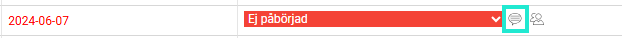
Du kan själv bestämma hur du vill se vyn genom att förstora rutan
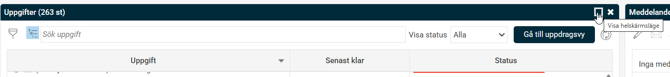
Eller ställa in om du vill se varje uppgift som en egen rad (
listvy
) eller om du vill använda
trädvy
för att se uppgifterna grupperat per uppdrag(anställd).
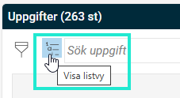
Det går också att filtrera på
status
samt efter ex. datum på ikonen för
filter
.
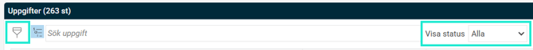
När en uppgift är klar ändrar du status till Klar.
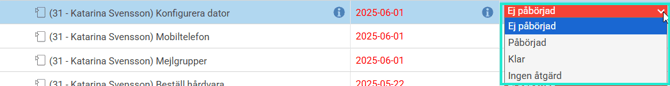
Om behörighet finns till den utökade vyn för uppdrag kan du se hela uppdraget för de anställda som du ansvarar för och om behörigheten finns ev. justera till exempel ansvarig eller senast klar på en uppgift. För att ta dig till den utökade vyn, klicka på
Gå till uppdragsvy
.
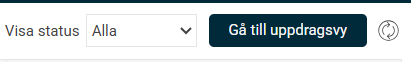
Status för uppdrag
I statusfältet kan en uppgift ha någon av följande statusar:
Ej påbörjad
(standard för nya uppgifter)
Påbörjad
Klar
Ingen åtgärd
För huvud- och delmoment visas istället en procentsats som anger hur många av de underliggande uppgifterna som är markerade som
Klar
eller
Ingen åtgärd
.
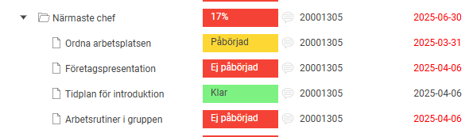
Påminnelser för Uppgifter
Påminnelser
om att uppgifter i uppdrag närmar sig/har passerat deadline syns på startsidan, i er organisation skickas ev. även påminnelse som e-post och notis i
HRM Mobile
. På startsidan ser du vilka anställda påminnelsen avser, och inom parentes hur många uppgifter det rör sig om. Om du
klickar på uppgiftens namn
öppnas vyn för Uppgifter.

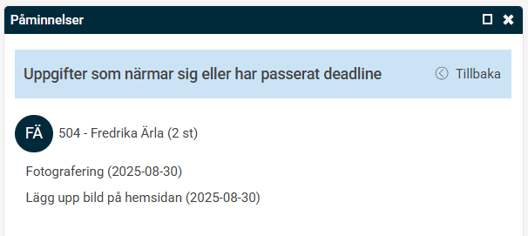
Exempel påminnelse via e-post
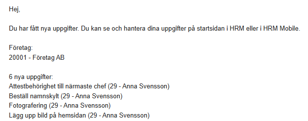
Relaterade artiklar
Hur skapar jag nya uppgifter och uppdrag i HRM?
Hur hanterar HRM Employee onboarding av anställda?
Hur hanterar HRM Employee offboarding av anställda?
