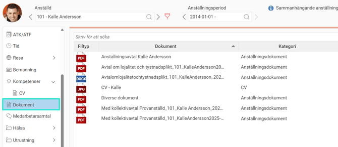
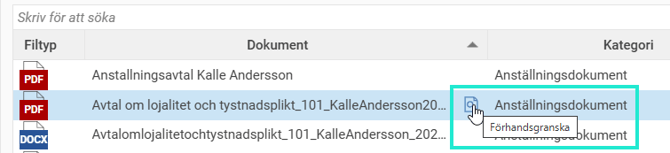
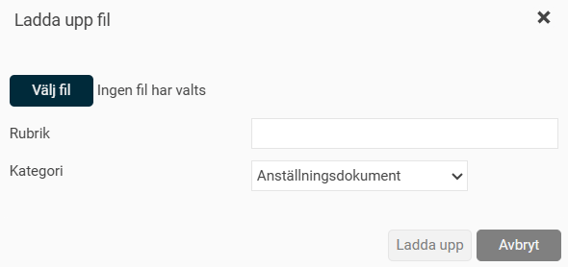
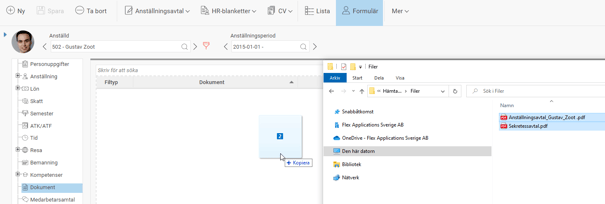
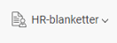
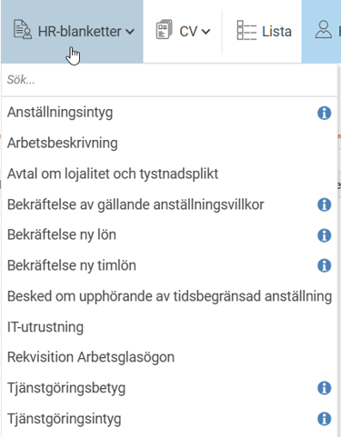
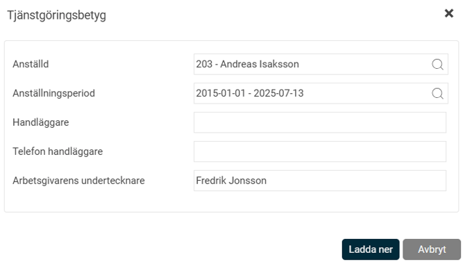
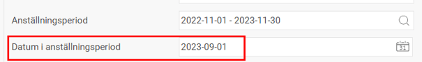

# Hur hanterar man dokument för anställda i HRM Employee?

**Datum:** den 12 augusti 2025  
**Kategori:** Employee  
**Underkategori:** Anställningshantering  
**Typ:** howto  
**Svårighetsgrad:** intermediate  
**Tags:** anställning, cv, dokument, hrm-employee, signering  
**Bilder:** 10  
**URL:** https://knowledge.flexhrm.com/sv/hur-hanterar-man-dokument-for-anstallda-i-hrm-employee

---

HRM Employee möjliggör uppladdning, nedladdning och radering av dokument kopplade till anställda, med möjlighet att kategorisera dem för behörighetsstyrning. Det finns även stöd för att generera HR-blanketter (som intyg och CV) med data från anställningsuppgifter.
Dokument
Klicka på fliken
Dokument
och du får upp följande vy:

I listan visas de dokument som har laddats upp på aktuell anställd. Filtyp beskriver vad det är för typ av dokument. Du kan även se information om vilken kategori dokumentet tillhör.
För att se dokumentet kan filen förhandsgranskas eller laddas ner.

Markera ett dokument
och klicka på knappen
Ladda ner
för att öppna dokumentet.

Lägg till dokument på anställd
Klicka på knappen
Ny fil
för att lägga till ett dokument.

När du klickar på Välj fil kan du bläddra bland katalogerna på din dator och leta upp den fil du vill lägga till. Ange en rubrik för filen och välj sedan vilken kategori den tillhör.
När du har angivit rubrik och kategori, klicka på Ladda upp. Filen hamnar då i listan med dokument.
Bra att veta!
Det är viktigt att lägga upp dokument mot rätt
Dokumentkategori
i HRM, då det är per dokumentkategori som behörighet att se dokument styrs på rollerna.
Du kan även ladda upp dokument via "Drag and Drop". Där du markerar en eller flera dokument i utforskaren på din dator och drar in dem till dokumentfliken.

När du släppt filerna öppnas ett fönster där du kan ändra rubrik på dokumenten samt välja dokumentkategori. När du är klar klickar du på Ladda upp, så läggs samtliga dokument in på dokumentfliken.

Använd knappen
Ta bort
för att radera ett dokument ur listan.
Observera att filen rensas bort och inte kan återställas i HRM.
HR-blanketter
HR-blanketter
finns i HRM för att underlätta administration av olika blanketter så som tex. intyg och betyg som man ibland behöver skriva för anställda. Om du som chef/HR har behörighet att hämta en blankett för en anställd ser du ikonen HR-blanketter

Ladda ned
en blankett gör du på den anställdes sida i anställdaregistret genom att välja blankett och hur den ska skapas.

Bra att veta!
Om HR-blanketten hämtar ut data från en anställningsperiod är det viktigt att först välja önskad anställningsperiod och sedan hämta upp HR-blanketten.
I vissa fall hämtar HR-blanketter upp datumstyrda fält och i de fall du har möjlighet att välja
Datum i anställningsperiod
innebär det att de datumstyrda fälten hämtas från det datum du väljer. Det kan exempelvis vara en blankett med en kommande ny lön.
Om du då skriver in dagens datum (2023-08-15) kommer blanketten hämta den lön som gäller idag, men skulle du skriva in 2023-09-01, och det finns en ny lön registrerad i HRM som gäller från 2023-09-01, så kommer systemet hämta upp den nya lönen.

I vissa fall kan HR-blanketter skickas för e-signering, då dyker rutan
Skicka för e-signering
upp bredvid
Ladda ned
. Här kan du hitta mer info om e-signering i HRM.
Läs mer om hur du skickar ett dokument för E-signering.
Ladda hem ett CV?
