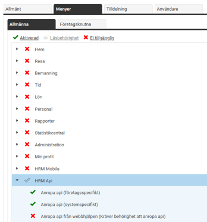
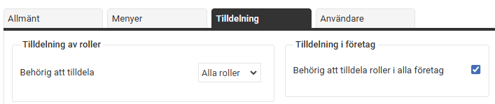
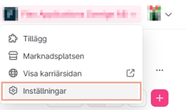
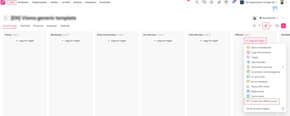
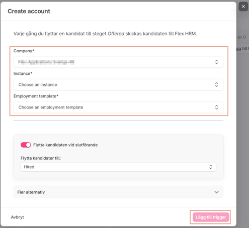

# ⚙️Hur integrerar jag Teamtailor med HRM?

**Datum:** den 11 september 2025  
**Kategori:** Employee  
**Underkategori:** Anställningshantering  
**Typ:** config  
**Svårighetsgrad:** advanced  
**Tags:** anställning, onboarding  
**Bilder:** 7  
**URL:** https://knowledge.flexhrm.com/sv/aktivera-integration-teamtailor-0

---

För dig som kund med Teamtailor som rekryteringsverktyg finns möjlighet att integrera med HRM. Via API-integrationen förs en kandidat, som blir erbjuden en tjänst, över till HRM Employee för en ännu effektivare onboardingprocess. 

Denna artikel beskriver hur du gör inställningar för att komma igång med integrationen till HRM.
För att få mer information om vad det innebär, för dig som kund hos Teamtailor, att aktivera integrationen tar du kontakt med Teamtailor.
Partner integration Flex HRM
Innehåll
Att göra i HRM
Att göra i Teamtailor
Integration Teamtailor
Här nedan följer en steg-för-steg guide hur du gör inställningar för att komma igång med integrationen till HRM.
Aktivering – steg för steg
Att göra i HRM
1.  Skapa en API-användare i HRM
Vi rekommenderar att skapa en ny användare, namnförslag ”Teamtailor API” med behörighet (roll) enligt bild.
Rollens behörigheter:

Sätt ett lösenord på användaren för att ange senare i Teamtailor.
2. Du som kund behöver ta fram och förse Teamtailor med uppgifter från HRM gällande:
URL-adressen
till er HRM med följande format:
https://företagsnamn.flexhosting.se/webapi/api/
alternativt
https://api.flexhrm.com/
HRM kundnummer
(det som står längst ner till höger i HRM) vilket anges som
Instance
i Teamtailor
Användarnamn
och
lösenord
till den API-användare som ni kommer använda till Teamtailor (se ovan punkt).
3. I HRM skapar du de
Anställningsmallar
och
Nyanställningsflöden
som är aktuella för ert företag. Anställningsmallen som är aktuell för varje rekrytering kopplas i Teamtailor för den aktuella tjänsten.
Vi rekommenderar
att du som HR/Admin har ett första steg i HRMs
nyanställningsflöde
för att koppla på aktuell chef tidigt i processen. Allt för att möjliggöra för att chefen blir en aktiv part i anställningsförfarandet i HRM.
Processen kan se olika ut för olika företag, ta gärna hjälp av en HRM konsult för att få råd om hur ni kan göra på bästa sätt för er.
Att göra i Teamtailor
1. Klicka på
Inställningar
högst upp till höger i vyn:

2. Välj
Marknadsplatsaktiveringar
längst ner under
Integrationer
, leta upp Flex HRM
och klicka på
Visa inställningar.

3. Fyll i uppgifter enligt nedan där
Instance
är kundnumret i HRM och
Username
och
Password
är från användaren som skapades i HRM (se ovan rubrik
Att göra i HRM
).

4. Du lägger till en
trigger
i en jobbannons enligt nedan exempel.
Där väljer du vilken
anställningsmall
från HRM (
Employment template
) som ska aktiveras när den anställde kommer över från Teamtailor till HRM. Du kan därmed välja olika anställningsmallar för olika jobbannonser.

