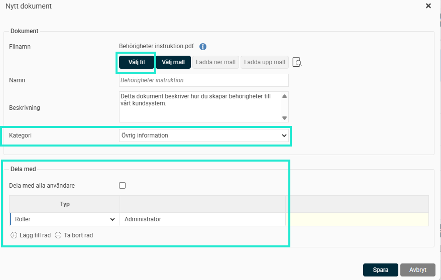
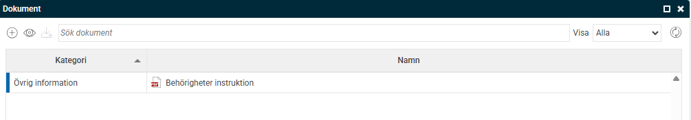
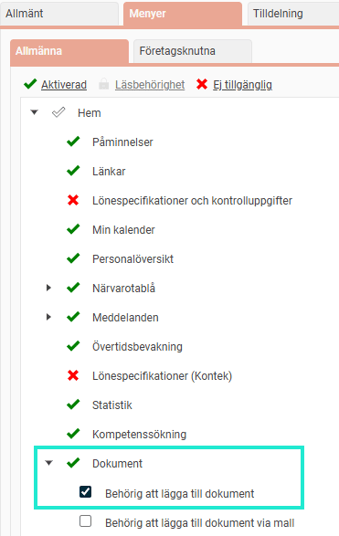

# Hur lägger jag upp ett dokument på startsidan i HRM?

**Datum:** den 17 september 2025  
**Kategori:** Employee  
**Underkategori:** Anställningshantering  
**Typ:** howto  
**Svårighetsgrad:** intermediate  
**Tags:** dokument  
**Bilder:** 4  
**URL:** https://knowledge.flexhrm.com/sv/hur-lagger-jag-upp-ett-dokument-pa-startsidan-0

---

Denna artikel beskriver hur du delar dokument via startsidan i HRM.
Dela dokument på startsidan
På Startidan kan du lägga upp dokument som andra ska kunna ta del av. Vanliga dokument på startsidan är informationsdokument till de anställda, så som policys, informationsbrev, instruktioner och manualer.
På startsidan hittar du Dokument. Klicka på
+
för
Lägg till nytt dokument
.
Välj
fil
Sätt
Namn
och eventuell
beskrivning
.
Välj
Dokumentkategori
Under
Dela med
välj vilka roller eller användare som du vill dela dokumentet med.
Spara

Dokumentet har nu publicerats under Dokument för användarna som du delat till.

Behörigheter
- Startsidan
För att kunna dela ett dokument med andra via startsidan behöver du aktivera den behörigheten för berörda roller under
Roller
.
Du behöver ha en roll som ger behörighet att lägga till dokument på startsidan.

Tänk på att du även behöver ha nedan ruta ibockad för de dokumentkategorier som ska kunna väljas på startsidan. Kontrollera vilka kategorier som kan användas för startsidan under
Dokumentkategorier
.

