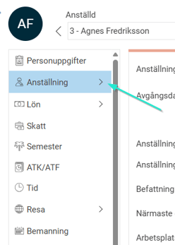
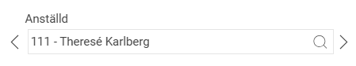
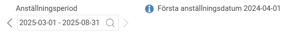
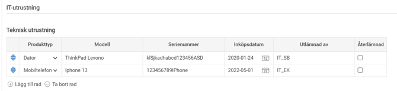
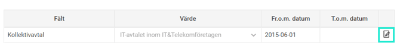
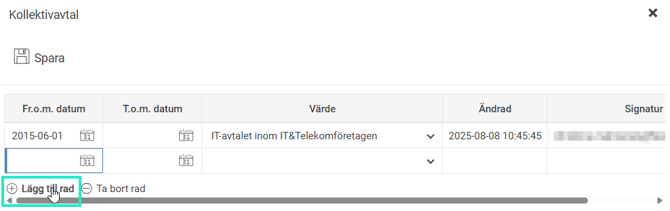
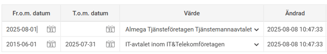
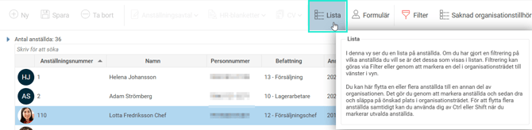
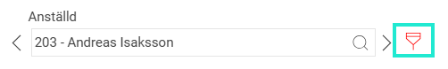
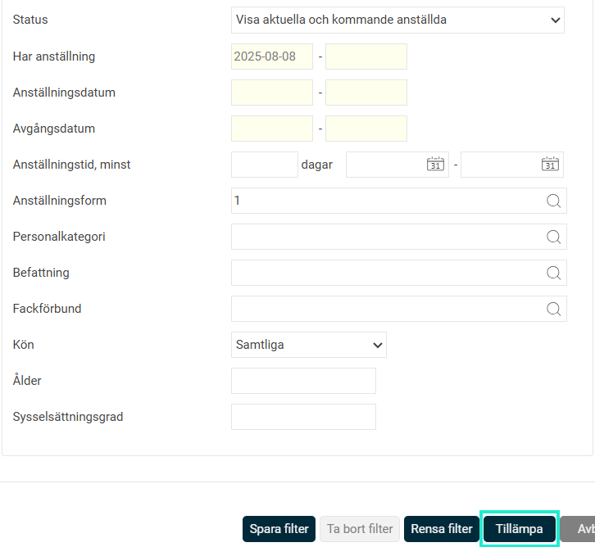

# Hur registrerar man personaldata och anställningsuppgifter i HRM Employee?

**Datum:** den 14 augusti 2025  
**Kategori:** Employee  
**Underkategori:** Anställningshantering  
**Typ:** howto  
**Svårighetsgrad:** intermediate  
**Tags:** anställning, hrm-employee, offboarding, onboarding  
**Bilder:** 12  
**URL:** https://knowledge.flexhrm.com/sv/hur-hanterar-man-personaldata-och-anst%C3%A4llningsuppgifter-i-flex-hrm-employee

---

HRM Employee, som nås via "Personal" i HRM, är huvudplatsen för att hantera anställdas person- och anställningsuppgifter. Användare kan navigera mellan anställda och anställningsperioder, redigera data via ikoner och tabeller med datumhistorik, samt filtrera listvyer för att snabbt hitta specifik information. I artikeln hittar du information och instruktioner för HRM Employee.
HRM Employee

Under
Personal
i HRM hittar du funktionerna för Employee. Här finns till exempel anställdaregister med personuppgifter och övriga funktioner i Employee.
Anställdaregister
Du hittar anställdaregister under
Personal > Anställda.
Personuppgifter och uppgifter om anställning
Formulär
Uppgifter på anställda hittar du genom att klicka på de olika ikonerna på vänster sida på den anställde i anställdaregistret.

Vilka ikoner du ser kan vara olika beroende av vilka moduler ni har och din behörighet.

För att navigera, klicka på en ikon. Finns det ett
+
kan du klicka på den för att se underliggande flikar.
Bra att veta! Om du har full behörighet så kan du redigera i ett fält men har du endast läsbehörighet kan du se men inte lägga till eller ändra på ett värde.
När du ändrar eller lägger till ett nytt värde så kom ihåg att
Spara.
Byt/välj anställd
För att navigera mellan olika medarbetare, sök upp den anställde genom att skriva i rutan
Anställd
, klicka på
förstoringsglaset
eller hoppa till nästa anställd via pilarna.

Byt/välj anställningsperiod
För att navigera mellan olika anställningsperioder för en och samma medarbetare, klicka på
förstoringsglaset
eller
hoppa till nästa via pilarna
under Anställningsperiod.

Eget fält av typ tabell
Vissa fält i HRM är byggda som
tabeller
. I en tabell kan du ha flera parallella rader.
Lägg till värden i tabellen genom att klicka på
+Lägg till rad

Eget fält av typ fältgrupp med datumhistorik
Vissa fält i HRM är byggda med datumhistorik. I de fälten syns endast informationen om det finns ett giltigt värde på den anställde. Du kan se tidigare eller ev. kommande värden på fältet om du
klickar på pennan
. Det är även via pennan man redigerar fältet.

Lägg till rad för att lägga in ett nytt värde

Spara förändringar via ikonen
Spara.
Lista
Via Lista kan du se de anställda i en listvy.

Filter
Via
filter
kan du välja att göra urval på vilka anställda du ser.
Röd ikon
innebär att det finns ett filter valt. Klicka på ikonen för att se mer information och göra eventuella filtreringar. Här kan du välja om du till exempel bara vill se aktuella och kommande anställda eller om du vill se samtliga anställda dvs även kunna se de som är avslutade.

Klicka på
Tillämpa
för att använda ditt valda filter och
Rensa filter
för att ta bort ett valt filter.

Ett valt filter ligger kvar tills du ändrar
filtret
eller rensar det. Vill du spara ett filter att använda igen, skriv namn högst upp och klicka på
Spara filter
.
Relaterade artiklar
Hur gör man för att registrera nyanställd och användare manuellt?
Hur hanterar HRM Employee onboarding av anställda?
Hur hanterar HRM Employee offboarding av anställda?
