# ⚙️Hur skapar jag Egna flikar och fält i HRM Employee?

**Datum:** den 11 september 2025  
**Kategori:** Employee  
**Underkategori:** Anställningshantering  
**Typ:** howto  
**Svårighetsgrad:** intermediate  
**Tags:** anställning, cv, dokument, hrm-employee, kompetens, lönerevision, medarbetarsamtal  
**Bilder:** 32  
**URL:** https://knowledge.flexhrm.com/sv/hur-skapar-jag-egna-flikar-falt-i-hrm-employee-0

---

Egna fält kan byggas under befintliga flikar i personregistret eller i egna flikar. Dessa erbjuder en frihet för er att välja hur flikarna ska byggas, vilket innehåll som ska visas och på vilket sätt. Med hjälp av egna flikar kan du styra var informationen ska synas och vem som ska se informationen.

Denna artikel beskriver hur du som administratör skapar egna fält och flikar.
Innehåll
Skapa egna fält
Skapa egna tabeller
Layout
Skapa ny egen flik
Flytta sidinnehåll till annan flik
Påminnelser
Behörighet till egna flikar
Skapa ett eget fält under befintlig flik
För att bygga ett eget fält, välj
Inställningar – Personal – Anställdaregistret – egna fält
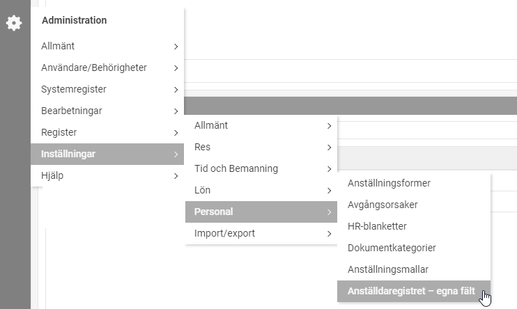
Välj var du ska placera det egna fältet (under vilken egen flik). I nedan exempel har egna fält byggts under en egen flik som heter
Övrig anställningsinformation
.
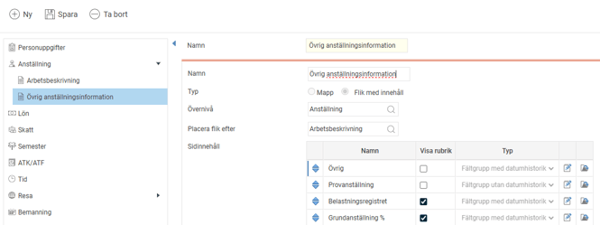
Klicka på
Lägg till rad
för att skapa ett sidinnehåll.
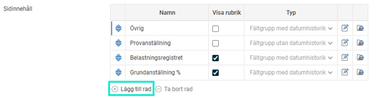
Välj vilken
typ
av fält du vill skapa.
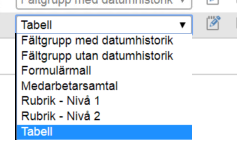
Typ
Anger vilken typ av sidinnehåll det är. Följande alternativ finns tillgängliga:
Fältgrupp med datumhistorik
Fält med datumhistorik väljs för att kunna ha en datumstyrning för ett värde samt få en historik på värdets förändring. Detta är användbart för t.ex. lönetillägg och olika förmåner. I anställdaregistret visas fältet i en tabell med dagens aktuella värde för respektive fält. Förutom numeriska fält kan du med fältgrupperna skapa textfält, kryssrutor och olika graderingar, såsom stjärnor och skjutreglage.
Fältgrupp utan datumhistorik
Detta alternativ ska väljas om det inte finns behov av datumstyrning utan man vill ha ett enkelt inmatningsfält direkt på fliken.
Formulärmall
Används för sidinnehåll till fliken
Medarbetarsamtal
(eller annan flik i anställdaregistret som valts för hantering av medarbetarsamtal) eller för andra typer av enkäter med frågor till de anställda.
Medarbetarsamtal
Används för sidinnehåll till fliken
Medarbetarsamtal
. Typerna
Medarbetarsamtal
och
Formulärmallar
är mycket lika. Skillnaden är att för typen
Medarbetarsamtal
anger du ansvarig samt datum när du fyller i en mall i anställdaregistret.
Rubrik – Nivå 1,
Rubrik – Nivå 2
För att skapa olika avsnitt på en flik kan du lägga in rubriker på olika nivåer genom att lägga in en rad med sidinnehåll och välja typen
Rubrik – Nivå 1
eller
Rubrik nivå 2.
Rubriker med nivå 1 har större font och en linje under rubriken, medan rubriker med nivå 2 har en mindre font utan linje.
Tabell
För att skapa olika kolumner på ett överskådligt sätt kan denna funktion användas. Det används exempelvis vid uppbyggnaden av CV:n.
Datumfält
För att skapa ett enkelt korrekt datum för egna fält som kan vara användbart i t.ex. egna tabeller enligt exemplet ovan.
Om du vill använda rubriker kan du t.ex. sätta upp det så här:
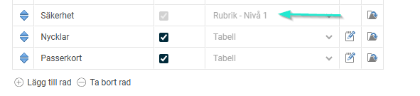
För att redigera/lägga till innehåll, välj
pennan
för att ändra/lägg till värden.
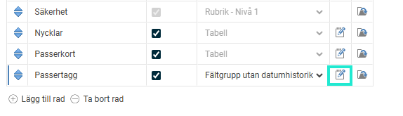
Nu kan du döpa ditt fält, välja
fälttyp
, värden, antal tecken och/eller decimaler.

Välj
fälttyp
. Fälttypen kommer att styra hur fältet blir och vilka val som finns för det aktuella fältet.
Spara
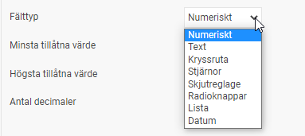
Fälttyp
Beskrivning
Numeriskt
Siffor
Text
Bokstäver
Kryssruta
Checkbox, till exempel Ja eller Nej
Stjärnor
Graderingsskala ex. 1-5
Skjutreglage
Av eller på, dvs. antingen eller
Lista
Rullista med alternativ.
Radioknappar
Kryssruta, t.ex. Bra, Dåligt, Vet ej.
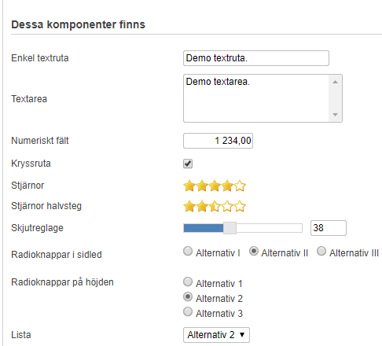
Vill du anpassa fältet mer så kan du göra olika inställningar. Se
Allmänt
och Layout.  I nedan exempel väljer vi att skapa ett
Numeriskt
fält för individuell bonus. Vi önskar att fältet ska synas både i HRM Lönerevision och HRM Lönekartläggning och kryssar därför i "Visa i".
Spara
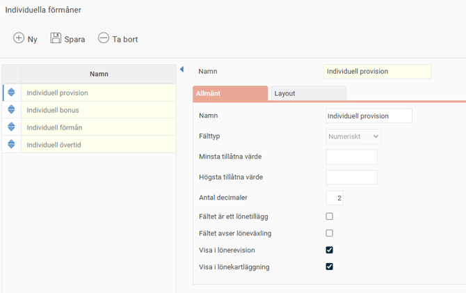
Angående valen för  "Visa på anställningsavtalet i rutan..."
När du väljer att skapa egna fält med fälttyp Text finns några inställningar för anställningsavtal. Dessa inställningar gäller enbart för standardavtalet som finns i HRM dvs inte för de mallar du skapar via HR-blanketter. När standardavtalet används styr bocken var i anställningsavtalet det ska visas. De allra flesta kunder använder egna HR-blanketter och då är denna inställning överflödig.
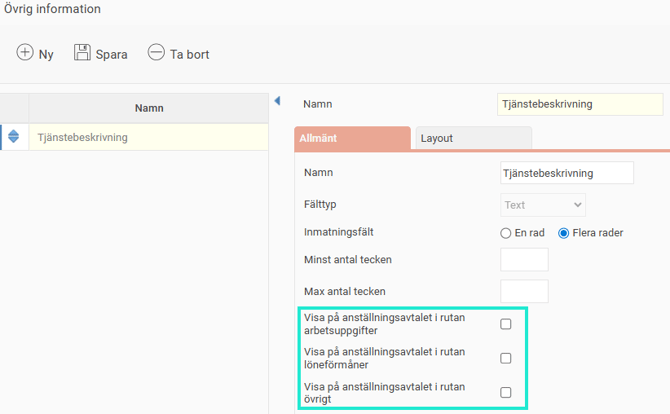
Egna tabeller i anställdaregistret
Varje företag har sina unika behov av uppgifter att lagra i anställdaregistret. För att få en så stor flexibilitet som möjligt har vi byggt vidare på funktionen för egna fält för att kunna skapa egna tabeller. Ett exempel på användnings-område är om man vill dokumentera tidigare yrkeserfarenheter som kan vara relevanta för nuvarande jobb.
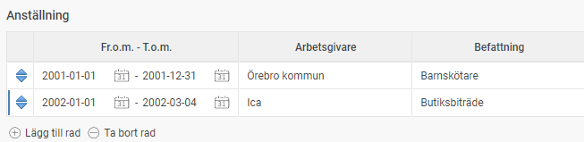
För att skapa en tabell skapar du ett sidinnehåll. Välj i listan till vänster vilken flik du vill skapa i tabellen (det går också att flytta tabellen till en annan flik senare), och därefter lägger du in en rad i listan med sidinnehåll med önskat namn och typen
Tabell
.
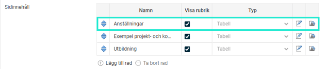
Det sista steget är att välja vilka kolumner som ska finnas i tabellen. Detta gör du genom att
klicka på ikonen
för att redigera som ligger till höger om kolumnen för typ.

I fönstret som öppnas lägger du till de olika kolumnerna på motsvarande sätt som du skapar egna fält. Du kan också välja ordning på kolumnerna i listan till vänster.
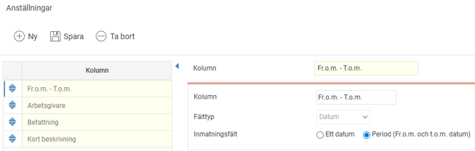
På detta enkla sätt kan du skapa tabeller på de flikar du önskar för att lagra information på ett strukturerat sätt. Du kan också få ut innehållet i en tabell i en HR-blankett eller via en export om du önskar få ut information från tabellen för flera anställda samtidigt.
Här hittar du fler exempel på hur olika egna fält i HRM Employee
Valbar storlek och rubrik på textrutor och numeriska fält
Du kan välja både storlek och placering av rubriken för egna fält av typen Text och Numeriskt. Välj den flik och det sidinnehåll där fältet du vill ändra på är placerat och klicka på knappen
Ändra/lägg till värden
.
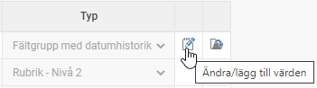
För önskat fält kan du under fliken
Layout
ändra storleken och rubrikens placering. Nedanför inställningarna ser du resultatet av aktuella inställningar.
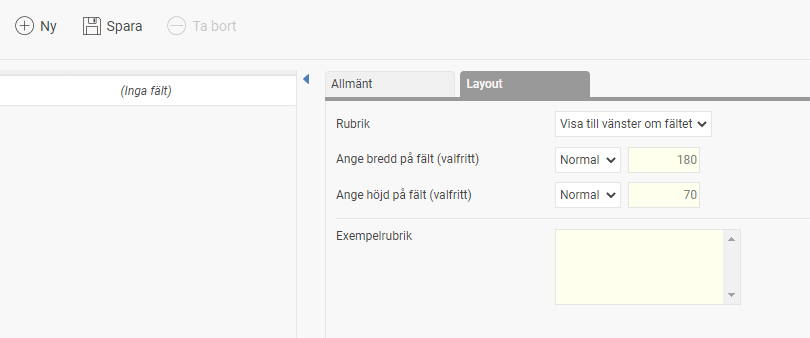
Valbart visa rubrik för sidinnehåll
Man kan också välja om rubriken för sidinnehållet ska visas eller inte.
Om man på fliken Medarbetarsamtal vill ha en enda lista med alla typer av medarbetarsamtal vill man kanske dölja rubriken för att inte få en onödig upprepning då fliken har samma rubrik.

I anställdaregistret blir det då så här (ingen rubrik ovanför listan):
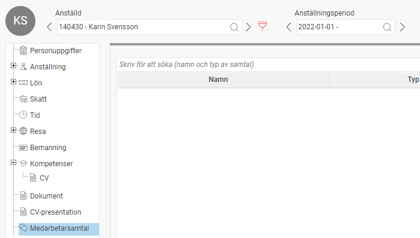
Om man istället har valt att dela upp olika typer av samtal i olika listor kan det vara praktiskt att
visa rubriken
.
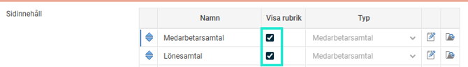
I anställdaregistret blir det då såhär:

Lägga upp en ny flik
En egen flik blir som en ny meny i anställdaregistret där du kan bygga egna fält med önskat innehåll. Med hjälp av behörigheter kan du styra vem eller vilka som ska ha tillgång till en flik och dess innehåll.
Välj
Namn
på fliken.
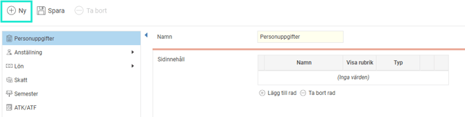
Välj om det ska vara en
Mapp
, dvs. med undermappar, eller en
Flik med innehåll
.
Välj ingen övernivå för att få en helt ny flik och välj var du vill placera fliken, efter t.ex. övrigt. Då ser det ut enligt bilden nedan. För att kunna redigera och skapa ett fält behöver det vara en flik med innehåll under mappen.
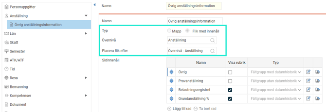

1
= Mapp
2
= Flik med innehåll
Flytta sidinnehåll mellan flikar
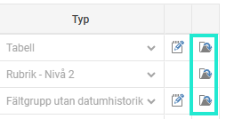
Om man vill göra om flikstrukturen kan man flytta sidinnehåll från en flik till en annan. Detta gör du genom att på önskad rad i listan av sidinnehåll
klicka på ikonen för flytt
längst till höger. Du får då upp en lista av flikar som du kan välja att flytta sidinnehållet till. När du flyttat sidinnehållet till en ny flik placeras det längst ner på den mottagande fliken. Om du vill ändra placeringen går du in på fliken och arrangerar sidinnehållet i önskad ordning.
Egna fält i valbar ordning
Det finns även möjlighet att välja i vilken ordning fälten ska ligga inom en fältgrupp genom att dra och släppa fälten med pilarna till vänster om fältets namn.
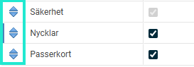
Påminnelser för egna fält
Vissa typer av egna fält behöver ni kanske hålla koll på när de går ut. För att göra detta enklare kan man skapa en påminnelse som varnar den ansvarige.
För att aktivera denna typ av påminnelse går du in under
Administration – Inställningar – Allmänt – Påminnelser
och skapar en ny påminnelse av typen
Egna fält
. Följande inställningar kan sedan göras för påminnelsehanteringen:
Typ av bevakning
Du kan välja mellan två olika typer av bevakning av egna fält:
Bevaka fältets slutdatum
Detta kan användas av fält med datumhistorik för att bevaka ett fälts slutdatum. Ett vanligt användningsområde är bevakning av lönetillägg.
Kontrollera fältets värde vid vald tidpunkt
Om man vid vald tidpunkt vill kontrollera ett värde kan man använda denna typ av bevakning.
Urval anställda
Här kan du göra urval på vilken grupp av anställda påminnelsen ska gälla.
Urval egna fält
Här väljer du vilket fält som påminnelsen ska titta på.
Schemaläggning av påminnelse
Här väljer du hur ofta påminnelser via e-post och notiser i HRM Mobile ska skickas ut till mottagaren. Du kanske t.ex. vill skicka ut ett e-postmeddelande till alla chefer som har anställda med utgående kompetenser varje torsdag kl. 15.
Meddelande till anställd
Här anger du önskad typ av påminnelse samt en meddelandetext som ska gå ut till den anställde. Om du inte väljer någon påminnelsetyp kommer ingen påminnelse att gå ut.
Meddelande till användare
Här anger du önskad typ av påminnelse samt en meddelandetext som ska gå ut till vald grupp av användare, vilket vanligen är chefer eller HR-avdelningar. Du kan antingen välja specifika användare som ska få påminnelsen, eller så kan du välja vilka roller, såsom attestansvarig chef, som ska få en påminnelse. Påminnelse kommer då gå ut till de användare som har vald roll för den anställde som påminnelsen avser.
Behörigheter till egna flikar
Administration – Användare/Behörigheter – Roller
För att kunna bygga egna flikar och fält behöver du aktivera det på din roll:
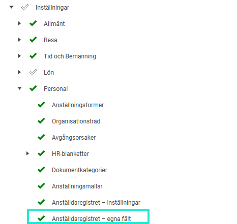
För att kunna se de egna flikar som finns i personregistret behöver du aktivera dessa på den eller de roller som ska ha behörighet till det.
Här är det mycket viktigt att veta att
Egna flikar
som ligger direkt under
Personal - Anställda
på rollen ger behörighet till alla egna flikar som byggs.
Vi rekommenderar därför i stort sett alltid att ha
Egna flikar
av, dvs
rött kryss
, under Anställda för annars blir konsekvensen att när du bygger till fler flikar kommer alla som har rollen att få behörighet att kunna se sådant som byggs till.
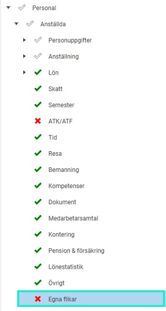
I stället ska du styra behörigheterna utifrån fliken
Menyer - Företagsknutna
per roll enligt nedan bilder. Då har du hela tiden kontroll över vilka roller som får behörighet till en flik. Tänk på att om du bygger nya flikar måste du aktivt gå in och aktivera behörighet till fliken på aktuella roller.
Här kan vi se att rollen chef har
full behörighet
(Aktiverad) till Medarbetarsamtal - Mål.
Läsbehörighet
till Hälsokontrolller, Kontorsutrustning och Övrig anställningsinformation. Medans CV, Sjukintyg, lönerevision och Kläder är
helt stängt
(Ej tillgänglig).
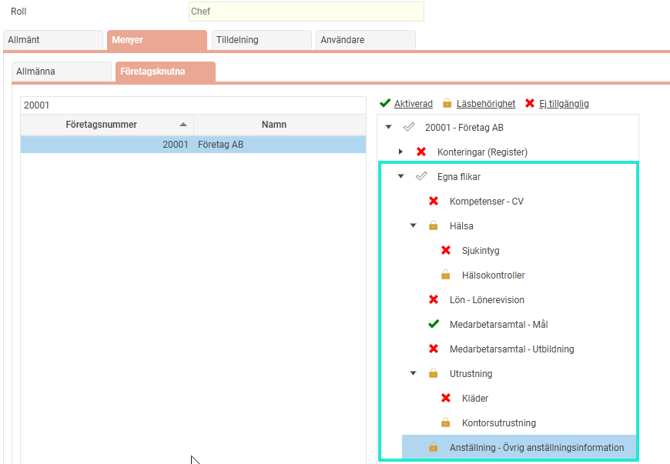
Notera
att
Företagsknutna
inställningar på rollen är per företag. Vilket innebär att du måste ställa in det på respektive företag om du har flera företag.
Under menyn
Personal - Anställda - Anställning
och under
Personal - Anställda - Lön
finns en behörighet som heter
Egna fält
. Om du ger er roll behörighet till
Egna fält
under denna meny så innebär det att rollen ser alla egna fält som är byggda direkt på fliken Anställning respektive Lön.
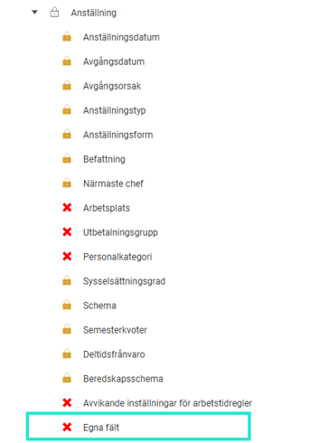
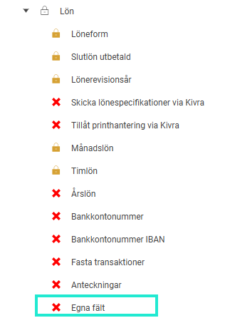
Exempel på egna fält byggda direkt på fliken Lön i anställdaregistret:
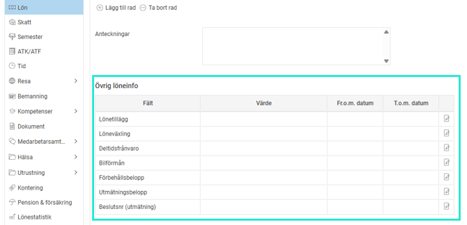
