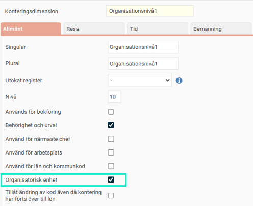
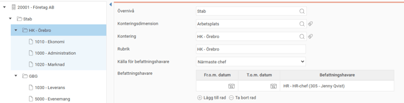
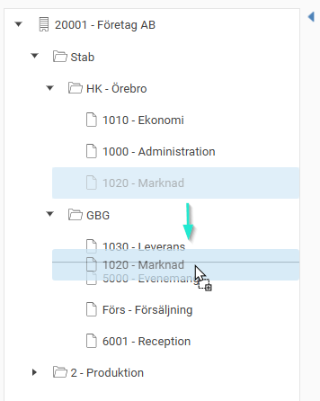
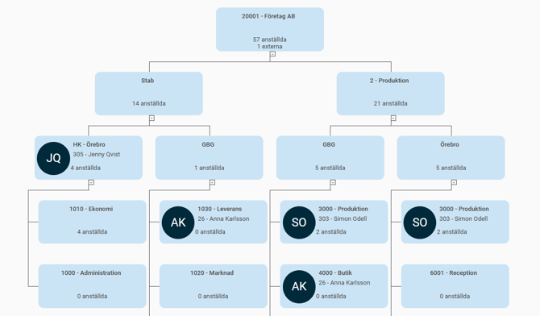
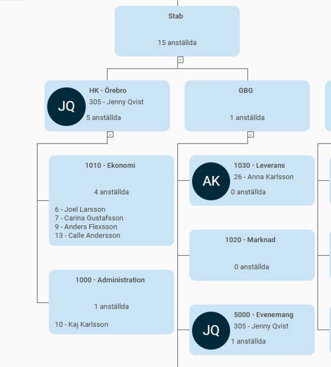
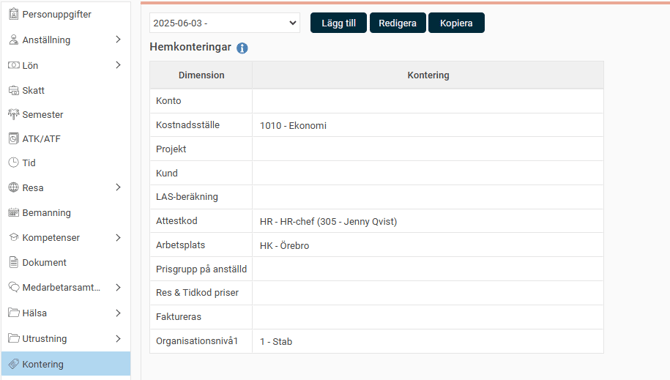
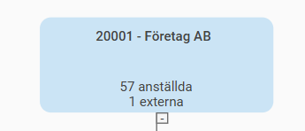
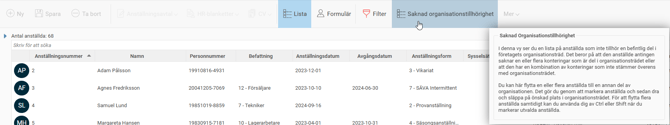

# ⚙️Hur skapar jag ett organisationsträd i HRM Employee?

**Datum:** den 23 september 2025  
**Kategori:** Employee  
**Underkategori:** Anställningshantering  
**Typ:** howto  
**Svårighetsgrad:** intermediate  
**Tags:** anställning, hrm-employee  
**Bilder:** 9  
**URL:** https://knowledge.flexhrm.com/sv/hur-skapar-jag-ett-organisationstrad-0

---

Ju större en organisation blir, desto viktigare är det att ha en tydlig överblick över hur den är uppbyggd. I HRM kan du använda funktionen Organisationsöversikt i anställdaregistret för att enkelt se och välja ut anställda som tillhör en viss del av organisationen. För att detta ska fungera behöver du först bygga upp ett organisationsträd.

Den här artikeln beskriver hur du skapar ett organisationsträd.
Förberedelser: Ange organisatoriska enheter
Innan du kan bygga trädet behöver du ställa in vilka konteringsdimensioner som ska fungera som organisatoriska enheter. Det är dessa enheter som kommer att utgöra de olika nivåerna och grenarna i ditt organisationsträd.

Bygg själva organisationsträdet
När du har ställt in dina konteringsdimensioner kan du börja bygga strukturen.
Det gör du under
Inställningar
>
Personal
>
Organisationsträd
.
Gör så här för att skapa en ny del i trädet:
Klicka på
Ny
.
Välj
Övernivå
,
konteringsdimension
,
kontering
, eventuell
rubrik
och
befattningshavare
.

Spara.
När du skapat en del i trädet kan du sedan skapa undernivåer i trädet.
I exemplet nedan har arbetsplats "HK -Örebro" lagts till som en undernivå till "Stab".

Du kan enkelt flytta en enhet i trädet genom att
klicka, dra och släppa den
på önskad plats (drag and drop). I bilden ser du hur marknadsavdelningen flyttas i trädet från "HK - Örebro" till "GBG".

Högst upp på sidan kan du
förhandsgranska
för att se hur trädet ser ut medan du bygger det.
Så fungerar hierarkin i trädet
Om flera delar (noder) i trädet ska ligga under varandra, kopplar du ihop dem genom att ange en
Övernivå
.
Det är viktigt att komma ihåg att en anställd som ska synas i en nod längst ner i en nod måste tillhöra
samtliga
överliggande organisatoriska enheter i samma gren.
Exempel:
I bilden nedan har trädet tre nivåer:
Nivå 1:
Stab
Nivå 2:
HK - Örebro
Nivå 3:
Ekonomi

För att den anställda ska synas när du klickar på
Ekonomi
, måste hen tillhöra både Stab, HK-Örebro och Ekonomi. Se exempel nedan där anställd 6 syns under Ekonomi.

Koppla anställda till organisationsträdet
För att en anställd ska visas korrekt i organisationsträdet måste du ange hens organisatoriska tillhörighet. Det gör du under fliken
Kontering
i
Anställdaregistret
.

Om du inte anger några konteringar på en anställd kommer hen inte att synas i någon av trädets noder, utan endast under den översta nivån för företaget.
Extern personal
I översta nivån för företaget ser du externa, dvs. de som är markerade med anställningstyp
Extern personal
i anställdaregistret. Extern personal syns inte i trädets undernivåer.

Lägg till VD högst upp i trädet
Om du vill att företagets VD ska visas högst upp i strukturen, direkt under företagsnamnet, anger du detta under
Allmänt
>
Företag
.
Hitta anställda som saknar tillhörighet
För att enkelt hitta anställda som ännu inte är kopplade till en del i organisationsträdet kan du gå till
Anställdaregistret
>
Lista
och klicka på
Saknas organisationstillhörighet
.

Börja använda organisationsträdet
När ditt organisationsträd är färdigbyggt kan du börja använda organisationsschemat på startsidan och få en tydlig organisationsöversikt i systemets olika vyer.
Här kan du läsa mer om hur du använder organisationsöversikten.
