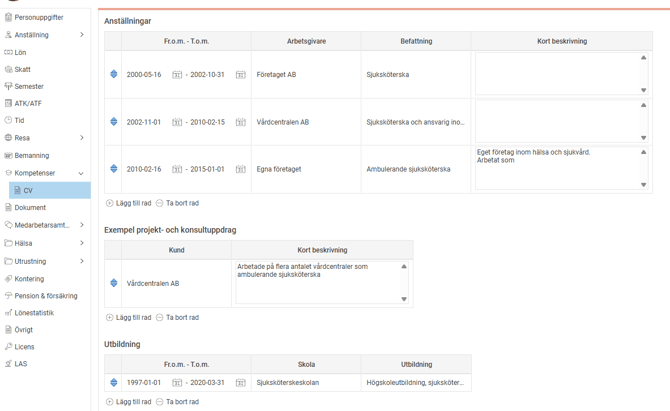
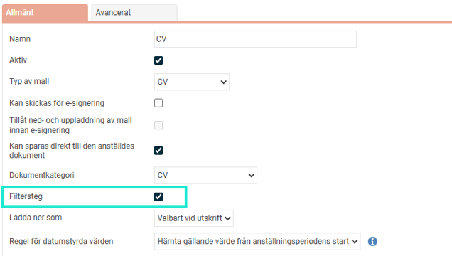

# ⚙️Hur skapar jag HR-blanketter för CV i HRM Employee?

**Datum:** den 27 augusti 2025  
**Kategori:** Employee  
**Underkategori:** Anställningshantering  
**Typ:** howto  
**Svårighetsgrad:** intermediate  
**Tags:** anställning, cv, dokument, hrm-employee, kompetens, kurs  
**Bilder:** 2  
**URL:** https://knowledge.flexhrm.com/sv/hur-skapar-jag-hr-blanketter-for-cv-0

---

HRM Employee gör det möjligt att generera HR-blanketter, som till exempel CV, baserat på anställningsuppgifter, kompetenser, kurser och erfarenheter.

Denna artikel beskriver hur du som administratör skapar och redigerar mallar för HR-blanketter av typen CV.
⚙️Här kan du läsa mer om hur du skapar
HR-blanketter.
CV-mallar
I företag som erbjuder t.ex. konsulttjänster, projektledning, arbeten eller andra tjänster där nyckelpersonernas kompetens och erfarenhet är viktiga är det vanligt att man underhåller ett CV för varje anställd som man kan visa för potentiella kunder. Att underhålla sådana CV:n kan vara både tidskrävande och administrativt påfrestande, och risken för att ett CV blir inaktuellt är stor. För att lösa detta problem har vi därför byggt en funktion för automatisk generering av ett ständigt uppdaterat CV med uppgifter som finns inmatade i HRM.
Skapa mallar för CV
Funktionen för CV bygger på hanteringen för HR-blanketter under
Administration – Inställningar – Personal – HR-blanketter
. För att skapa en mall för CV skapar du en HR-blankett och väljer
CV
under valet
Typ av mall
.
Utformningen av själva CV:t gör du på precis samma sätt som för
HR-blanketter
, där du i ett worddokument kan välja vilka uppgifter som ska komma med i dokumentet och hur dokumentet ska se ut.
Uppgifter om den anställdes kompetenser och kurser kan hämtas från HRM till CV:t.
Information om andra erfarenheter till CV:t byggs ofta som egna tabeller i HRM där användare löpande kan uppdatera informationen. Se avsnittet
Egna fält
för att läsas mer om hur egna tabeller kan byggas i HRM.

När du lägger upp din mall för CV går det också att ställa in om man vid utskrift av CV ska kunna välja vilka uppgifter som kommer med i utskriften. Detta kan vara användbart om du har gått en lång rad av kurser, men för ett visst projekt vill skapa ett CV som endast innehåller relevanta erfarenheter, kurser och kompetenser. För att möjliggöra filtrering vid utskrift kryssar du i valet
Filtersteg
.

Välj om CV:t ska kunna
sparas direkt till den anställdes dokument
och ställ in hur den ska
laddas ner
, som
pdf
,
word
eller
valbart vid utskrift
.
Välj sedan din mall som du skapat i Word och ladda upp den under
Välj fil
.
Spara
.
Relaterade artiklar
Hur hanterar man dokument för anställda i HRM Employee?
Ladda hem ett CV
