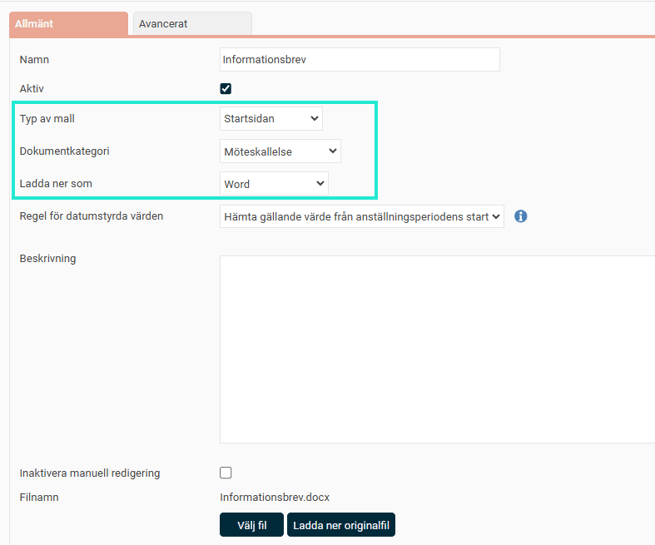
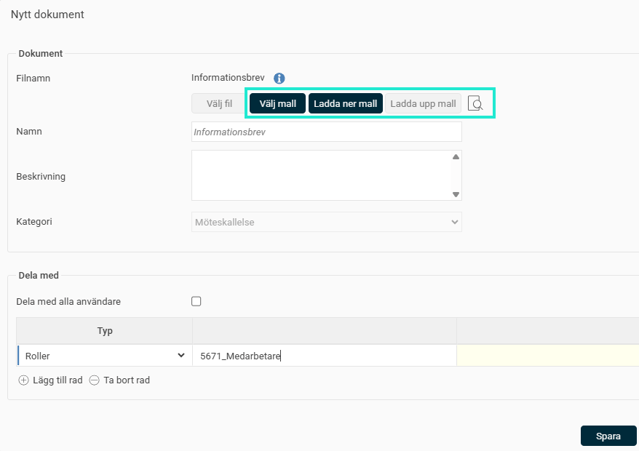
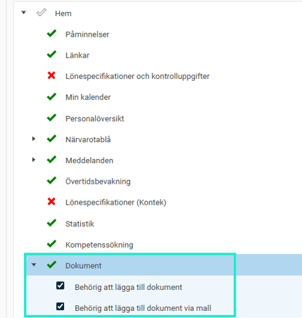
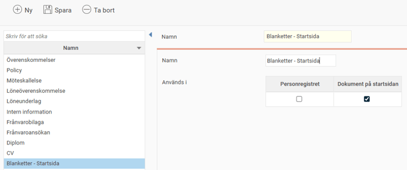

# ⚙️Hur skapar jag HR-blanketter för startsidan i HRM Employee?

**Datum:** den 26 augusti 2025  
**Kategori:** Employee  
**Underkategori:** Anställningshantering  
**Typ:** howto  
**Svårighetsgrad:** intermediate  
**Tags:** anställning, dokument, hrm-employee  
**Bilder:** 4  
**URL:** https://knowledge.flexhrm.com/sv/hur-skapar-jag-hr-blanketter-for-startsidan-0

---

Dela dokument på startsidan via HR-blanketter

Denna artikel beskriver hur du som administratör skapar och redigerar mallar för HR-blanketter för delning via startsidan i HRM.
⚙️Här kan du läsa mer om hur du skapar
HR-blanketter.
Dela dokument på startsidan via HR-blanketter
Du kan använda färdiga mallar, via HR-blanketter, för att dela dokument på startsidan i HRM. Det kan gälla generella mallar som exempelvis interna utskick med information, kallelser till infomöten etc. Ett annat användbart område är om du vill dela en blankett som anställda själva ska kunna hämta ut via startsidan, exempelvis en tjänstledighetsansökan.
HR-blanketter som mallar
Skapa mallar till startsidan
För att kunna dela en mall via startsidan i HRM behöver du lägga upp den under
HR-blanketter
och välja att
Typ av mall
är
Startsidan
. I övrigt gör du på samma sätt som för övriga HR-blanketter, det vill säga fyller i aktuella val och laddar upp din fil. Du kan även i mallarna till startsidan använda dig av taggarna under
Tillgängliga taggar
. Beroende på vad du väljer under
Ladda ner
som kommer du få rätt till (Word) eller inte rätt till (PDF) att redigera i mallen innan den delas från startsidan.

Dela dokumentmallar från startsidan
För att dela ett dokument på startsidan via en mall (från HR-blanketter) väljer du först
Lägg till
nytt dokument
och sedan
Välj mall
. Är mallen inställd på att redigering är tillåten kommer du att få valet att
Ladda ner mall
. Det innebär att du kan redigera i dokumentet, kanske skriva dit datum för ett möte eller liknande, och sedan välja att spara och
Ladda upp
mall igen. Den knappen lyses enbart upp om du först laddat ner mallen för redigering.

Genom att klicka på ikonen med
förstoringsglaset
i ett dokument kan du förhandsgranska mallen innan du sparar och delar den med andra.
Observera
att du kommer att se eventuella taggar i mallen oformaterade innan du delat dokumentet eftersom det ännu inte är kopplat till någon anställd.
Notera
även att taggarna enbart visar ett värde för de som är anställda i det företag som dokumentet delas i, det vill säga är du enbart användare till ett visst företag blir eventuella fält med taggar med anställningsuppgifter i tomma.
Behörigheter
- Startsidan
För att kunna dela ett dokument, via en mall, med andra via startsidan behöver du först aktivera den behörigheten för berörda roller under
Roller
.

Tänk på att du även behöver ha nedan ruta ibockad för de dokumentkategorier som ska kunna väljas på startsidan. Kontrollera vilka kategorier som kan användas för startsidan under
Dokumentkategorier
.

