# ⚙️Hur skapar jag HR-blanketter i HRM Employee?

**Datum:** den 17 september 2025  
**Kategori:** Employee  
**Underkategori:** Anställningshantering  
**Typ:** howto  
**Svårighetsgrad:** intermediate  
**Tags:** anställning, cv, dokument, hrm-employee, signering  
**Bilder:** 23  
**URL:** https://knowledge.flexhrm.com/sv/hur-skapar-jag-hr-blanketter-0

---

HRM Employee möjliggör för att generera HR-blanketter så som anställningavtal, olika intyg och CV med data från anställningsuppgifter.

Denna artikel beskriver hur du som administratör skapar och redigerar mallar för HR-blanketter.
HR-blanketter
En HR-blankett är ett dokument som kan hämta uppgifter från person-registret i HRM. Exempel på HR-blanketter är anställningsavtal (som inte matchar standardmallen i HRM), sekretessavtal och intyg. För att få ut en HR-blankett ur HRM med den information och i det format du själv vill ha går du till väga enligt beskrivningen nedan.
Inställningar
Gå till Inställningar – Personal – HR-blanketter för att lägga upp dina wordmallar som ska användas som HR-blanketter.
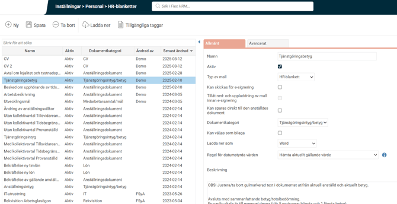
Välj
namn
på din mall i HRM.
Välj om din mall ska vara
aktiv
eller ej. Välj aktiv först när den är klar att användas.
Välj
typ av mall
.
Välj om det ska vara möjligt att
spara direkt till den anställdes dokument
Välj
dokumentkategori
Välj om mallen ska kunna väljas som
bilaga till anställningsavtal
.
Välj hur filen ska
laddas ner
, PDF, Word eller valfritt
Välj
regel för datumstyrda värden
. Här väljer du vilket värde som ska hämtas för taggar med datumhistorik så som månadslön, timlön, sysselsättningsgrad, arbetsmått, hemkontering och egna fält
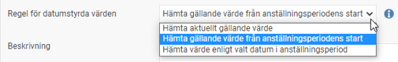
Beskrivning
: Här kan du förklara till vad och när denna mall ska användas och för vilken/vilka personalkategorier om du har flera mallar aktiva.
Under fliken
Avancerat
kan du välja hantering för decimaler och avrundning.
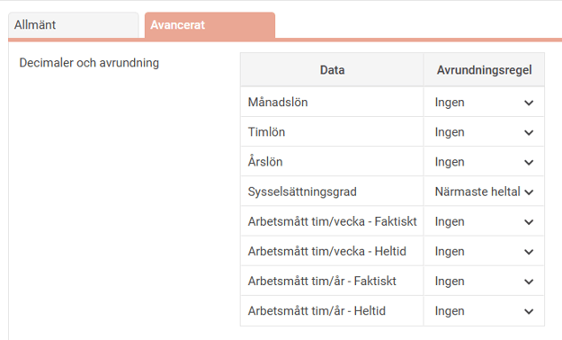
Välj din fil (mallen som du skapat i word) här och tryck på
Spara
.
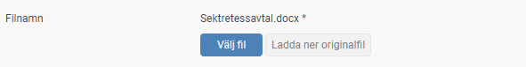
Innan du laddar upp din fil taggar du dokumentmallen med Tillgängliga taggar. Se nedan hur du skapar dokumentmallar i word för HRM.
Skapa dokumentmall
Vi vill att HRM tar med information som redan finns i HRM till HR-blanketten, det vi då behöver göra är att förbereda vårt dokument som en mall.
Välj
tillgängliga taggar
för att se vad du kan infoga i mallen.
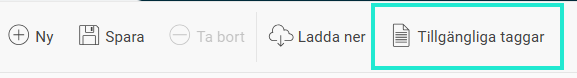
Nedan syns de taggar som finns att välja mellan. Använd taggen genom att du kopiera den och klistra in den där du vill ha den i mallen som alltid baseras på ett Worddokument (det går att skriva in taggen själv också).
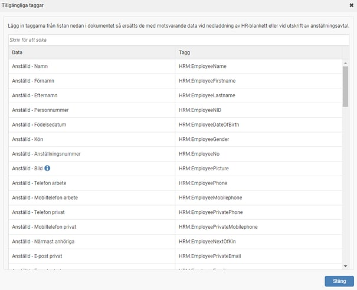
Kopiera de taggar
du vill ha i den högra kolumnen och lägg dem i dokumentet.
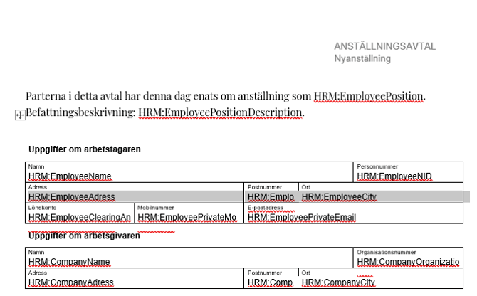
För en underskrift kan du till exempel göra så här för att automatiskt få med namnförtydligandet under signeringsraden:
HRM:EmployeeName
Anställd - Bild
Vill du lägga till en bild på den anställd du skriver ut blanketten för anger du taggen
HRM:EmployeePicture
(du hittar den där Tillgängliga taggar finns) på valfritt ställe i dokumentet, dvs. där du vill att bilden ska hamna.
För bättre positionering av bilden, lägg in en valfri standardbild som mall. För att ersätta vald mall-bild med personbilden från personregistret i HRM högerklickar du på den och väljer
Redigera Alternativtext
och klistrar in taggen där. Bilden blir i ”HRM-storlek” oavsett hur stor bild du har i mallen.
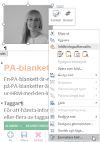
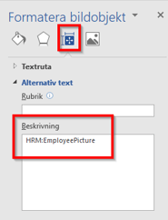
Välj alltid att formatera bilden som det passar situationen genom att högerklicka på bilden:
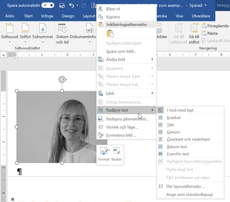
Anställd – Egna fält
För att lägga in ett eget fälts värde i dokumentet, ange taggen och fältets namn inom []. Till exempel HRM:OwnField[Lönetillägg]. Lägg in taggen på valfri plats i dokumentet.
Anställd – Egna tabeller
För att lägga in en tabell du byggt i HRM, anger du tabellens namn/rubrik i HRM inom [] i taggen. Till exempel HRM:OwnTable[Yrkeserfarenheter]. Lägg sedan in taggen på valfri plats i Word-dokumentet.
Tabellen kommer att använda ett standardformat om inget eget anges i dokumentmallen. Om eget format för tabellen önskas, spara ett format i dokumentmallen med namnet HRM:TableStyle av typen Tabell.
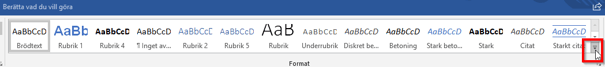

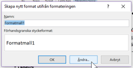
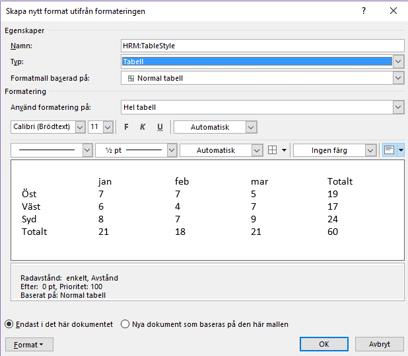
För att ändra i formateringen du redan gjort går du in via Format:
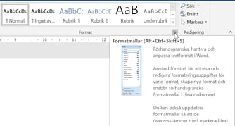
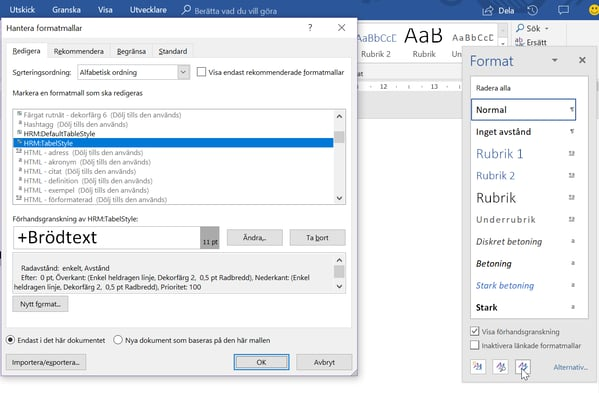
Skapa dokumentmall - Avancerat
För att kunna göra snyggare mallar hjälper det att kunna använda funktioner under menyn Utvecklare i Word. För att få denna meny synlig går du till Arkiv och Alternativ och bockar i Utvecklare enligt bilden nedan:
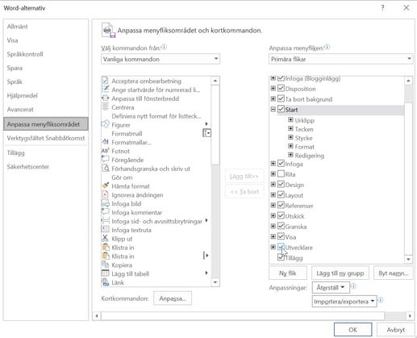
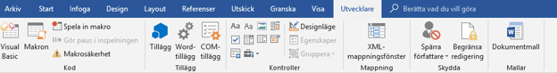
Behörigheter
För att aktivera inställningar för HR-blanketter, gå till
Administration – Användare/Behörigheter– Roller
.
Behörighet att redigera mallar för HR-blanketter
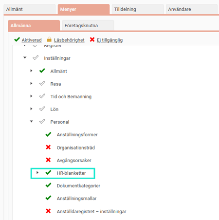
Ställ in på rollerna om rollen ska få hämta HR-blanketter för anställda. Exempelvis om chefer ska få hämta upp HR-blankett för intyg och CV på sina anställda. Ge behörighet till ikonen HR-blanketter och CV:
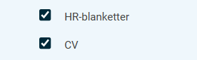
Ställ in vilka dokumentkategorier som rollen ska få hämta HR-blanketter för. Full behörighet (Aktiverad) till dokumentkategorin som HR-blanketten är kopplad till krävs för att få hämta ner den:

Behörig att hämta ut Anställningsavtal?
Tänk på att du måste ha behörighet till
HR-blanketter
,
dokumentkategorier
för aktuella HR-blanketter och behörighet till
Rapporten Anställningsavtal
för att kunna hämta ut HR-blanketter via knappen
Anställningavtal
.
Styr vilka HR-blanketter som får hämtas (Dokumentkategori)
Nedan får HR-blanketter kopplade till kategorierna "Anställningsdokument" och "CV" hämtas ut. Finns det HR-blanketter kopplade till kategorin "Diverse", kan denna roll inte hämta ut dessa blanketter.
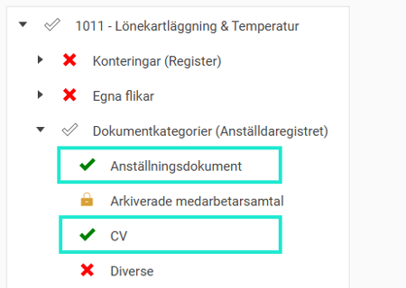
Rapport styr om HR-blanketter av typen "Anställningsavtal" får hämtas
För anställningsavtal krävs ovan + denna behörighet

Relaterade artiklar
Hur hanterar man dokument för anställda i HRM Employee?
Hur fungerar Dokumentkategorier i HRM Employee?
Läs mer om hur du skickar ett dokument för E-signering.
Ladda hem ett CV?
⚙️Hur skapar jag HR-blanketter för startsidan i HRM Employee?
⚙️Hur skapar jag HR-blanketter för CV i HRM Employee?
