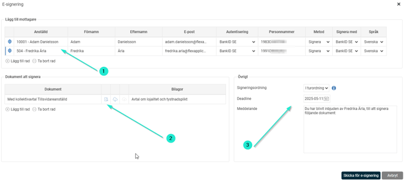
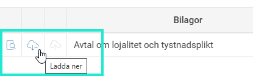
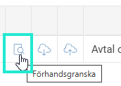
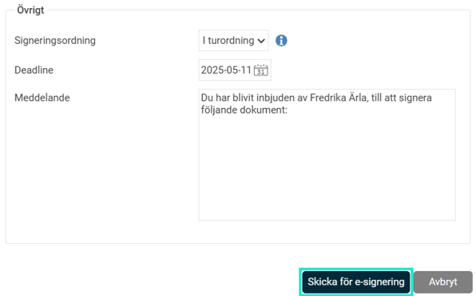
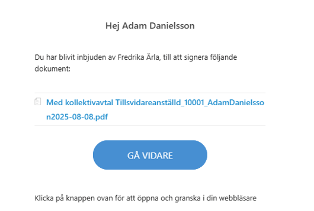

# Hur skickar jag en HR-blankett för e-signering i HRM Employee?

**Datum:** den 12 augusti 2025  
**Kategori:** Employee  
**Underkategori:** Anställningshantering  
**Typ:** howto  
**Svårighetsgrad:** intermediate  
**Tags:** anställning, dokument, hrm-employee, signering  
**Bilder:** 5  
**URL:** https://knowledge.flexhrm.com/sv/hur-skickar-jag-en-hrblankett-for-esignering-i-hrm-employee

---

HRM Employee möjliggör e-signering av HR-blanketter så som Anställningsavtal och andra HR-blanketter så som intyg.
Skicka för E-signering
Lägg till mottagare
- Kontrollera/välj mottagarnas uppgifter så som rätt e-postadress, personnummer och signeringsmetod. Justera vid behov vem som ska signera först med den blå ikonen.
Under
Dokument att signera
ska du förhandsgranska avtalet för att se hur det ser ut innan det skickas.
Välj under
Övrigt
Signeringsordning, Deadline och ev. Meddelande.

Om ert företag tillåter så kan ett dokument vid behov justeras manuellt innan det skickas för e-signering. Under
Dokument att signera
klickar du först på ikonen i mitten
Ladda ner
, redigerar dokumentet och sparar det på din dator. Klicka sedan på ikonen
Ladda upp
till höger för att ladda upp ditt redigerade dokument som du vill ska skickas för signering.

Ladda upp-ikonen blir inte aktiv förrän du först laddat ner dokumentet.
När ett redigerat dokument har laddat upp kan du se det redigerade dokumentet via Ikonen
Förhandsgranska
.

Val av
signeringsordning
innebär att du kan välja om mottagarna ska signera i tur och ordning eller om alla mottagare kan signera dokumentet parallellt.
Efter att datumet för
deadline
har passerat kan dokumentet inte signeras.
När dokument och inställningar är granskat kan du skicka det för signering.

Mottagaren som ska signera ett dokument får ett e-postmeddelande som ser ut ungefär som bilden nedan. För att granska och signera dokumentet följer de instruktionerna i mailet.

Dokumentet hamnar nu under
Dokument
på den anställde. Här kan du följa status på dokumentets under signeringsprocessen.
