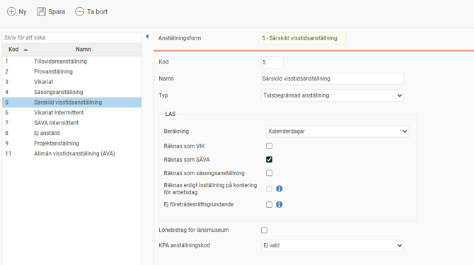

# ⚙️Hur ställer jag in anställningsformer?

**Datum:** den 22 oktober 2025  
**Kategori:** Employee  
**Underkategori:** Anställningshantering  
**Typ:** config  
**Svårighetsgrad:** advanced  
**Tags:** anställning  
**Bilder:** 1  
**URL:** https://knowledge.flexhrm.com/sv/hur-stalla-in-anstallningsform-0

---

I detta register kan du som administratör lägga upp ett register över de anställlningsformer ni behöver hantera.
Anställningsformer
Klicka på
Inställningar > Personal
och välj
Anställningsformer
från menyn.
Du får då upp följande vy:

I I listan till vänster visas eventuella tidigare upplagda anställningsformer. Till höger anges/visas uppgifter om respektive anställningsform.
Kod -
Här visas/anges koden (förkortningen) för aktuell anställningsform.
Namn -
H
är visas/anges benämningen på anställningsformen.
Typ -
För att systemet ska veta hur olika anställningsformer ska hanteras anger du här aktuell typ av anställningsform. Följande alternativ finns:
Tillsvidareanställning, Provanställning, Tidsbegränsad anställning, Vikariat
och
Behovsanställning
.
Inställningar för LAS -
Hä
r görs inställningar som styr hanteringen av LAS (Lagen om Anställningsskydd) för vald anställningsform. För mer information, se
LAS - Inställningar och beräkningsdetaljer.
Lönebidrag för länsmuseum -
D
en
na inställning är kopplad till lönestatistik till Sobona (tidigare KFS). För länsmuseer finns i Sobo
na en speciell hantering för löneform för anställda med lönebidrag. För dessa ska du ange löneform 4 och 5 istället för 1 och 3 (månadslön/timlön). För att hantera detta finns denna kryssruta där du markerar att det gäller lönebidrag för länsmuseum.
KPA anställningskod -
F
ör att du kunna rapportera rätt anställningskod till KPA behöver denna anges i HRM. M
arkera här den anställningskod som ska användas för respektive anställningsform.
