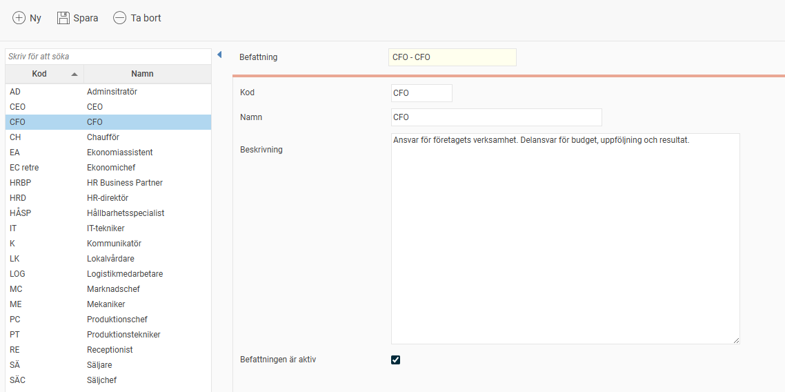

# ⚙️Hur ställer jag in våra befattningar?

**Datum:** den 22 oktober 2025  
**Kategori:** Employee  
**Underkategori:** Anställningshantering  
**Typ:** config  
**Svårighetsgrad:** intermediate  
**Tags:** anställning  
**Bilder:** 1  
**URL:** https://knowledge.flexhrm.com/sv/hur-stalla-in-befattningar-0

---

I detta register kan du som administratör lägga upp de befattningar som ni har i ert företag.
Befattningar
Gå till
Administration > Register
och välj
Befattningar
från menyn.
Du får då upp följande vy:

I listan till vänster visas de befattningar som finns upplagda. Till höger anges/visas uppgifter om respektive befattning.
Klicka på
Ny
för att skapa en ny befattning.
Kod -
Här visas/anges koden (förkortningen) för aktuell befattning.
Namn -
H
är visas/anges benämningen på befattningen.
Beskrivning -
Här anger du en kort beskrivning av befattningen. Denna beskrivning kan du sedan hämta till anställningsavtalet via taggar för HR-blanketter.
Genom att avmarkera rutan
Befattningen är aktiv
kan du inaktivera befattningar som inte längre används.
Inaktiverade befattningar finns fortfarande tillgängliga i registret och kan tas fram via inställningen
Visa även inaktiva befattningar
nedanför listan till vänster.
Befattningsregistret kan importeras från fil via
Bearbetningar > Servicerutiner > Import.
