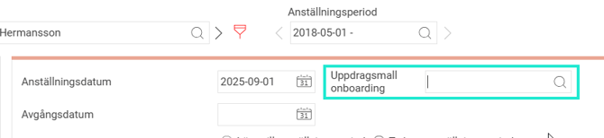
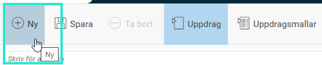
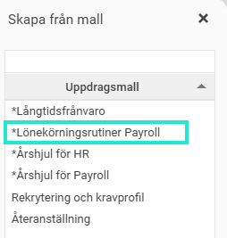
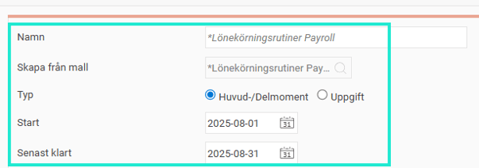
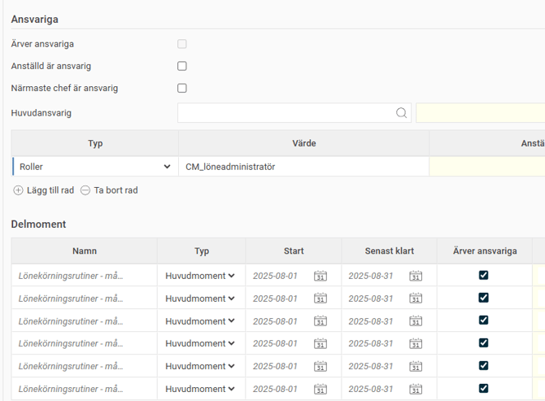

# Hur startar jag nya uppgifter och uppdrag i HRM?

**Datum:** den 27 oktober 2025  
**Kategori:** Employee  
**Underkategori:** Anställningshantering  
**Typ:** howto  
**Svårighetsgrad:** intermediate  
**Tags:** anställning, offboarding, onboarding  
**Bilder:** 7  
**URL:** https://knowledge.flexhrm.com/sv/hur-skapar-jag-uppgifter-och-uppdrag-i-flex-hrm-0

---

HRM Employee effektiviserar onboarding och offboarding genom guidade anställningsprocesser där man kan följa upp uppdrag via en panel på startsidan. Uppgifter och Uppdrag kan även användas för uppföljning av andra HR- och löneprocesser. 

Denna artikel beskriver hur du startar nya uppdrag och uppgifter.
Starta och hantera nya uppdrag
Uppdrag för Onboarding
Uppdrag kopplat till onboarding startas normalt i
Nyanställning
. Skulle ett uppdrag för onboarding inte kopplats på i samband med nyanställning kan det kopplas till anställningsperioden direkt i anställningsregistret.
Gå till
Personal > Anställda > Anställning
Koppla rätt uppdragsmall bredvid anställningsdatum i rutan för
Uppdragsmall Onboarding

Uppdrag för offboarding
Gå till
Personal > Anställda > Anställning
När en anställd ska sluta behöver ett avgångsdatum läggas in.

När avgångsdatum läggs in så dyker fälten
Uppdragsmall
och
Avgångsorsak
upp. Här fyller du i rätt mall/värde från listan.

Fristående uppdrag
Ett fristående uppdrag kan exempelvis vara en checklista för att följa upp HR- och löneprocesser. De fristående uppdragen skapas direkt i vyn
Uppdrag.
Möjlighet att starta uppdrag/uppgifter direkt från Uppdragsvyn styrs av behörigheterna i systemet.
Klicka på
Ny
.

Välj en
mall
eller skapa ett uppdrag/uppgift utan mall genom att skriva in önskade uppgifter manuellt.

Gå igenom uppgifterna för att se så att du får med det som önskas så som info, ansvariga och deadlines för senast klart.

Om du lägger till
Ansvariga
i uppdrag/uppgifter är det viktigt att tänka på att uppdrag till
Roller,
i exemplet ovan "Löneadministratör", innebär att alla med den rollen blir tilldelad uppgiften. Det är sedan någon av löneadministratörerna som behöver klarmarkera uppgiften för att den ska anses vara hanterad. Det är alltså ett delat ansvar.
Relaterade artiklar
Hur hanterar jag uppgifter och uppdrag i HRM?
Hur hanterar HRM Employee onboarding av anställda?
Hur hanterar HRM Employee offboarding av anställda?
