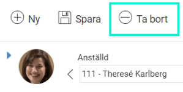
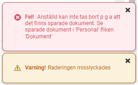
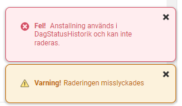

# Hur tar jag bort en anställd?

**Datum:** den 14 augusti 2025  
**Kategori:** Employee  
**Underkategori:** Anställningshantering  
**Typ:** howto  
**Svårighetsgrad:** intermediate  
**Tags:** anställning, dokument  
**Bilder:** 4  
**URL:** https://knowledge.flexhrm.com/sv/hur-tar-jag-bort-en-anst%C3%A4lld

---

I artikeln hittar du information om hur du tar bort en anställd i HRM Employee.

Under
Personal> Anställda
i HRM hittar du anställdaregister med personuppgifter och övriga anställningsuppgifter.
Ta bort anställd
Ta bort en anställd gör du via ikonen
Ta bort
högst upp i HRM.

Om en anställd tas bort från HRM så kommer all information att rensas på den anställde. Det innebär även att ev. signerade dokument som finns på den anställde kommer att rensas i HRM. Denna åtgärd går inte att ångra.
Observera att användaren dock inte tas bort och måste hanteras manuellt.
I vissa fall går det inte att ta bort anställda och användare då det finns sparade loggar i HRM eller något annat som spärrar. En varning fås som talar om när det händer.
Exempel på varningar

HRM har separata funktion för
gallring av personuppgifter
och funktion för
anonymisering av anställda
.
Relaterade artiklar
Gallring - Rensning av personuppgifter
Hur fungerar anonymisera anställda i HRM?
