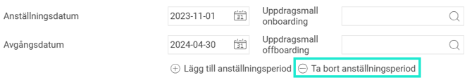
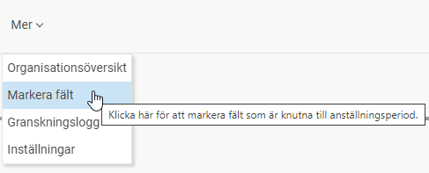
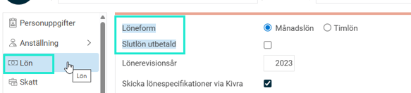

# Hur tar jag bort en anställningsperiod?

**Datum:** den 14 augusti 2025  
**Kategori:** Employee  
**Underkategori:** Anställningshantering  
**Typ:** howto  
**Svårighetsgrad:** intermediate  
**Tags:** anställning  
**Bilder:** 5  
**URL:** https://knowledge.flexhrm.com/sv/hur-tar-jag-bort-en-anst%C3%A4llningsperiod

---

I artikeln hittar du information om hur du tar bort en anställningsperiod i HRM Employee.

Under
Personal> Anställda
i HRM hittar du anställdaregister med personuppgifter och övriga anställningsuppgifter.
Ta bort anställningsperiod
Ta bort anställningsperiod gör du via
Anställning
-
Ta bort anställningsperiod

Om en anställningsperiod tas bort så kommer inte vissa datumstyrda fält att tas bort med automatik exempelvis ny lön, sysselsättningsgrad, konteringar eller egna fält. Dessa behöver då tas bort manuellt i anställdaregistret. Tänk på att inte rensa fel uppgifter och att vara observant på eventuella slutdatum som har sats på datumstyrda fält så som egna fält, lön m.m.
Under Ikonen
Mer
hittar du funktionen
Markera fält
som visar vilka fält som är direkt kopplade till en anställningsperiod. Övriga fält som inte markeras är inte direkt kopplade och behöver därför tas bort/hanteras separat.

Notera att det under respektive sidomeny (Anställning, Lön, Tid, Resa osv) kan finnas uppgifter som är direkt kopplade till anställningsperioden. Du ser vilka det gäller genom att navigera mellan de olika menyerna.

Relaterade artiklar
Hur tar jag bort en anställd?
