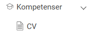
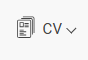
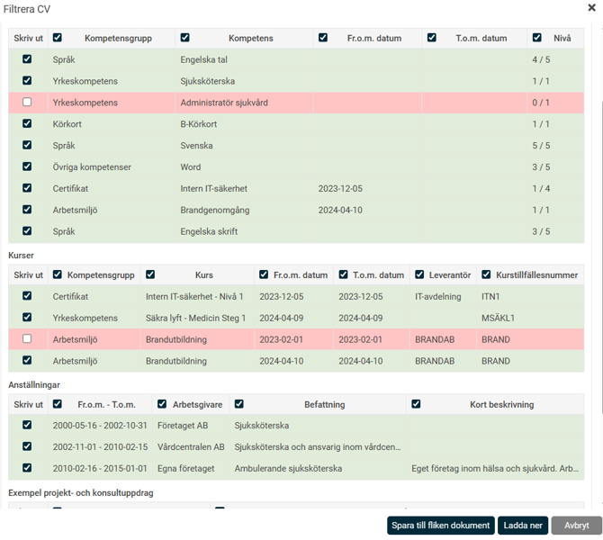
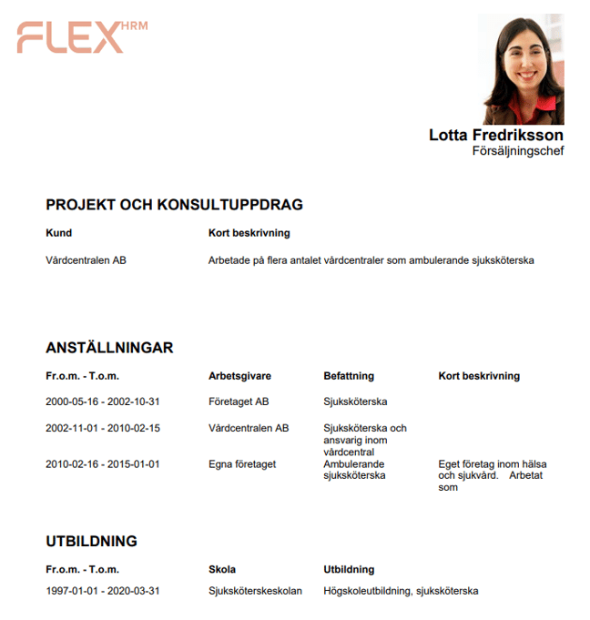

# Hur tar jag fram ett CV för en anställd i HRM Employee?

**Datum:** den 26 augusti 2025  
**Kategori:** Employee  
**Underkategori:** Anställningshantering  
**Typ:** howto  
**Svårighetsgrad:** intermediate  
**Tags:** anställning, cv, dokument, hrm-employee, kompetens, kurs  
**Bilder:** 4  
**URL:** https://knowledge.flexhrm.com/sv/hur-tar-jag-fram-ett-cv-for-en-anstalld

---

I HRM Employee finns stöd för att generera HR-blanketter (som intyg och CV) med data från anställningsuppgifter.
CV för erfarenheter, kompetenser och/eller tidigareprojekt.
Ladda hem HR-blanketter - CV
Använder ditt företag CV på de anställda kan det hämtas från den anställdes sida i anställdaregistret.
Uppgifter till CV registreras direkt i HRM – antingen via anpassade tabeller eller genom att lägga in kompetenser och kurser som du vill visa i CV:t.

När uppgifter på anställda finns i HRM är det smidigt att hämta ett dokument av typen CV.
CV
har en egen ikon.

När du ska ladda hem CV kan du sedan bestämma om ett CV ska innehålla all information eller om du önskar välja bort vissa delar.
Klicka ur
bockarna om någon kolumn eller rad inte ska följa med över till CV:t.

Klicka på
Ladda ner
för att skapa CV:t eller spara det direkt till den anställdes
Dokument
.

Relaterade artiklar
Så får du full överblick över vilka kompetenser dina anställda har – och saknar?
⚙️Hur skapar jag HR-blanketter för CV i HRM Employee?
