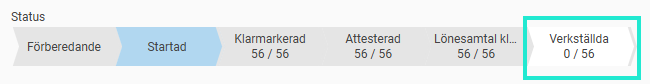
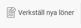
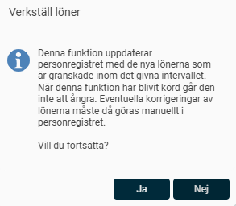
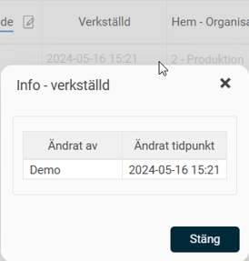

# Hur verkställer jag årets Lönerevision?

**Datum:** den 24 september 2025  
**Kategori:** Employee  
**Underkategori:** Anställningshantering  
**Typ:** howto  
**Svårighetsgrad:** advanced  
**Tags:** lönerevision  
**Bilder:** 4  
**URL:** https://knowledge.flexhrm.com/sv/hur-verkstaller-jag-arets-lonerevision-0

---

I artikeln hittar du information om hur du enkelt arbetar med årets lönerevision.  

Nedan beskrivs funktionen Verkställ i lönerevisionen.

Arbeta med lönerevisionen - Verkställa löner
Personal > Lönerevision
När alla steg i granskningen är klara för en anställd kan du verkställa lönen. Det innebär att den nya lönen sparas i anställdaregistret och börjar gälla i resten av systemet. Vanligtvis är det en administratör som utför det här steget för att ha kontroll över flödet för utbetalning av retroaktiv lön i lönesystemet.
Så här verkställer du nya löner
För att verkställa alla löner som är färdiggranskade klickar du på knappen
Verkställ nya löner
.

Därefter får du bekräfta ditt val.

Om du bara vill verkställa lönerna för ett urval av anställda behöver du först
filtrera
listan. Se till att endast de anställda du vill verkställa lönen för visas, och klicka sedan på
Verkställ nya löner
.
Efter att lönen är verkställd
När lönen är verkställd kan du se tidpunkt och signatur genom att klicka på
i-symbolen
i kolumnen
Verkställd
.

Den nya lönen visas därefter i
Personal
under sidomenyn
Lön
. Även lönerevisionsåret uppdateras, vilket visar att lönerevisionen är klar för den anställde för det här året.
Blev lönerevisionen klar sent i år? Information om retroaktiv löneberäkning hittar du här.
Har du Flex Lön som lönesystem kan du läsa om hur du överför de nya lönerna till lönesystemet
här
.
