# ⚙️Integration till BKY - Hur kopplar jag BKY och HRM?

**Datum:** den 26 augusti 2025  
**Kategori:** Employee  
**Underkategori:** Anställningshantering  
**Typ:** config  
**Svårighetsgrad:** advanced  
**Tags:** kompetens  
**Bilder:** 15  
**URL:** https://knowledge.flexhrm.com/sv/integration-till-bky-

---

Syftet med integrationen mellan BKY och HRM är att säkerställa att ingen anställd framför fordon utan giltig behörighet/kompetens.
Denna artikel beskriver hur du aktiverar anslutningen till BKY från HRM.
Integration till BKY
Tack för beställningen av vår modul med koppling till Behörighetskontroll Yrkestrafik BKY som är ett digitalt system för kontroll av förarbehörigheter och trafiktillstånd. Det är utvecklat av Svenska Taxiförbundet och Transportstyrelsen i samarbete med Sveriges Bussföretag och Sveriges Åkeriföretag. BKY är ett hjälpmedel för företag att svara upp mot behörighetskrav som lagstiftningen inom yrkestrafiken har satt upp. Du kan läsa mer på
www.bky.se
.
Aktivera anslutning till BKY
För att komma igång med en anslutning till BKY förutsätter det att ditt företag har Transportstyrelsens medgivande om Direktåtkomst till Vägtrafikregistret. När ni ansöker på
www.bky.se
skapas det två ansökningar:
Dels en ansökan om Transportstyrelsens medgivande om Direktåtkomst till Vägtrafikregistret och dels ett avtal för BKY, som tecknas med Svenska Taxiförbundets Service AB som är systemägare av BKY.
När Transportstyrelsen har tagit beslut kommer ett e-post från dem till ert företag och BKY får en kopia på beslutet. Ett medgivande aktiverar avtalet i BKY och ett systemgenererat e-post skickas till den ansvarige användaren med inloggningsuppgifter och handledning.
Aktivera funktion i HRM
För att aktivera kopplingen till BKY behöver du först följa nedan steg.
Kompetensregister
För att aktivera funktionen behöver du först lägga upp kompetenser för de behörigheter du vill kontrollera mot BKY. Det gör du under "Kompetenser" i HRM.
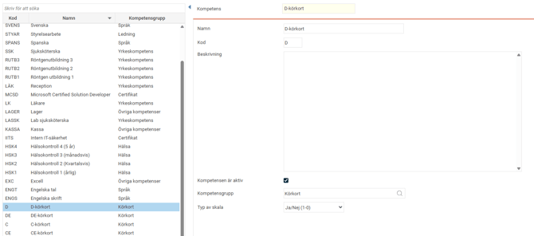
Varje kompetens ovan behöver även vara kopplad till en Kompetensgrupp som du skapar under "Kompetensgrupp".
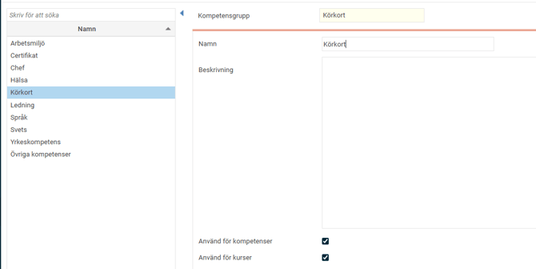
Licens
Gå in under "Företag" och fliken Licens på det företag du ska koppla på integrationen för. Kontrollera att licensen är i:
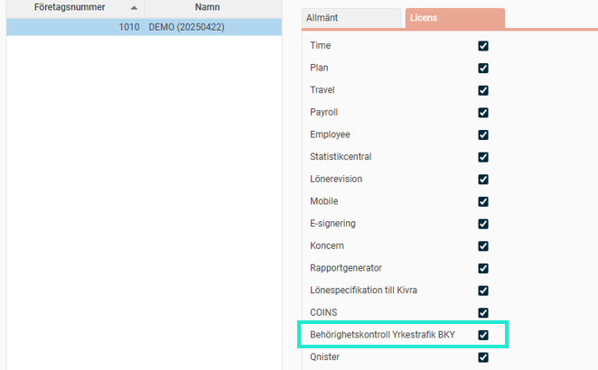
Programlänk
Lägg upp en ny programlänk under "Programlänkar" där du fyller i följande:
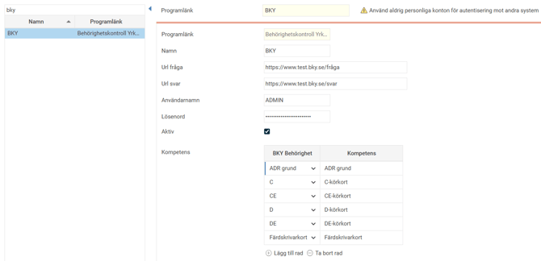
Programlänk
Välj
Behörighetskontroll Yrkestrafik BKY
Namn
Ange ett namn.
URL fråga och svar
Skriv in nedan adresser i respektive ruta.
Fråga
: https://bkyfraga.bky.se/FB_BKY40Fraga/BKYFraga.svc
Svar
: https://bkysvar.bky.se/FB_BKY40Svar/BKYSvar.svc
Användarnamn och lösenord
Gå in i Kontrollpanelen på BKY.se genom att använda de uppgifter du får när du fick din ansökan beviljad:
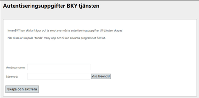
Klicka på
Skapa och aktivera
och sedan på
Visa lösenord
och skriv in lösenordet och användarnamnet i HRM. Rekommendationen är att du kopierar informationen och klistrar in den.
Aktiv
Markera detta val när du vill aktivera programlänken.
Kompetens
Här mappar du upp vilka BKY-behörigheter som motsvarar vilka kompetenser i HRM. Klicka på
Lägg till rad
och välj i listan i kolumnen
BKY Behörighet
vilka behörigheter som är relevanta för just ditt företag att fråga om och koppla respektive till rätt kompetens.
Logg
Eftersom allt sker i bakgrunden så har en logg skapats för att kunna följa flödet på anrop och för eventuella fel som kan uppstå. Loggen finns i högst upp i vyn på BKY-programlänken i knappen Visa logg
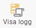
Allt som sker loggas här i som t.ex. när svaret blir Nej på en kompetens genererar det en egen rad per anställd det gäller.
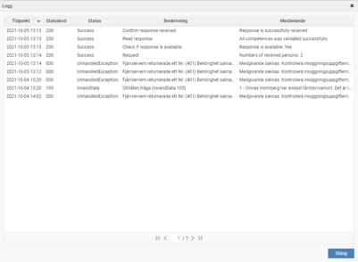
Kompetenser på anställda
Lägg till den eller de behörigheter respektive anställd har under fliken Kompetenser.
OBS
! Här är det viktigt att du lägger upp den högsta behörigheten, enligt hierarkin nedan, som den anställde har d.v.s. har den anställde CE-behörighet kan du inte lägga in bara C-behörighet som kompetens.

Färdskrivarkort
När du frågar om ett färdskrivarkort så görs detta via ett 16-siffrigt färdskrivarkortnummer. Du får enbart fråga på färdskrivarkort om det finns minst en annan BKY-kompetens aktiv på den anställde. Detta sköts automatiskt via HRM.
För att veta vilken kompetens i HRM som är just färdskrivarkort behöver du koppla den kompetensen till färdskrivarkort på programlänken enligt instruktion under rubriken Programlänk.
Du behöver sedan lägga in korrekt färdskrivarkortnummer per anställd genom att klicka på det plus som dyker upp när du kopplat ihop BKY-behörigheten i programlänken. Numret består av 16 tecken. Färdskrivarkortnummer läggs in manuellt i HRM även om du via en import i övrigt importerar in kompetenser från ett annat system.
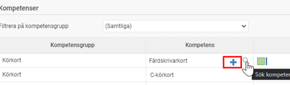
Giltigt personnummer
För att en anställd ska kunna komma med i kontroller krävs att den har ett korrekt svenskt personnummer eller svenskt samordningsnummer. Gå därför igenom och kontrollera detta på berörda anställda.
Påminnelser
För att få påminnelser för när någon anställd blir av med sin behörighet behöver du aktivera påminnelsen Utgående kompetenser d.v.s. för de kompetenser som motsvarar någon BKY-behörighet. Detta är samma påminnelse som funnits sedan tidigare men nu är den även kopplad till BKY-behörigheter och går ut så snart du får svaret att en behörighet gått ut.
Du kan välja att göra olika påminnelser för de olika BKY-behörigheterna genom att välja olika kompetenser under Urval. Det underlättar om du vill ha olika rubriker och beskrivningar i de mejl och notiser som går ut.
Påminnelsen är behörighetsstyrd vilket innebär att om du skickar till en roll kommer de med vald roll enbart att få påminnelser och notiser för de anställda de är behöriga att se.
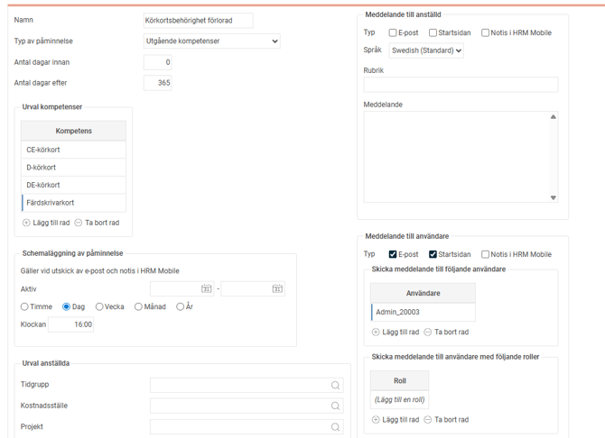
Har du ställt in påminnelsen på att visas på startsidan i HRM kan du se en överblick över vilka anställdas kompetenser som gått ut:
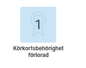
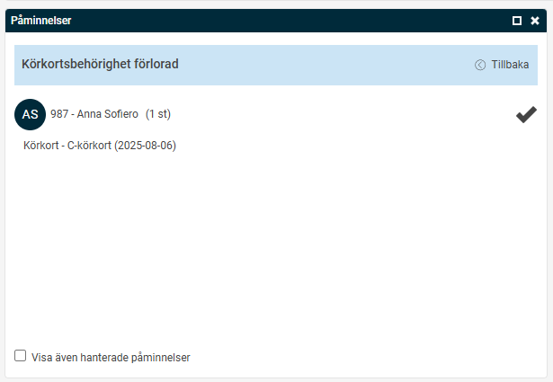
Teknisk information
En fråga om anställdas behörighet fortsatt är giltig skickas varje dag mellan kl 15.00 - 17.00 och svaret kan hämtas innan kl 06.00 i normalfallet. Detta sker med automatik via HRM.
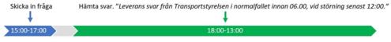
Frågor till Transportstyrelsen
En fråga får enbart ställas på en behörighet som en anställd har angivit att den har och som du har kopplat samman till en BKY-behörighet under programlänken. Det betyder att den anställde måste ha en aktiv kompetensrad, i fliken Kompetenser i anställdaregistret, för den kompetens vi frågar om.
Om svaret sedan blir nej på frågan angående behörigheten så får du inte ställa frågan igen förrän den anställde sagt att den har fått tillbaka behörigheten. I HRM innebär detta alltså att vi enbart skickar frågor på aktiva kompetenser.
Frågan får, och kommer, enbart ställas på den högsta behörigheten enligt nedanstående hierarki. Är det t.ex. en anställd som har alla B-behörigheter BE/B96/B så ställs frågan alltså endast på BE.
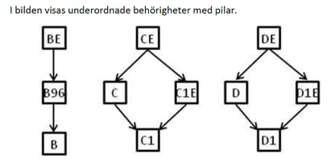
Bakgrundsjobb
Vid en aktiv programlänk kommer ett bakgrundsjobb att triggas i HRM när fråga skickas och det triggar sedan ett jobb som hämtar svar, det går regelbundet till dess du får svar. Körningen sammanställer då frågeunderlaget från de anställdas aktiva kompetenser.
Svar från Transportstyrelsen
Efter att ett svar har hämtats läses det av i HRM. För de anställda som inte har tappat några behörigheter/kompetenser händer ingenting. Är det däremot någon anställd där ett negativt svar returneras innebär detta att berörd kompetens på den anställde inaktiveras genom att t.o.m.-datum sätts på raden till gårdagens datum. I kolumnen “Logg” sätts det att ändringen är gjord av BKY-integrationen. Om det finns en påminnelse aktiv för utgående kompetenser så skickas även en notis ut till berörda.
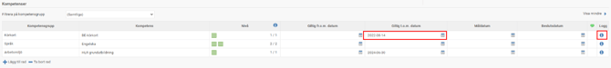
