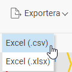

# Kan jag exportera årets Lönerevision till en Excell-fil?

**Datum:** den 30 september 2025  
**Kategori:** Employee  
**Underkategori:** Lönerevision  
**Typ:** faq  
**Svårighetsgrad:** advanced  
**Tags:** lönerevision  
**Bilder:** 1  
**URL:** https://knowledge.flexhrm.com/sv/exportera-arets-lonerevision-0

---

I artikeln hittar du information om hur du enkelt arbetar med årets lönerevision.  

Nedan beskrivs funktionen Exportera i lönerevisionen.
Arbeta med lönerevisionen -
Export till Excel

Ibland kan det vara bra att kunna exportera underlaget i lönerevisionen till Excel eller något annat kalkylprogram för att göra analyser eller andra beräkningar. Det kan också vara ett smidigt sätt att skicka underlaget till fackförbundet vid en facklig förhandling, eller om du vill skriva ut underlaget på papper.
I knappraden i lönerevisionen har vi lagt in en funktion för att
exportera
underlaget som en .csv-fil. En .csv-fil är ett generellt filformat som kan öppnas i t.ex. Excel. Observera dock att filformatet är ett rådataformat och därför inte innehåller någon formatering. Därför kommer kolumnerna inte att vara anpassade i bredd efter innehållet.
