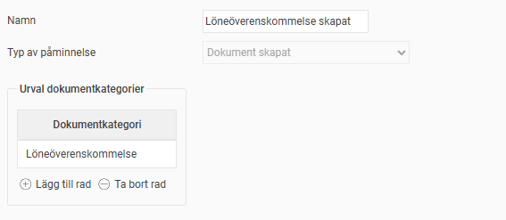
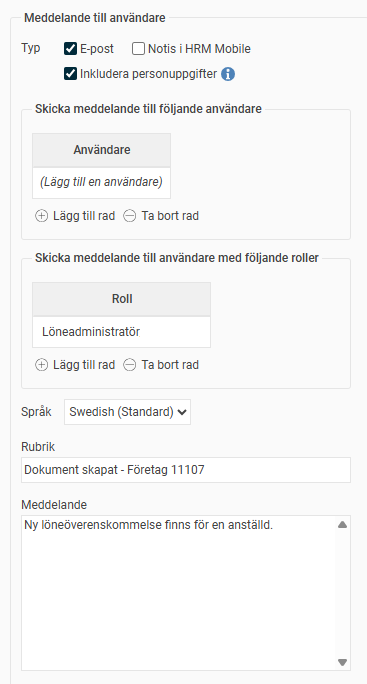

# ⚙️Kan jag få en notis när ett nytt dokument läggs upp i HRM?

**Datum:** den 17 september 2025  
**Kategori:** Employee  
**Underkategori:** Anställningshantering  
**Typ:** config  
**Svårighetsgrad:** intermediate  
**Tags:** anställning, dokument, signering  
**Bilder:** 2  
**URL:** https://knowledge.flexhrm.com/sv/notis-nar-ett-nytt-dokument-laggs-upp-0

---

I HRM Employee finns det möjlighet att lägga upp dokument på anställda och på startsidan. För att göra det enklare att uppmärksamma när ett nytt dokument lagts upp finns det en påminnelse för dokument. 

Den här artikeln beskriver hur du skapar påminnelser för nya dokument.
Notis på dokument i HRM
I HRM kan du använda påminnelser för att uppmärksamma när ett nytt dokument läggs upp. Det gäller för:
Personliga dokument i anställningsregistret
Dokument på startsidan
HR-blanketter som sparas direkt till den anställdes dokument
Bilagor som läggs till i anställningsregistret via den anställdes frånvaroansökan i HRM Time
Observera att påminnelsen inte fungerar för dokument som hanteras via E-signering.
Ställ in påminnelser för uppgifter
För att aktivera automatiska påminnelser för nya uppladdade dokument, gå till
Administration > Inställningar > Allmänt > Påminnelser
.
Här skapar du en påminnelse av typen
Dokument skapat.
Välj för vilken/vilka dokumentkategorier påminnelsen ska gälla.

Ställ in vem/vilka som ska få påminnelsen.

