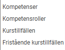

# Kan jag ta ur en rapport med anställdas kompetenser/kurser?

**Datum:** den 5 november 2025  
**Kategori:** Employee  
**Underkategori:** Kompetens & Kurser  
**Typ:** faq  
**Svårighetsgrad:** beginner  
**Tags:** kompetens, kurs  
**Bilder:** 1  
**URL:** https://knowledge.flexhrm.com/sv/rapport-kompetenser-kurser-0

---

Denna artikel innehåller vanliga frågor för kompetenser och kurser i HRM
Ja, du kan ta ut rapporter med anställdas kompetenser och kurser i rapportgeneratorn i HRM. Använd huvuddatakälla Anställda och lägg till de kopplingsbara datakällorna för kompetenser/kurser. Följande datakällor kan du välja på:

