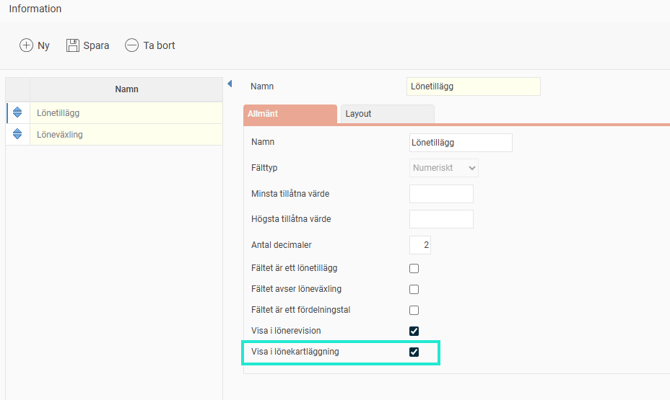

# ⚙️Kom igång med Lönekartläggning i HRM - Förbered HRM för din första lönekartläggning

**Datum:** den 8 december 2025  
**Kategori:** Employee  
**Underkategori:** Anställningshantering  
**Typ:** config  
**Svårighetsgrad:** intermediate  
**Tags:** anställning, dokument  
**Bilder:** 2  
**URL:** https://knowledge.flexhrm.com/sv/kom-igang-med-lonekartlaggning-i-hrm-0

---

Den här artikeln guidar dig steg för steg vad du behöver förbereda och ställa in i HRM för att vara redo att genomföra en Lönekartläggning.
Lönekartläggning - Inställningar
Licens
Aktivera licensen för lönekartläggning för ditt företag
Allmänt > Företag
Behörigheter
Innan du skapar en lönekartläggning behöver du ställa in rätt behörighet för de som ska ha tillgång till lönekartläggningen i HRM.
Det gör du under
Användare/Behörigheter > Roller
.

Observera
att du ser
alla anställda
om du har behörighet till vyerna i lönekartläggningen. Den vanliga behörighetstyrningen där du endast ser de anställda du annars har behörighet till
gäller inte
i Lönekartläggningen.
Vyerna
Anställningslista
och
Analys
visar detaljer på alla anställda och deras löner. I vyn
Dokument
kan du i vissa fall utläsa anställdas löner i slutrapporten om du till exempel endast har en anställd på ett visst arbete. Är detta inte lämpligt rekommenderar vi att vara restriktiv med vilka roller du ge behörighet till dessa vyer.
Egna fält i lönekartläggningen
I lönekartläggningen tittar du på total lön, vilket innebär att du behöver tala om vilka andra fält för lön och förmåner utöver heltidslön som ska visas i lönekartläggningen.
De fält som ska visas i lönekartläggningen behöver aktiveras under
Inställningar > Allmänt > Anställdaregistret > egna fält
Leta upp de fält som är aktuella och kryssa i
Visa i lönekartläggning.

Har du inte alla fält i HRM så kan du behöva bygga upp nya fält.
Här kan du läsa mer om egna flikar och fält i HRM.
Förbered uppgifter på anställda
Kontrollera & komplettera vid behov
Uppgift om lön finns på alla anställda.
Anställningstyp är korrekt inställt (Extern personal tas ej med).
Kön finns definierat på anställda (hämtas från personnr alternativt fältet kön).
För att se anställningstid behövs anställningsdatum.
För att se medelålder måste födelsedatum finnas inlagt.
Befattning (alternativt arbete via kontering) finns specificerat i register och på anställda.
Komplettera övrig ersättningar vid behov
För att kunna få total ersättning på anställda så som lön + lönetillägg, förmåner, provision, bonus osv kan det behövas göra uträkningar av ett genomsnitt för lönetillägg, provision, bonus eller liknande per anställda. När uträkningen är klar behöver det importeras in i HRM. Exempelvis genomsnitt provision de senaste 12 månaderna. OBS att ett/flera egna fält behöver finnas i HRM för att importera värdet till.
Skapa Egna fält för provision/förmåner eller liknande, se ovan gällande egna fält.
Räkna ut ett genomsnitt per anställd av de ersättningar som är aktuella.
Importera/lägg in det uträknade värdet i HRM för aktuella anställda.
