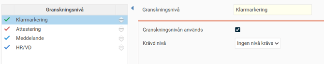
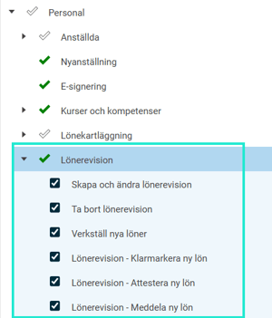
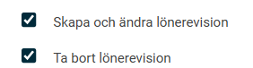
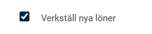
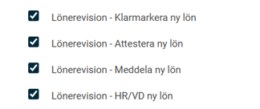
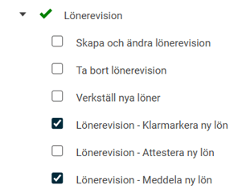
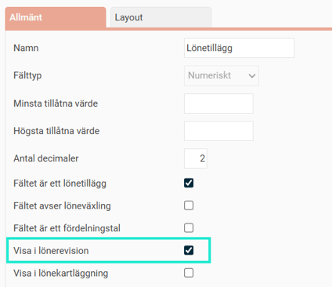
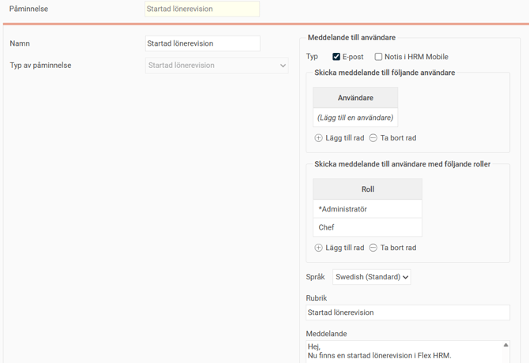

# ⚙️Kom igång med Lönerevision i HRM

**Datum:** den 30 september 2025  
**Kategori:** Employee  
**Underkategori:** Anställningshantering  
**Typ:** config  
**Svårighetsgrad:** intermediate  
**Tags:** lönerevision  
**Bilder:** 9  
**URL:** https://knowledge.flexhrm.com/sv/kom-igang-med-lonerevision-i-hrm

---

Första gången du ska genomföra en lönerevision i HRM behöver du göra några grundinställningar. 

Den här guiden hjälper dig som administratör att förbereda systemet steg för steg.
Grundinställningar
Licens
Aktivera licensen för lönerevision för ditt företag
Allmänt > Företag
Granskningsnivåer
I HRM kan du skapa så många granskningssteg du vill för att godkänna nya löner.
1. Skapa granskningsnivåer
Börja med att skapa de granskningsnivåer som din organisation använder. Detta gör du en gång och nivåerna kan sedan användas i alla företag.
Gå till
Administration > Allmänt > Granskningsnivåer > Lönerevision
.
Här namnger du de olika nivåerna i deras olika böjningsformer och väljer en färg för varje nivå.
Finns det inga granskningsnivåer här behöver de skapas upp. Klicka på
Ny
, ange namn och
Spara
.
Notera
att menyn
Administration > Allmänt > Granskningsnivåer > Lönerevision
är systemgemensam och gäller samtliga företag i din installation. Ändrar du på namnet på en granskningsnivå slår det igenom hela o
2. Aktivera och ordna nivåer för ett företag
Därefter väljer du vilka av de skapade granskningsnivåerna som företaget ska använda.
Gå till
Administration > Inställningar > Allmänt > Granskningsnivåer > Lönerevision
.
I listan till vänster drar och släpper du nivåerna för att bestämma i vilken ordning de ska visas.

Du kan också ställa in om en granskningsnivå kräver att en annan granskning har gjorts innan.
Exempel på flöde:
Chefen klarmarkerar lönerna när lönesättningen är färdig.
En högre chef attesterar de nya lönerna.
HR-avdelningen/VD godkänner lönerna i hela lönerevisionen.
Lönesamtalet hålls och den nya lönen meddelas den anställde.
Lönerna verkställs.
Behörigheter
För att allt ska fungera korrekt behöver du se över behörigheterna för de roller som ska arbeta med lönerevisionen. Detta gör du under
Administration > Användare/Behörigheter > Roller
.

Förklaring av behörigheter

Denna behörighet styr vilka anställda en användare får se och ändra i lönerevisionen. Du kan även ge läsbehörighet till användare som inte ska kunna ändra löner.

Dessa behörigheter är avsedda för administratörer eller HR som förbereder lönerevisionen innan de lönesättande cheferna får tillgång.

Ger en administratör rätt att verkställa en lön som är färdiggranskad. Att verkställa innebär att den nya lönen sparas i anställdaregistret och kan föras över till lönesystemet.

Dessa kryssrutor ger användaren behörighet att utföra en specifik granskningsnivå. Här kan en chef få behörighet att klarmarkera de nya lönerna, och en HR-ansvarig eller högre chef få behörighet att attestera dem.
Exempel på roll för lönesättande chef:
En chef med denna roll för sin grupp anställda kan sätta nya löner, klarmarkera dem och kryssa i att lönesamtal har hållits.

Fackförbund
Du kan registrera vilket fackförbund en anställd tillhör, vilket är användbart vid skapandet av potter för olika kollektivavtal i lönerevisionen.
Börja med att lägga upp ett register över aktuella fackförbund/kollektivavtal under
Administration > Register > Fackförbund
.
Gå sedan till anställdaregistret och ange fackförbund på fliken
Personuppgifter
. Anställda kan även själva ange detta under
Mina uppgifter
.
Egna fält
Under
Egna fält
kan du skapa anpassade fält som kan vara till hjälp vid lönesättningen. Du kan till exempel lägga till fält för lönetillägg och förmåner under fliken
Lön
i anställdaregistret.
Inställningen hittar du under
Administration > Inställningar > Personal > Anställdaregistret > Egna fält.
För att ett eget fält ska visas som en kolumn i lönerevisionen behöver du markera en specifik kryssruta.

Påminnelser
Du kan skapa en påminnelse för att meddela berörda användare att en lönerevision har startat.
Ställ in detta
Inställningar > Allmänt > Påminnelser

När du är klar med inställningarna enligt ovan kan du börja förbereda lönerevisionen.
Nästa steg - Skapa lönerevision
Din kompletta guide till Lönerevision
Förberedelser
Skapa Lönerevision
Skapa potter i en lönerevision
Valbara kolumner i lönerevision
Arbeta med lönerevision
Starta Lönerevision
Arbeta med årets lönerevison
Hur verkställer jag årets lönerevision?
Överför Lönerevision till Flex Classic lön
Anställd ingår i aktiv lönerevision
Kan jag exportera årets Lönerevision till en Excell-fil?
