# ⚙️Kompetenshantering i HRM - Hur skapar jag nya kompetenser?

**Datum:** den 26 augusti 2025  
**Kategori:** Employee  
**Underkategori:** Anställningshantering  
**Typ:** howto  
**Svårighetsgrad:** advanced  
**Tags:** anställning, kompetens, kurs  
**Bilder:** 13  
**URL:** https://knowledge.flexhrm.com/sv/kompetenshantering-i-hrm-hur-skapa-nya-kompetenser-0

---

HRM Employee möjliggör centraliserad hantering av kompetenser för anställda. Systemet tillåter koppling av kompetenser till roller och individer samt spårning av kompetensnivåer och målnivåer.

Denna artikel beskriver hur du administrerar och skapar nya kompetenser och kompetensroller.
💻Här finns en beskrivning av arbetsflödet för att lägga in kompetenser på anställda
⚙️
Guide
1. Kompetensegrupper
2. Kompetenser
3. Kompetensroller
4. Påminnelser för utgående kompetenser
5. Behörighet
Kompetenshantering
I HRM finns kompetenser som kan kopplas till de anställda. Det gör det möjligt att se vilka kompetenser som en anställd har samt planera ev. kompetensutveckling.
Kompetensgrupper
Register - Kompetensgrupper
För att du ska kunna organisera kompetenserna på ett överskådligt sätt behöver du först gruppera dem i s.k. Kompetensgrupper. Du måste ha minst en Kompetensgrupp för att kunna komma vidare.
Nedan ser du exempel på vanligt förekommande kompetensgrupper. I ditt företag kan det finnas andra grupperingar som känns mer ändamålsenligt.
Skapa kompetensgrupper och besluta om gruppen ska kunna användas för kompetenser och/eller för kurser.
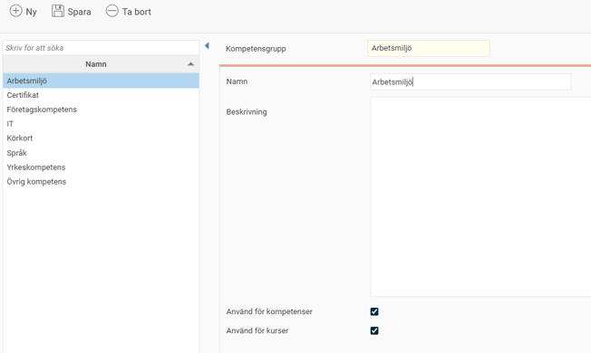
Kompetenser
Register - Kompetenser
Här lägger du in de kompetenser ni vill använda/administrera i HRM. Tänk efter vilka ni verkligen har nytta av att kunna hantera och vilka kompetenser ni vill kunna söka efter i HRM.
Gör så här för att skapa en ny kompetens:
Klicka på
Ny
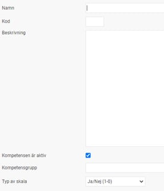
Sätt ett
Namn
och välj en
Kod
(skapa en struktur med max fem tecken)
V
ä
l
j
Kompetensgrupp
för just denna kompetens.
V
ä
l
j vilken
Typ av skala
som ska användas för
att gradera den a
nställdes nivå för den aktuella kompetensen.
V
äljer du en graderingsskala kommer ytterligare ett val upp under
Typ av skala
där du väljer hur många steg graderingen ska vara.
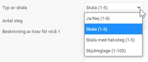
Ja/Nej switch (0-1)
Används för t.ex. certifikat eller andra kompetenser som man antingen har eller inte har, utan någon gradering.
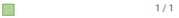
Skala (1-5)
Gradering med skalor. Välj skala mellan 1-5.
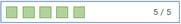
Skala med halvsteg (1-5)
Gradering med stjärnor som tillåter halva steg.
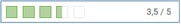
Skjutreglage (1-100)
Gradering med skjutreglage. Välj skala mellan 1-100 steg. Användbart då man vill bedöma kompetensen i procent.
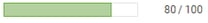
Om du väljer att ändra skalan
på en kompetens som används kommer systemet att anpassa den anställdes aktuella nivå till den nya skalan. Om man t.ex. först har 4 av 5 stjärnor, och byter graderingen till skjutreglage med 100 steg, så kommer nivån 4 stjärnor att omvandlas till 80 av 100 med hjälp av procentberäkning. Notera att beroende på hur skalan förändras kan den aktuella nivån bli mer eller mindre förändrad procentuellt. Du bör därför inte ändra skalan utan att först analysera konsekvenserna.
Beskrivning
finns till som en hjälptext när du lägger upp en kompetens på en anställd. Väljer du graderingar kan du med fördel skriva in en beskrivning för att tydliggöra vad varje nivå innebär.
Klicka på
Spara
högst upp när du är klar.
Kompetensroller
För att se om anställda uppfyller ev. kompetenskrav som deras roll innebär kan man koppla kompetenser till kompetensroller. Dessa knyts sedan till de anställda, och det syns då vilka kompetenser som krävs i en specifik kompetensroll.

Under
Register - Kompetensroller
skapar du upp företagets kompetensroller
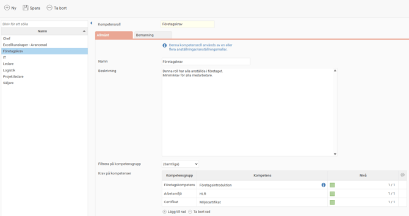
Bra att veta
Det framgår i registret för kompetensroller om denna roll används.

Lägger du till nya kompetenser
i kompetensrollen kommer följande att hända.
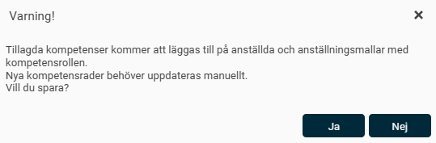
Kompetensroller/kompetenser i anställningsmallar
Du kan lägga in
kompetensroller
och/eller
kompetenser
på en
anställningsmall
för att underlätta upplägg av nyanställda. På så sätt kan du få med önskade kompetensroller automatiskt när du lägger upp en nyanställd och anger en anställningsmall. Du lägger in kompetensrollerna i anställningsmallen under
Administration – Inställningar – Personal – Anställningsmallar
,
fliken
Kompetenser
.
Påminnelser
Vissa typer av kompetenser, såsom certifikat, behöver förnyas med jämna mellanrum, och andra vill man se över och uppdatera nivån på ibland. För att göra detta enklare kan man skapa en påminnelse som varnar när en kompetens är på väg att gå ut. Påminnelsen görs då på det datum som läggs in på den anställdes kompetens under
Giltig t.o.m. datum.
För att aktivera denna typ av påminnelse går du in under A
dministration – Inställningar – Allmänt – Påminnelser
och skapar en
ny
påminnelse av typen
Utgående kompetenser
. Följande inställningar kan sedan göras för påminnelsehanteringen:
Antal dagar innan och efter
Här väljer du hur många dagar före samt efter kompetensens slutdatum man ska få en påminnelse på startsidan.
Urval anställda
Här kan du göra urval på den grupp av anställda påminnelsen ska gälla.
Urval kompetenser
Här väljer du de kompetenser du vill bevaka. Om du t.ex. vill ha olika tidig bevakning på olika kompetenser kan du skapa flera olika påminnelser med urval på olika kompetenser.
Schemaläggning av påminnelse
Här väljer du hur ofta påminnelser via e-post och notiser i HRM Mobile ska skickas ut till mottagaren. Man kanske t.ex. vill skicka ut ett e-postmeddelande till alla chefer som har anställda med utgående kompetenser varje torsdag kl. 15. OBS att det i påminnelsen på e-post inte framgår vilken kompetens det är som går ut, det syns på startsidan i HRM.
Meddelande till anställd
Här anger du önskad typ av påminnelse samt en meddelandetext som ska gå ut till den anställde. Om man inte väljer någon påminnelsetyp kommer ingen påminnelse att gå ut.
Medde
lande till användar
e
H
ä
r
anger du önskad typ av påminnelse samt en meddelandetext som ska gå ut till vald grupp av användare, vilket vanligen är chefer eller HR-avdelningar. Du kan antingen välja specifika användare som ska få påminnelsen, eller så kan du välja vilka roller, såsom attestansvarig chef, som ska få påminnelsen. Påminnelsen kommer då gå ut till de användare som har vald roll för den anställde som påminnelsen avser.
Behörigheter
Administration – Användare/Behörigheter – Roller
För att kunna administrera register av kompetenser, kompetensgrupper samt kompetensroller behöver följande aktiveras för administratören.
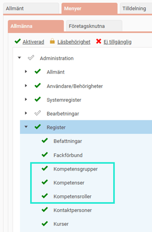
För en roll som ska få tillgång till kompetenssökning och kompetensmatris aktiveras följande på rollen under
Personal
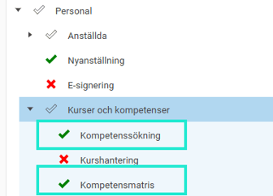
Om rollen också ska få tillgång till kompetenssökningen från startsidan aktiverar du även behörigheten på rollen under
menyn
Hem
.
Vilka anställda en användare får tillgång till i kompetenssökningen styrs av rollens behörighet. Om användarna har denna roll för hela företaget kan de söka på alla anställda i företaget, men om de har rollen för t.ex. en avdelning i företaget får de endast tillgång till denna avdelning i kompetenssökningen.
