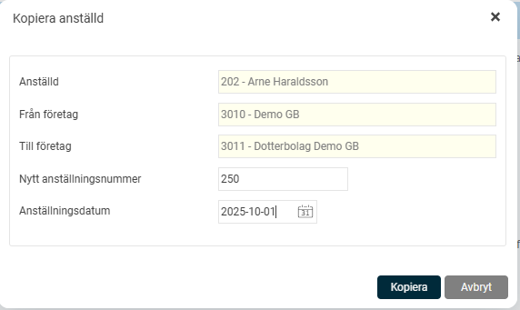

# Kopiera anställd mellan bolag – smartare personalhantering för hela koncernen

**Datum:** den 9 december 2025  
**Kategori:** Employee  
**Underkategori:** Anställningshantering  
**Typ:** other  
**Svårighetsgrad:** advanced  
**Tags:** anställning  
**Bilder:** 2  
**URL:** https://knowledge.flexhrm.com/sv/kopiera-anstalld-inom-koncern

---

I artikeln hittar du information om hur du enkelt kan flytta anställda mellan olika juridiska bolag inom er koncern, där viktig grunddata automatiskt följer med.
Att manuellt registrera en anställd som byter bolag inom koncernen kan vara tidskrävande och ökar risken för fel. Med funktionen
Kopiera anställd
kan du med några få klick initiera en överflyttning där viss nödvändig grunddata automatiskt följer med. Detta sparar inte bara värdefull tid, utan säkerställer också att informationen är korrekt från start i den nya anställningen.
Följande grunddata kopieras till det nya bolaget
Bild
Namn
och
personnummer
Nationalitet
,
födelsedatum
och
kön
Adressuppgifter
(inklusive skyddad folkbokföring och förmedlingsadress)
Kontaktuppgifter
som e-post privat, e-post arbete, privat mobil och arbets-mobil, inklusive inställningar för utskick
Så här använder du funktionen
Hitta den anställda:
I listvyn för Anställdaregistret letar du upp den person du vill flytta till ett annat bolag.
Dra och släpp:
Dra den markerade anställda direkt till det nya bolaget. En dialogruta visas för att du ska kunna bekräfta överflyttningen.

Ange detaljer:
I dialogrutan fyller du i det nya
anställningsnumret
och det nya
anställningsdatumet
som den nya anställningen ska ha.

Bekräfta:
Klicka på "Spara". En ny anställning skapas nu i det valda bolaget.
Observera
att anställningsperioder inte kopieras, eftersom dessa ofta är unika för varje anställning.
Förutsättningar för att använda funktionen
För att kunna använda funktionen
Kopiera anställd
krävs följande:
Ditt företag måste ha en
Koncernlicens
i HRM.
Som användare behöver du behörighet att se
listvyn
i anställdaregistret och behörighet till funktionen
Kopiera anställd inom koncern
.
Du måste ha behörighet att
lägga upp en ny anställning
och
anställningsperiod
.
Du behöver vara behörig att administrera
både
aktuellt företag och målföretaget.
Endast användare med behörighet till samtliga anställda i det nya företaget kommer att ha behörighet till den nyligen kopierade anställningen.
