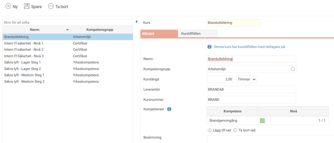
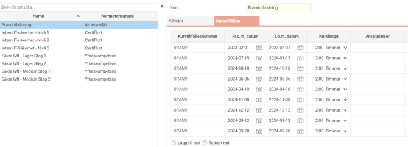
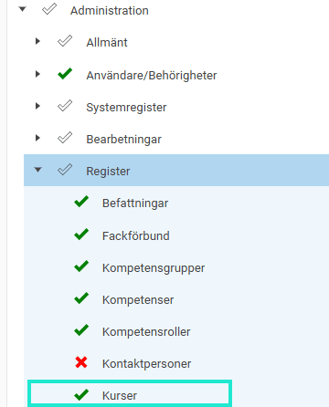
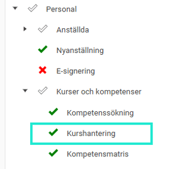
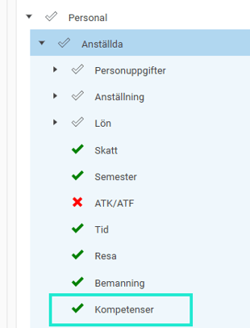

# ⚙️Kurshantering i HRM - Hur skapar jag nya kurser?

**Datum:** den 26 augusti 2025  
**Kategori:** Employee  
**Underkategori:** Kompetens & Kurser  
**Typ:** howto  
**Svårighetsgrad:** intermediate  
**Tags:** cv, kompetens, kurs  
**Bilder:** 5  
**URL:** https://knowledge.flexhrm.com/sv/kurshantering-i-hrm-hur-skapa-nya-kurser-0

---

HRM Employee möjliggör hantering av kurser och uppföljning av kurstillfällen för anställda.

Denna artikel beskriver hur du administrerar och skapar nya kurser och kurstillfällen.
💻Här finns en beskrivning av arbetsflödet för att lägga in kurser på anställda
⚙️
Guide
Kurshantering
Kurstillfällen
Behörighet
Kurshantering
Funktionen Kurser kan användas för att hantera kurser som medarbetare ska gå eller har gått. För varje kurs lägger man sedan till kurstillfällen som de anställda kan anmälas till. I kurshanteringsvyn administreras de olika kurstillfällena.
Kurser kan även koppas till CV-funktionen i HRM, så att man kan få ut en förteckning över vilka kurser personen har gått.
Bygga upp kurser
De kurser som det ska gå att välja bland lägger du upp i kursregistret under
Administration – Register – Kurser
.

Du anger där följande uppgifter under
Allmänt:
Namn
Kompetensgrupp
Ange vilken kompetensgrupp kursen avser. Syftet är att gruppera kurser efter ämnesområde. Du kan per kompetensgrupp välja om de ska användas för kurser och/eller kompetenser, vilket gör att du kan skapa kompetensgrupper som t.ex. bara används för kurser. Dessa inställningar hittar du i registret för kompetensgrupper.
Kurslängd
Kurslängd anges för att få en förståelse för hur omfattande en kurs är.
Leverantör
Information om vem som anordnar kursen för att t.ex. underlätta kursbokningar.
Kursnummer
Eventuellt kursnummer hos utbildningsleverantören.
Kompetenser
Lägg till om godkänd kurs ska ge en kompetens
Beskrivning
En kort beskrivning av kursens innehåll.
Kurstillfällen
För varje kurs behöver du också lägga upp de kurstillfällen som ska vara valbara i registret per kurs.

Kurstillfällenummer
E
ventuellt kurstillfällenummer hos utbildningsleverantören.
Datum
Ange datum för de olika kurstillfällena
Kurslängd
Antal platser
Finns det begränsat antal platser? Ange hur många deltagare som kan gå på respektive tillfälle
Leverantör
Ort
Kurspris
Behörigheter
För att kunna använda funktionen för kurser behöver du aktivera detta på rollen/rollerna.
Följande styr att en administratör kommer åt
registret för kurser och kurstillfällen

Följande styr om en roll har behörighet till
Kurshanteringsvyn
under
Personal

För att komma åt och
lägga in kompetenser/kurser på en anställd i anställdaregister
behövs följande behörighet

