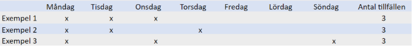

# ⚙️LAS - Beräkningsdetaljer fördjupning

**Datum:** den 15 oktober 2025  
**Kategori:** Employee  
**Underkategori:** Anställningshantering  
**Typ:** config  
**Svårighetsgrad:** advanced  
**Tags:** anställning  
**Bilder:** 1  
**URL:** https://knowledge.flexhrm.com/sv/las-berakningsdetaljer-fordjupning-0

---

Funktionen LAS ingår i modulerna HRM Employee och HRM Payroll.

I denna artikel finns en beskrivning om beräkningarna för SÄVA och Vikariat i LAS-listorna.
Beräkning för Vikariat (VIK)
Beräkningen för VIK gör följande:
definierar perioden genom att kolla datumet fem år bakåt från beräkningsdatumet,
summerar VIK-dagarna i perioden och
kollar om VIK-dagarna överstiger gränsvärdet på två år (antal dagar du ställt in på respektive personalkategori).
Beräkning för Särskild visstidsanställning (SÄVA)
Enligt lagen om anställningsskydd 5 a § övergår en särskild visstidsanställning till en tillsvidareanställning när arbetstagaren har varit anställd hos arbetsgivaren i särskild visstidsanställning i sammanlagt mer än tolv månader
under en femårsperiod eller
under en period då arbetstagaren har haft tidsbegränsade anställningar hos arbetsgivaren i form av särskild visstidsanställning, vikariat eller säsongsarbete och anställningarna följt på varandra. Detta alternativ kallar vi i Flex HRM för Kedjeregeln.
Grunden i beräkningen för SÄVA gör följande
definierar perioden genom att kolla datumet fem år (se även rubriken nedan om övergångsregeln) bakåt från beräkningsdatumet,
kolla vilket datum du har haft en sammanhängande anställning utifrån beräkningstidpunkten (oavsett om anställningen är aktiv på beräkningsdatumet). Som sammanhängande räknas anställningsformer med SÄVA, VIK och Säsongsanställning, enligt kryssrutorna på anställningsformerna, med maximalt sex månaders mellanrum. Kedjeregeln gör att du kan hitta SÄVA-dagar längre bak i tiden än fem år men du räknar ändå bara SÄVA-dagar - se separata rubriker nedan om kedjeregeln och övergångsregeln,
summerar SÄVA-dagarna i perioden och
kollar om SÄVA-dagarna överstiger gränsvärdet på tolv månader (antal dagar du ställt in på respektive personalkategori).
Kedjeregeln SÄVA
Kedjeregeln beräknas utifrån om:
from-datum på period är max fem år bakåt. Fem år innebär 365 * 5, då ett år räknas som 365 dagar och
perioden är sammanhängande med föregående period på max sex månader, Sex månader innebär 30 * 6, månad räknas som 30 dagar.
Tre tillfällen eller fler - Beräkning av mellanliggande tid vid SÄVA
De som haft tre eller fler SÄVA-dagar under en och samma kalendermånad får tillgodoräkna sig tiden/dagarna mellan första och sista arbetade dagen. Det här gäller oavsett om beräkningen görs på kalenderdagar eller arbetsdagar.
I nedan exempel har den anställde tre SÄVA-dagar/anställningar för perioden måndag till söndag 1-7 september 2025.

Exempel 1 = 3 anställningsdagar
Exempel 2 = 4 anställningsdagar
Exempel 3 = 7 anställningsdagar
I artikeln om
Inställningar och beräkningsdetaljer
finns information om funktionen
Utökad tillfälleshantering
som gör det möjlighet att, vid beräkning på arbetsdagar, göra anpassning av hur tillfälleshanteringen för mellanliggande tid ska fungera vid SÄVA.
Övergångsregel från AVA till SÄVA
I samband med att nya regler i LAS började tillämpas 1 oktober 2022 ingick vissa övergångsregler. En övergångsregel innebär att du får tillgodoräkna dig Allmän visstidsanställning (AVA) från och med 2022-03-01. Det gör att du måste bocka i att anställningsformen AVA ska räknas som SÄVA för att HRM ska ta hänsyn till övergångsregeln.
